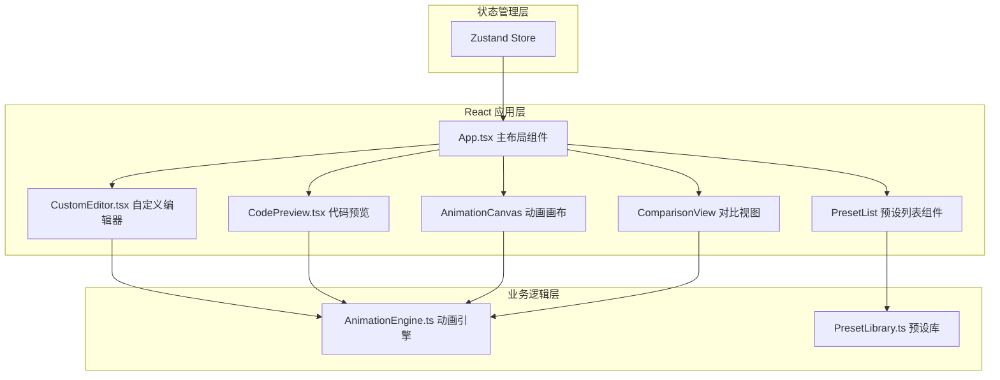

## 1. 架构设计



## 2. 技术说明

- **前端框架**：React 18 + TypeScript（StrictMode）
- **构建工具**：Vite
- **状态管理**：Zustand
- **唯一ID生成**：uuid
- **代码高亮**：Prism.js
- **动画实现**：CSS @keyframes + requestAnimationFrame

## 3. 项目结构

```
├── package.json          # 项目依赖和脚本
├── index.html            # 入口HTML
├── vite.config.js        # Vite构建配置
├── tsconfig.json         # TypeScript严格模式配置
└── src/
    ├── App.tsx           # 主布局组件
    ├── AnimationEngine.ts # 动画引擎模块
    ├── PresetLibrary.ts   # 预设库模块
    ├── CustomEditor.tsx   # 自定义编辑器组件
    ├── CodePreview.tsx    # 代码预览组件
    ├── components/
    │   ├── AnimationCanvas.tsx
    │   ├── PresetList.tsx
    │   └── ComparisonView.tsx
    ├── store/
    │   └── useAnimationStore.ts
    └── styles/
        └── index.css
```

## 4. 数据模型

### 4.1 动画预设类型

```typescript
interface AnimationPreset {
  id: string;
  name: string;
  category: 'bounce' | 'pulse' | 'rotate' | 'fade' | 'slide' | 'elastic' | 'other';
  duration: number; // 毫秒
  easing: string; // ease-in-out, cubic-bezier(...)等
  keyframes: KeyframeDefinition[];
}

interface KeyframeDefinition {
  offset: number; // 0-100 百分比
  properties: AnimationProperties;
}

interface AnimationProperties {
  transform?: string;
  opacity?: number;
  width?: string;
  height?: string;
  backgroundColor?: string;
}
```

### 4.2 自定义动画状态

```typescript
interface CustomKeyframe {
  id: string;
  offset: number; // 0-100
  property: 'transform' | 'opacity' | 'width' | 'height' | 'background-color';
  value: string;
}

interface EditorState {
  keyframes: CustomKeyframe[];
  selectedKeyframeId: string | null;
  history: CustomKeyframe[][]; // 用于撤销，最多5步
  historyIndex: number;
}
```

## 5. 核心模块设计

### 5.1 AnimationEngine.ts

- 职责：解析预设和自定义keyframes参数，生成CSS字符串并注入DOM，管理播放状态
- 核心方法：
  - `play(animationName, options)`：播放动画
  - `pause()`：暂停动画
  - `stop()`：停止动画
  - `reset()`：重置动画
  - `generateCSS(keyframes, options)`：生成CSS @keyframes字符串
  - `injectCSS(css, animationName)`：动态注入CSS到DOM
  - `getCurrentTime()`：获取当前播放时间（用于时间轴指示）

### 5.2 PresetLibrary.ts

- 职责：存储20+内置动画数据，提供筛选和搜索接口
- 核心方法：
  - `getAllPresets()`：获取所有预设
  - `getPresetsByCategory(category)`：按分类筛选
  - `searchPresets(keyword)`：按名称搜索
  - `getPresetById(id)`：根据ID获取单个预设

### 5.3 CustomEditor.tsx

- 职责：时间轴编辑、关键帧节点拖拽、属性值设置、撤销/重做
- 子组件：TimelineTrack, KeyframeNode, PropertyInputPanel

### 5.4 CodePreview.tsx

- 职责：显示生成的CSS代码，语法高亮，提供复制功能
- 使用Prism.js进行代码高亮

## 6. 性能优化

- 使用CSS transform和opacity实现硬件加速动画
- 时间轴更新使用requestAnimationFrame确保≥50fps
- 动态CSS注入使用单一<style>标签管理，避免重复创建
- 组件合理拆分，使用React.memo避免不必要的重渲染
