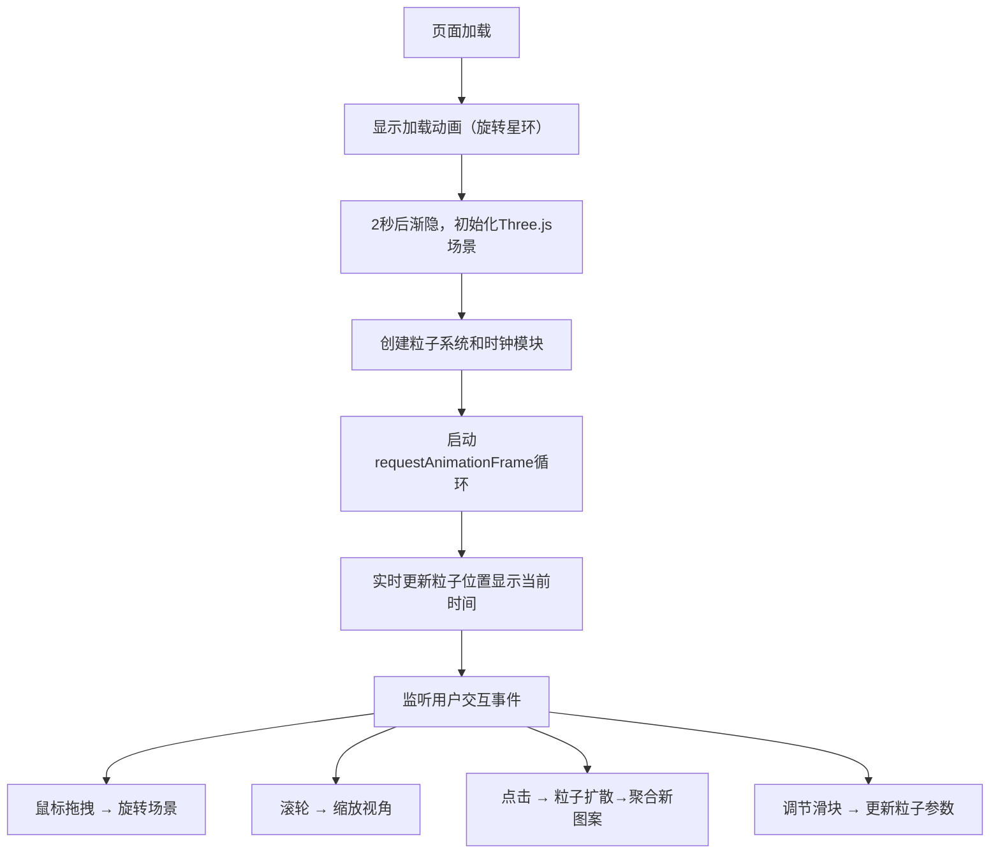

## 1. 产品概述

星际粒子时钟秀是一款基于WebGL和粒子系统的炫酷交互式桌面时钟应用。它在3D空间中用数千个彩色粒子动态渲染实时跳动的数字时钟，粒子如星河般流动旋转，形成极具视觉冲击力的科幻风格桌面摆件。

- **核心价值**：将普通的时钟功能升华为沉浸式的视觉艺术体验
- **目标用户**：追求个性化桌面体验、喜爱科幻风格视觉效果的科技爱好者
- **使用场景**：桌面时钟、动态壁纸、视觉展示、创意展示

## 2. 核心特性

### 2.1 功能模块

1. **粒子时钟渲染**：7段数码管粒子数字显示，实时更新时分秒
2. **场景交互控制**：鼠标拖拽旋转、滚轮缩放、点击扩散聚合动画
3. **粒子参数调节**：右侧控制面板，实时调整粒子大小、速度、颜色、旋转
4. **动态图案切换**：点击随机切换雪花、银河漩涡、星环三种图案

### 2.2 页面详情

| 页面名称 | 模块名称 | 功能描述 |
|---------|---------|---------|
| 主场景 | 粒子时钟 | 3D空间中粒子组成7段数码管显示当前时间，数字切换时粒子漂移过渡 |
| 主场景 | 背景粒子 | 深空背景粒子流动，营造星河氛围 |
| 控制面板 | 参数调节 | 四个滑块控制粒子大小、发射速度、色相偏移、旋转速度 |
| 交互层 | 鼠标控制 | 拖拽旋转、滚轮缩放、点击触发扩散聚合动画 |

## 3. 核心流程

## 4. 用户界面设计

### 4.1 设计风格

- **整体风格**：暗色科幻风格，深空主题
- **主色调**：深空蓝黑背景 `#0a0a1a`
- **渐变色**：粒子从中心到边缘蓝紫渐变 `#00bfff` → `#8a2be2`
- **霓虹光晕**：控制面板元素带蓝色霓虹光晕 `box-shadow: 0 0 10px #00bfff`
- **毛玻璃效果**：控制面板使用 `backdrop-filter: blur(8px)`

### 4.2 页面设计概览

| 页面名称 | 模块名称 | UI元素 |
|---------|---------|--------|
| 主场景 | 3D粒子时钟 | 粒子组成的时分秒数字，呼吸光效，流动背景粒子 |
| 右侧控制面板 | 参数滑块 | 四个带数值显示的滑块，半透明深色背景，圆角12px，宽度240px |
| 加载层 | 加载动画 | 旋转星环动画，2秒后渐隐 |

### 4.3 响应式设计

- 桌面端：控制面板固定在右侧，宽度240px
- 移动端（最小宽度320px）：控制面板自适应宽度，可折叠
- Canvas始终全屏显示

### 4.4 3D场景设计

- **环境**：深空黑色背景，营造宇宙氛围
- **光照**：粒子自发光，无需额外光源
- **相机**：PerspectiveCamera，初始距离适中，可通过滚轮缩放（0.5-3.0倍）
- **构图**：时钟数字居中，背景粒子营造纵深感
- **交互**：OrbitControls拖拽旋转（阻尼0.95），点击触发扩散动画
- **动效**：粒子呼吸光效（正弦波），数字切换漂移过渡（0.3s），点击扩散聚合（0.6s ease-out）
- **性能**：粒子总数≤3000，帧率稳定55FPS以上
