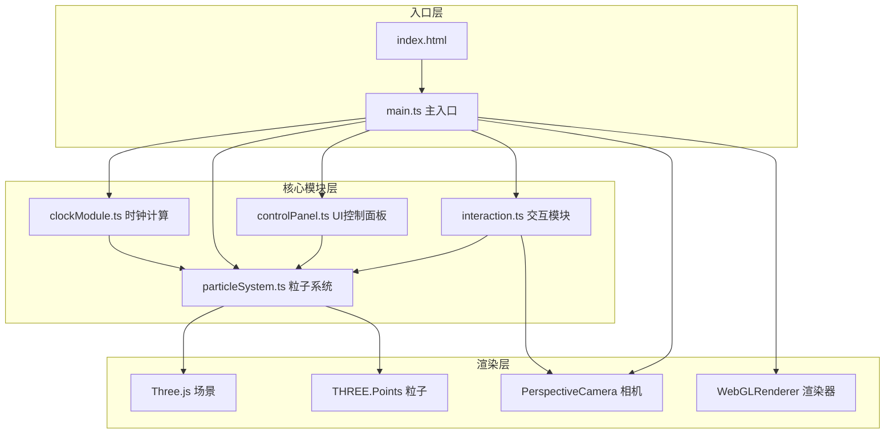

## 1. 架构设计



## 2. 技术栈说明

- **前端框架**：原生 TypeScript（无UI框架，Three.js直接操作DOM和WebGL）
- **3D引擎**：Three.js @0.160.0
- **类型定义**：@types/three
- **构建工具**：Vite 5.x
- **语言**：TypeScript 5.x（严格模式，target ES2020）
- **样式**：原生CSS（毛玻璃效果、霓虹光晕、flexbox布局）

## 3. 文件结构

```
project/
├── package.json              # 项目依赖和脚本
├── index.html                # 入口HTML，含canvas容器和加载动画
├── vite.config.js            # Vite构建配置
├── tsconfig.json             # TypeScript配置（严格模式）
└── src/
    ├── main.ts               # 主入口，场景初始化，动画循环
    ├── clockModule.ts        # 时钟计算模块，7段数码管粒子位置
    ├── particleSystem.ts     # 粒子系统模块，Points管理，动画效果
    ├── controlPanel.ts       # UI控制面板，滑块交互，事件派发
    └── interaction.ts        # 交互模块，OrbitControls，点击扩散
```

## 4. 模块接口定义

### 4.1 clockModule.ts

```typescript
// 7段数码管段定义
type SegmentName = 'a' | 'b' | 'c' | 'd' | 'e' | 'f' | 'g';

// 粒子位置接口
interface ParticlePosition {
  x: number;
  y: number;
  z: number;
}

// 对外暴露方法
export function getTimePositions(): {
  hours: ParticlePosition[];
  minutes: ParticlePosition[];
  seconds: ParticlePosition[];
  all: ParticlePosition[];
};
```

### 4.2 particleSystem.ts

```typescript
// 粒子参数接口
interface ParticleParams {
  size: number;          // 粒子大小 1-6px
  speed: number;         // 发射速度 0.1-2.0
  hueOffset: number;     // 色相偏移 0-360度
  rotationSpeed: number; // 旋转速度 0-0.5
}

// 图案类型
type PatternType = 'clock' | 'snowflake' | 'galaxy' | 'starRing';

// 粒子系统类
export class ParticleSystem {
  constructor(scene: THREE.Scene, count: number);
  update(delta: number): void;
  setParams(params: Partial<ParticleParams>): void;
  diffuseAndAggregate(pattern: PatternType): void;
  dispose(): void;
}
```

### 4.3 controlPanel.ts

```typescript
// 控制面板事件
type ControlEvent = 'paramsChange';

// 控制面板类
export class ControlPanel {
  constructor(container: HTMLElement);
  on(event: ControlEvent, callback: (params: ParticleParams) => void): void;
  dispose(): void;
}
```

### 4.4 interaction.ts

```typescript
// 交互模块类
export class Interaction {
  constructor(camera: THREE.Camera, domElement: HTMLElement);
  update(): void;
  onClick(callback: () => void): void;
  setZoomScale(scale: number): void;
  dispose(): void;
}
```

## 5. 核心算法

### 5.1 7段数码管粒子生成

- 每段由若干粒子均匀排列组成
- 数字0-9对应不同的亮段组合
- 时分秒分别计算位置，整体居中布局

### 5.2 粒子扩散聚合动画

- 点击时：粒子从当前位置向外扩散（随机方向 + 速度衰减）
- 扩散0.6s后：计算新图案目标位置
- 使用ease-out缓动函数：`t => 1 - (1-t)^3`
- 粒子逐个向目标位置聚拢

### 5.3 颜色渐变与呼吸光效

- 基于粒子到中心的距离计算颜色插值
- 蓝紫渐变：`#00bfff` → `#8a2be2`
- 呼吸光效：正弦波调制透明度 `sin(time * frequency) * 0.3 + 0.7`

### 5.4 性能优化

- 粒子总数控制在3000以内
- 使用BufferGeometry存储粒子数据
- 单帧内只更新必要的粒子属性
- 复用Three.js对象，避免频繁GC

## 6. 性能指标

- 目标帧率：≥ 55 FPS
- 粒子数量：≤ 3000
- 内存占用：< 50MB
- 首屏加载：< 2s
