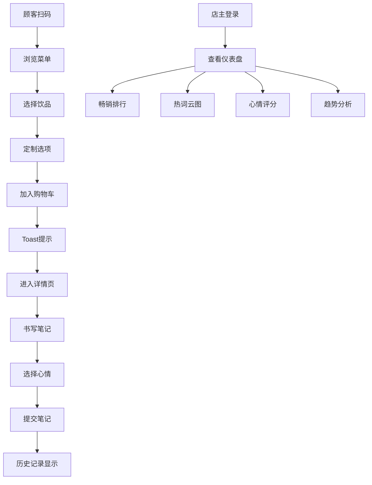

## 1. 产品概述

本项目是专为小型独立咖啡店设计的顾客点单与风味日记系统，通过扫码点单、个性化定制、风味笔记等功能提升顾客体验，同时为店主提供数据洞察以优化菜单。

- 核心价值：简化点单流程、增强顾客参与感、帮助店主了解顾客偏好
- 目标用户：咖啡店顾客（扫码点单）、咖啡店店主（后台管理）

## 2. 核心功能

### 2.1 用户角色

| 角色 | 登录方式 | 核心权限 |
|------|----------|----------|
| 顾客 | 无需登录，扫码访问 | 浏览菜单、定制饮品、提交订单、书写风味笔记、标记心情 |
| 店主 | /login 密码登录 | 查看点单记录、畅销排行、笔记热词、心情评分、点单趋势 |

### 2.2 功能模块

1. **菜单展示页**：饮品卡片列表、定制选项、购物车、Toast提示
2. **饮品详情页**：饮品大图、详细信息、定制表单、笔记提交、历史笔记
3. **店主仪表盘**：畅销排行榜、热词云图、心情评分、趋势折线图

### 2.3 页面详情

| 页面名称 | 模块名称 | 功能描述 |
|----------|----------|----------|
| 菜单展示页 | 饮品卡片 | 展示饮品缩略图、名称、价格、描述，点击弹出大图 |
| 菜单展示页 | 定制选项 | 下拉选择牛奶/糖浆类型，滑块调节浓缩份数、冰块量 |
| 菜单展示页 | 购物车 | 加入购物车后Toast提示，浅绿色带对勾图标 |
| 饮品详情页 | 笔记提交 | textarea 200字上限，虚线聚焦边框，背景#fafafa |
| 饮品详情页 | 心情选择 | 5种emoji（开心、悠闲、提神、失望、惊喜），42px大小，选中放大1.2倍 |
| 饮品详情页 | 历史笔记 | 按时间倒序排列，带淡入动画0.4s |
| 店主仪表盘 | 畅销排行 | 左端数字排名，红色渐变#ff5252到#ff1744 |
| 店主仪表盘 | 热词云图 | Canvas绘制，词频8-24px，随机旋转，颜色#4fc3f7到#7c4dff渐变 |
| 店主仪表盘 | 趋势折线图 | 近七日点单趋势，Canvas绘制 |

## 3. 核心流程

顾客扫码进入菜单页 → 浏览饮品 → 选择饮品并定制 → 加入购物车（Toast提示）→ 进入详情页 → 书写风味笔记 → 选择心情 → 提交笔记 → 笔记显示在历史记录区

店主登录 /login → 查看仪表盘 → 分析畅销排行、热词云图、心情评分、点单趋势 → 调整菜单

## 4. 用户界面设计

### 4.1 设计风格

- 主色调：米白#f5f0eb（背景）、深棕#5d4037（文字）、珊瑚粉#ff8a80（点缀）
- 辅助色：蓝色#4fc3f7（滑块轨道）、浅绿色#c8e6c9（Toast）、红色渐变#ff5252到#ff1744（排名）
- 按钮样式：圆角8px，按下缩放0.95，反色效果
- 字体：标题使用Playfair Display或衬线字体，正文使用系统字体
- 卡片：y轴2px blur 6px微弱投影，悬停时背景#e8e0d8且左移3px，0.3s过渡
- 动画：页面加载时从下方弹入（translateY 20px→0，透明→不透明，0.5s，各卡片延迟0.1s依次出现）

### 4.2 页面设计概述

| 页面名称 | 模块名称 | UI元素 |
|----------|----------|---------|
| 菜单展示页 | 饮品卡片 | 75x75px圆角8px缩略图，卡片投影，悬停效果，加载动画 |
| 菜单展示页 | 定制控件 | 下拉选择框，滑块（轨道4px高，#4fc3f7，弹性动画0.2s） |
| 菜单展示页 | Toast提示 | 浅绿色#c8e6c9，左端对勾图标，2.5s自动消失 |
| 饮品详情页 | 笔记输入 | textarea，背景#fafafa，虚线聚焦边框，200字计数 |
| 饮品详情页 | 心情选择器 | 5个emoji，42px，选中放大1.2倍，下方文字标签 |
| 饮品详情页 | 历史笔记 | 时间倒序，淡入动画0.4s，带心情emoji |
| 店主仪表盘 | 排行榜 | 红色渐变排名，饮品名称，销量数字 |
| 店主仪表盘 | 词云图 | Canvas绘制，随机旋转，渐变色 |
| 店主仪表盘 | 折线图 | Canvas绘制，近七日数据点和连线 |

### 4.3 响应式设计

- 桌面端：三列网格布局，gap 20px
- 移动端：单列flex-wrap布局
- 触控优化：按钮最小44x44px触控区域，手势友好

### 4.4 性能要求

- 页面交互响应时间 < 200ms
- 笔记列表滚动保持60fps
- 窗口大小变化时重绘不超过一次
- 使用虚拟滚动优化长列表性能
