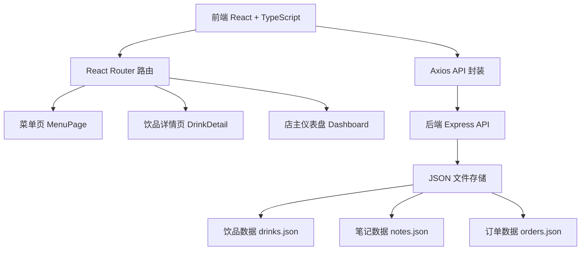
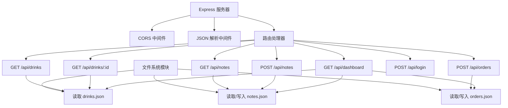
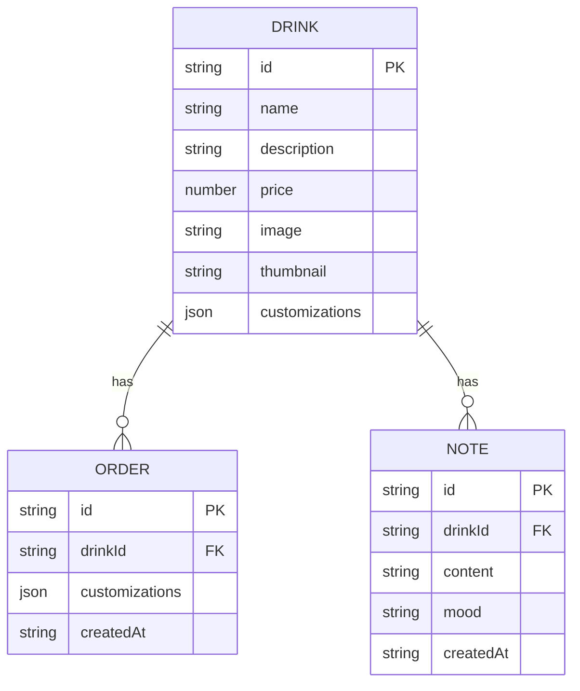

## 1. 架构设计



## 2. 技术描述

- **前端**：React 18 + TypeScript + React Router DOM + Axios
- **后端**：Node.js + Express 4 + TypeScript + ts-node
- **数据存储**：JSON 文件（drinks.json, notes.json, orders.json）
- **开发工具**：react-scripts（Create React App）、ts-node
- **图标**：使用 emoji 作为心情标记，对勾使用 HTML 实体

## 3. 路由定义

| 路由路径 | 页面组件 | 用途 |
|----------|----------|------|
| / | MenuPage | 菜单展示和定制点单页 |
| /drink/:id | DrinkDetail | 饮品详情页，含笔记提交 |
| /login | Login | 店主登录页 |
| /dashboard | Dashboard | 店主后台仪表盘 |

## 4. API 定义

### 类型定义

```typescript
interface Drink {
  id: string;
  name: string;
  description: string;
  price: number;
  image: string;
  thumbnail: string;
  customizations: {
    milkTypes: string[];
    syrupFlavors: string[];
    temperatures: string[];
    espressoShots: { min: number; max: number; default: number };
    iceLevels: { min: number; max: number; default: number };
  };
}

interface Note {
  id: string;
  drinkId: string;
  content: string;
  mood: 'happy' | 'relaxed' | 'energized' | 'disappointed' | 'surprised';
  createdAt: string;
}

interface Order {
  id: string;
  drinkId: string;
  customizations: {
    milkType: string;
    syrupFlavor: string;
    temperature: string;
    espressoShots: number;
    iceLevel: number;
  };
  createdAt: string;
}

interface DashboardStats {
  topDrinks: { drinkId: string; name: string; count: number }[];
  wordCloud: { word: string; count: number }[];
  moodAverages: { drinkId: string; name: string; averageMood: number }[];
  weeklyTrend: { date: string; count: number }[];
}
```

### API 端点

| 方法 | 路径 | 描述 | 请求参数 | 响应 |
|------|------|------|----------|------|
| GET | /api/drinks | 获取饮品列表 | 无 | Drink[] |
| GET | /api/drinks/:id | 获取单个饮品详情 | id (path) | Drink |
| GET | /api/notes | 获取所有笔记 | drinkId (query, optional) | Note[] |
| POST | /api/notes | 创建新笔记 | { drinkId, content, mood } | Note |
| POST | /api/orders | 创建订单 | { drinkId, customizations } | Order |
| GET | /api/dashboard | 获取仪表盘统计 | 无 | DashboardStats |
| POST | /api/login | 店主登录 | { password } | { success: boolean } |

## 5. 服务端架构



## 6. 数据模型

### 6.1 实体关系



### 6.2 初始化数据

#### drinks.json
```json
[
  {
    "id": "uuid-1",
    "name": "季节拿铁",
    "description": "当季限定风味，丝滑醇厚",
    "price": 38,
    "image": "https://images.unsplash.com/photo-1570968915860-54d5c301fa9f?w=800",
    "thumbnail": "https://images.unsplash.com/photo-1570968915860-54d5c301fa9f?w=150",
    "customizations": {
      "milkTypes": ["全脂奶", "脱脂奶", "燕麦奶", "椰奶"],
      "syrupFlavors": ["香草", "焦糖", "榛果", "无糖"],
      "temperatures": ["热饮", "冰饮", "常温"],
      "espressoShots": { "min": 1, "max": 4, "default": 2 },
      "iceLevels": { "min": 0, "max": 100, "default": 50 }
    }
  }
]
```

#### notes.json
```json
[
  {
    "id": "note-uuid-1",
    "drinkId": "uuid-1",
    "content": "丝滑的口感，焦糖香气浓郁，非常适合下午时光。",
    "mood": "happy",
    "createdAt": "2026-06-15T10:30:00Z"
  }
]
```

#### orders.json
```json
[
  {
    "id": "order-uuid-1",
    "drinkId": "uuid-1",
    "customizations": {
      "milkType": "全脂奶",
      "syrupFlavor": "焦糖",
      "temperature": "冰饮",
      "espressoShots": 2,
      "iceLevel": 50
    },
    "createdAt": "2026-06-15T10:25:00Z"
  }
]
```

## 7. 项目结构

```
.
├── package.json
├── tsconfig.json
├── index.html
├── public/
├── server/
│   ├── index.ts
│   └── data/
│       ├── drinks.json
│       ├── notes.json
│       └── orders.json
└── src/
    ├── App.tsx
    ├── components/
    │   ├── MenuPage.tsx
    │   ├── DrinkDetail.tsx
    │   ├── NotesFeed.tsx
    │   └── Dashboard.tsx
    └── utils/
        └── api.ts
```
