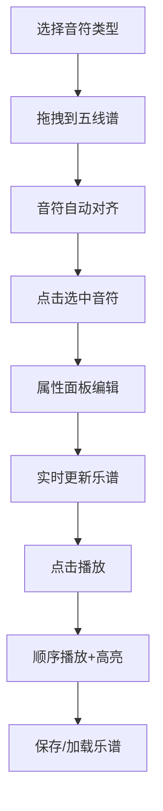

## 1. 产品概述

交互式乐谱编辑与播放预览应用，用户可通过拖拽音符到五线谱上创建简单旋律，并实时播放听取效果。

- 主要用途：音乐创作入门、简单旋律编辑与试听
- 目标用户：音乐爱好者、初学者、教育场景
- 产品价值：降低音乐创作门槛，提供可视化的乐谱编辑体验

## 2. 核心功能

### 2.1 功能模块

1. **音符选择栏**：提供四种音符类型（全音符、二分音符、四分音符、八分音符），支持拖拽到五线谱
2. **五线谱编辑区**：Canvas 绘制五线谱，支持音符放置、选中、编辑
3. **属性编辑面板**：编辑选中音符的音高、时长、延音点
4. **播放控制区**：播放/暂停/停止、速度调节、进度显示
5. **乐谱保存/加载**：JSON 格式序列化，.melody 文件导入导出

### 2.2 页面详情

| 页面名称 | 模块名称 | 功能描述 |
|---------|---------|----------|
| 主页面 | 音符选择栏 | 四种音符类型按钮，支持拖拽放置 |
| 主页面 | 五线谱面板 | 800x300 画布，显示五线谱和音符，支持交互 |
| 主页面 | 属性面板 | 编辑选中音符的音高、时长、延音点 |
| 主页面 | 播放控制区 | 播放/暂停/停止按钮、速度滑块、进度条 |
| 主页面 | 保存/加载按钮 | 导出/导入 .melody 文件 |

## 3. 核心流程

用户从左侧音符选择栏拖拽音符到五线谱区域 → 音符按音高位置和节拍对齐放置 → 点击音符可选中并在右侧属性面板编辑 → 点击播放按钮按顺序播放旋律，当前音符高亮显示 → 可保存乐谱为文件或加载已有乐谱。

## 4. 用户界面设计

### 4.1 设计风格

- 主题：深色主题，背景色 #1e1e1e
- 面板：圆角卡片设计（圆角 12px），背景色 #2d2d2d，阴影 0 2px 8px rgba(0,0,0,0.3)
- 主色调：蓝色 #2196f3（保存）、绿色 #4caf50（播放）、橙色 #ff9800（加载）、红色 #ff5252（高亮）
- 按钮：圆角 4px，悬停过渡 0.2s，点击缩放 0.95 倍
- 字体：系统默认无衬线字体，确保可读性

### 4.2 页面设计概述

| 页面名称 | 模块名称 | UI 元素 |
|---------|---------|--------|
| 主页面 | 音符选择栏 | 4 个圆形按钮（直径 40px），深色背景，悬停放大 |
| 主页面 | 五线谱面板 | 800x300 画布，白纸色背景，五条黑色谱线 |
| 主页面 | 属性面板 | 宽 200px，深色背景，圆角 8px，包含音高、时长、延音点控件 |
| 主页面 | 播放控制区 | 高度 60px，播放/暂停/停止按钮，速度滑块，进度条 |

### 4.3 响应式

- 桌面端优先设计
- 页面最小宽度 900px
- 小屏设备自动缩放适配

### 4.4 交互动效

- 音符拖拽预览：半透明（不透明度 0.5）跟随鼠标
- 选中状态：蓝色虚线轮廓（#4a90d9，2px 宽）
- 播放高亮：红色（#ff5252）+ 缩放动画（1.05 倍，0.1s）
- 按钮悬停：背景色过渡 0.2s
- 按钮点击：缩放 0.95 倍，0.1s
- 提示消息：右上角弹出，2 秒后消失
