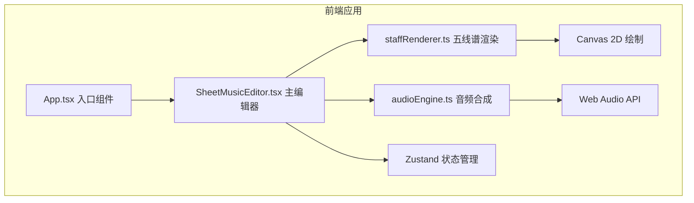

## 1. 架构设计



## 2. 技术描述

- 前端框架：React 18 + TypeScript
- 构建工具：Vite + @vitejs/plugin-react
- 状态管理：Zustand
- 渲染技术：Canvas 2D API（五线谱绘制）
- 音频技术：Web Audio API（钢琴音色合成）
- 样式方案：原生 CSS（全局样式文件）

## 3. 核心模块说明

### 3.1 五线谱渲染模块 (staffRenderer.ts)

- 职责：在 Canvas 上绘制五线谱、谱号、音符符号
- 输入：音符数据数组、当前播放索引
- 输出：Canvas 绘制结果
- 关键功能：
  - 绘制五条谱线（间距 8px，颜色 #333）
  - 绘制不同类型音符（全、二分、四分、八分）
  - 音高位置映射（C4 到 C6）
  - 当前播放音符高亮（红色 + 缩放动画）
  - 选中音符虚线轮廓

### 3.2 音频合成模块 (audioEngine.ts)

- 职责：封装 Web Audio API，生成钢琴音色
- 关键类/方法：
  - `playNote(pitch: string, duration: number, startTime?: number)`：播放单个音符
  - `playSequence(notes: Note[], bpm: number)`：顺序播放音符序列
  - `stop()`：停止播放
  - `pause()` / `resume()`：暂停/恢复
- 钢琴音色实现：使用多个振荡器叠加 + 包络（ADSR）模拟钢琴音色

### 3.3 乐谱编辑器组件 (SheetMusicEditor.tsx)

- 职责：主编辑器逻辑，拖拽交互，状态管理
- 子组件：
  - PlaybackPanel：播放控制面板
  - 属性面板：音符属性编辑
- 关键功能：
  - 拖拽音符放置（HTML5 Drag & Drop API）
  - 节拍自动对齐
  - 音符重叠自动偏移
  - 音符选中与属性编辑
  - 播放进度同步

### 3.4 状态管理 (Zustand)

- 状态：
  - notes: Note[] 音符数组
  - selectedNoteId: string | null 选中音符ID
  - currentPlayIndex: number 当前播放索引
  - isPlaying: boolean 播放状态
  - bpm: number 速度
- 操作：
  - addNote / removeNote / updateNote
  - selectNote
  - setPlayState / setCurrentIndex
  - setBpm

## 4. 数据模型

### 4.1 音符数据结构

```typescript
interface Note {
  id: string;
  type: 'whole' | 'half' | 'quarter' | 'eighth'; // 音符类型
  pitch: string; // 音高，如 'C4', 'D5'
  beatIndex: number; // 节拍位置索引
  dotted: boolean; // 是否加延音点
}
```

### 4.2 乐谱文件格式 (.melody)

```json
{
  "version": "1.0",
  "bpm": 120,
  "notes": [
    {
      "id": "note-1",
      "type": "quarter",
      "pitch": "C4",
      "beatIndex": 0,
      "dotted": false
    }
  ]
}
```

## 5. 性能指标

- 五线谱重绘帧率：≥ 30 FPS
- 音频播放延迟：≤ 50ms
- 响应时间：交互反馈 ≤ 100ms
