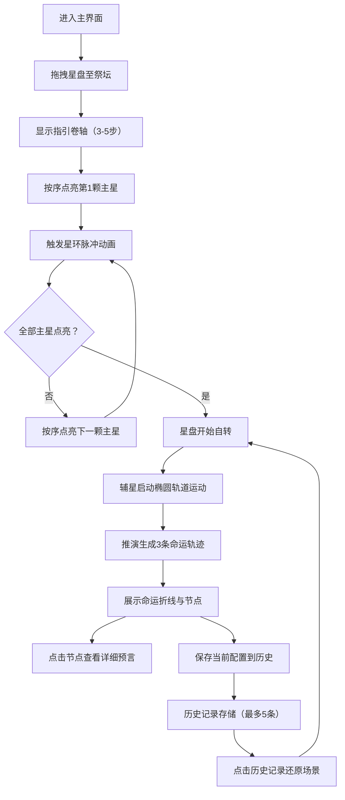

## 1. 产品概述

占星术士星盘推演应用是一款为奇幻角色扮演游戏设计的沉浸式命运预测工具。玩家通过仪式感强烈的星盘构建过程，与命运系统进行深度交互，从而影响游戏剧情走向。

- 核心目标：为RPG游戏提供有深度的、仪式感强的命运决策交互方式
- 目标用户：奇幻RPG游戏玩家、TRPG桌游玩家、沉浸式叙事爱好者
- 产品价值：通过可视化星盘推演增强叙事代入感，让玩家的选择具有宿命般的重量

## 2. 核心功能

### 2.1 用户角色

| 角色 | 注册方式 | 核心权限 |
|------|----------|----------|
| 占星术士（玩家） | 无需注册，直接使用 | 构建星盘、推演命运、保存/回溯历史记录 |

### 2.2 功能模块

1. **星盘构建与星曜推演模块**：恒星拖拽、按序点亮主星、星环脉冲动画、自转与轨道运动
2. **命运轨迹生成模块**：3种命运路径计算、关键事件节点展示、详细预言查看
3. **历史推演回溯模块**：历史记录保存、缩略图展示、场景还原

### 2.3 页面详情

| 页面名称 | 模块名称 | 功能描述 |
|----------|----------|----------|
| 主推演界面 | 中央星盘场景 | 3D星盘渲染、恒星拖拽、点亮交互、自转动画 |
| 主推演界面 | 左侧指引卷轴 | 3-5步点亮顺序指引、金色墨水文字、墨迹渐干效果 |
| 主推演界面 | 右侧历史面板 | 最多5条历史记录、缩略星盘图、时间戳、场景还原 |
| 主推演界面 | 底部状态栏 | 当前相位显示、推演进度条、神祇亲和力条形图 |
| 主推演界面 | 命运轨迹展示 | 3条命运折线、5-7个事件节点、符文图标、预言弹窗 |

## 3. 核心流程

用户拖拽星盘至祭坛 → 按卷轴指引顺序点亮主星（每步触发星环脉冲）→ 星盘自转并启动辅星轨道运动 → 系统推演生成3条命运轨迹 → 点击节点查看预言 → 可保存当前配置至历史记录 → 可从历史记录还原任意星盘状态继续推演

## 4. 用户界面设计

### 4.1 设计风格

- **主色调**：深空蓝紫背景（#0b0c1a），金色主星（#f0d060），淡蓝辅星（#8899cc）
- **文字色**：发光金米色（#e0d0a0），带0.5px金色（#ffd700）发光晕
- **神祇属性色**：力量-赤金红、智慧-星空蓝、诡计-幽暗紫、慈悲-翠绿
- **按钮风格**：像素粒子边框、按下缩小至0.95倍并恢复、图标颜色闪白
- **字体**：衬线体（如Cinzel或Cinzel Decorative）用于仪式感文字，正文使用易读衬线体
- **布局风格**：三栏式（宽屏）→ 上下抽屉式（中屏）→ 全屏触控（小屏）
- **视觉特效**：毛玻璃面板、羊皮纸卷轴、烧痕纹理、星云漩涡背景、星环脉冲、发光字体

### 4.2 页面设计概述

| 页面名称 | 模块名称 | UI元素 |
|----------|----------|--------|
| 主推演界面 | 中央星盘场景 | 直径=视口高60%的圆形区域、星云漩涡纹理、微弱旋转、50颗恒星（12主+38辅） |
| 主推演界面 | 左侧指引卷轴 | 宽240px、半透明羊皮纸、烧痕边缘、金色墨水文字渐干、3-5步指引 |
| 主推演界面 | 右侧历史面板 | 毛玻璃效果（#1a1a3a，0.7透明度，12px模糊）、滑入动画0.3秒 |
| 主推演界面 | 底部状态栏 | 高48px、相位指示器、推演进度条、4种神祇亲和力条形图 |
| 主推演界面 | 命运轨迹 | 折线（3px宽，颜色渐变）、符文节点（24px）、预言弹窗（星空背景） |

### 4.3 响应式设计

- **1024px以上（宽屏）**：三栏式布局，左卷轴+中央星盘+右面板
- **768px-1024px（中屏）**：左侧卷轴折叠为顶部图标按钮，历史面板变为底部抽屉
- **小于768px（移动端）**：星盘全屏，触控手势为主，卷轴和面板可滑出

### 4.4 3D场景指导

- **环境与氛围**：深空背景、星云漩涡纹理（微弱旋转）、低环境光+点光源
- **光照设置**：环境光0.3强度，金色主光0.8强度从上方投射，辅星自发光
- **相机设置**：正交或透视相机，正对星盘平面，可轻微视角倾斜
- **动画组成**：星盘自转（8秒/圈）、辅星椭圆轨道运动（0.5-1.2圈/秒随机）、星环脉冲（半径0→100px，0.4秒，神祇属性色）
- **交互与动画**：拖拽放置、点击点亮、平滑过渡（0.2-0.3秒ease）
- **后处理效果**：Bloom发光效果、轻微色差
- **性能预算**：60FPS流畅运行，星盘初始构建<1秒，历史恢复<0.3秒
