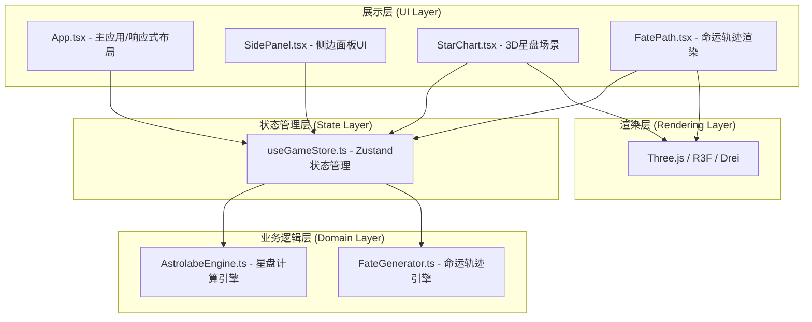
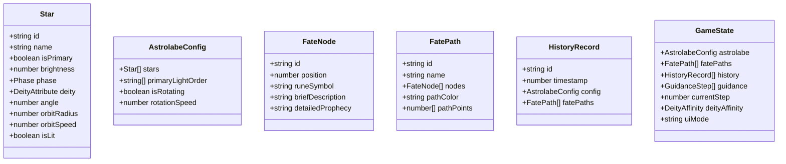

## 1. 架构设计



## 2. 技术说明

- **前端框架**：React 18 + TypeScript（严格模式）
- **构建工具**：Vite 5（含路径别名@ → src）
- **3D渲染**：Three.js + @react-three/fiber + @react-three/drei
- **状态管理**：Zustand
- **唯一标识**：uuid
- **样式方案**：CSS Modules + CSS变量（全局主题色）
- **初始化方式**：npm init vite-init（react-ts模板）

## 3. 路由定义

| 路由 | 用途 |
|------|------|
| / | 主推演界面（单页应用，无多路由） |

## 4. 数据模型

### 4.1 核心类型定义



### 4.2 枚举与辅助类型

- **Phase**：顺行(prograde) | 逆行(retrograde)
- **DeityAttribute**：力量(strength) | 智慧(wisdom) | 诡计(trickery) | 慈悲(compassion)
- **DeityAffinity**：{ strength: number, wisdom: number, trickery: number, compassion: number }（范围0-100）
- **GuidanceStep**：{ order: number, starId: string, instruction: string, inkDryness: number }

## 5. 模块职责与文件组织

```
src/
├── main.tsx                          # React入口，挂载App
├── components/
│   ├── App.tsx                       # 主应用，布局组装，响应式控制
│   ├── store/
│   │   └── useGameStore.ts           # Zustand状态：星盘/命运/历史/UI
│   └── ui/
│       └── SidePanel.tsx             # 左侧卷轴+右侧历史面板
├── modules/
│   ├── astrolabe/
│   │   ├── AstrolabeEngine.ts        # 恒星生成、相位计算、推演规则（纯函数）
│   │   └── StarChart.tsx             # R3F星盘3D场景+动画
│   └── fate/
│       ├── FateGenerator.ts          # 命运轨迹规则引擎（纯函数）
│       └── FatePath.tsx              # R3F命运折线+节点渲染
└── styles/
    └── globals.css                   # 全局CSS变量与主题
```

## 6. 性能优化策略

- **计算与渲染分离**：AstrolabeEngine与FateGenerator为纯函数模块，与UI/渲染层解耦
- **requestAnimationFrame驱动**：所有3D动画通过R3F useFrame钩子统一调度
- **对象池化**：星环脉冲等临时对象复用Geometry/Material
- **按需渲染**：星盘未自转时降低帧率，交互时恢复60FPS
- **状态最小化**：Zustand仅存储必要数据，避免不必要的重渲染
- **响应式缓存**：历史记录保存为完整可还原快照，恢复时间<0.3秒
