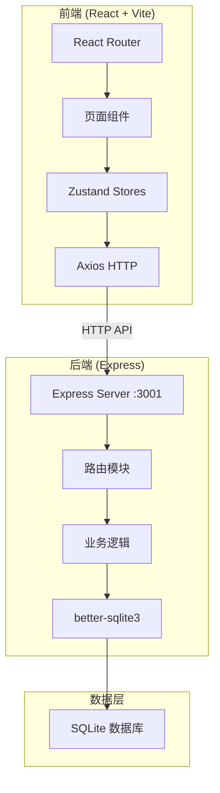
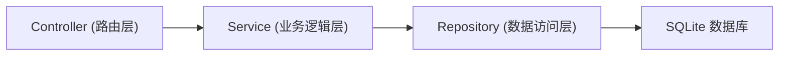
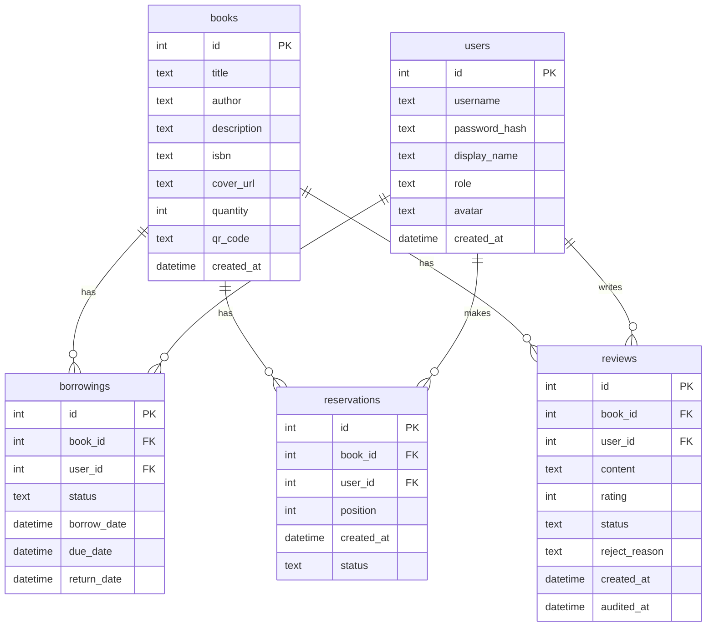

## 1. 架构设计



## 2. 技术说明

- 前端：React@18 + TypeScript(严格模式) + Vite@5 + TailwindCSS
- 状态管理：Zustand
- HTTP通信：Axios
- 后端：Express@4 + TypeScript
- 数据库：SQLite (better-sqlite3)
- 密码加密：bcrypt
- 唯一标识：uuid
- 初始化工具：vite-init (react-express-ts模板)

## 3. 路由定义

| 路由 | 用途 |
|------|------|
| `/` | 书籍列表页，展示所有书籍卡片网格 |
| `/book/:id` | 书籍详情页，展示详情、借阅/预约、书评 |
| `/profile` | 会员个人中心，借阅和预约记录 |
| `/admin` | 管理员统计看板 |
| `/admin/books/new` | 管理员书籍入库表单 |
| `/admin/reviews` | 管理员书评审核列表 |
| `/login` | 会员登录页 |
| `/register` | 会员注册页 |

## 4. API定义

### 4.1 书籍相关

```typescript
GET /api/books?page=1&limit=12&search=&status=
Response: { books: Book[], total: number, page: number }

GET /api/books/:id
Response: Book & { reviews: Review[] }

POST /api/books
Body: { title: string, author: string, description: string, isbn: string, coverUrl: string, quantity: number }
Response: Book
```

### 4.2 用户相关

```typescript
POST /api/users/login
Body: { username: string, password: string }
Response: { user: User, token: string }

POST /api/users/register
Body: { username: string, password: string, displayName: string }
Response: { user: User, token: string }

GET /api/users/:id
Response: User & { borrowings: Borrowing[] }
```

### 4.3 借阅预约相关

```typescript
POST /api/borrowings
Body: { bookId: number, userId: number }
Response: Borrowing

PUT /api/borrowings/:id/return
Response: { success: boolean, nextReservation: Reservation | null }
```

### 4.4 书评相关

```typescript
POST /api/reviews
Body: { bookId: number, userId: number, content: string, rating: number }
Response: Review

PUT /api/reviews/:id/audit
Body: { approved: boolean, rejectReason?: string }
Response: Review

GET /api/reviews/book/:bookId
Response: Review[]

GET /api/reviews/pending
Response: Review[]
```

### 4.5 统计相关

```typescript
GET /api/stats
Response: { totalBooks: number, totalMembers: number, monthlyBorrowings: number, pendingReviews: number, weeklyTrend: { date: string, count: number }[] }
```

## 5. 服务端架构图



## 6. 数据模型

### 6.1 数据模型定义



### 6.2 数据定义语言

```sql
CREATE TABLE books (
  id INTEGER PRIMARY KEY AUTOINCREMENT,
  title TEXT NOT NULL,
  author TEXT NOT NULL,
  description TEXT DEFAULT '',
  isbn TEXT DEFAULT '',
  cover_url TEXT DEFAULT '',
  quantity INTEGER DEFAULT 1,
  qr_code TEXT DEFAULT '',
  created_at DATETIME DEFAULT CURRENT_TIMESTAMP
);

CREATE TABLE users (
  id INTEGER PRIMARY KEY AUTOINCREMENT,
  username TEXT NOT NULL UNIQUE,
  password_hash TEXT NOT NULL,
  display_name TEXT NOT NULL,
  role TEXT NOT NULL DEFAULT 'member',
  avatar TEXT DEFAULT '',
  created_at DATETIME DEFAULT CURRENT_TIMESTAMP
);

CREATE TABLE borrowings (
  id INTEGER PRIMARY KEY AUTOINCREMENT,
  book_id INTEGER NOT NULL REFERENCES books(id),
  user_id INTEGER NOT NULL REFERENCES users(id),
  status TEXT NOT NULL DEFAULT 'active',
  borrow_date DATETIME DEFAULT CURRENT_TIMESTAMP,
  due_date DATETIME NOT NULL,
  return_date DATETIME,
  FOREIGN KEY (book_id) REFERENCES books(id),
  FOREIGN KEY (user_id) REFERENCES users(id)
);

CREATE TABLE reservations (
  id INTEGER PRIMARY KEY AUTOINCREMENT,
  book_id INTEGER NOT NULL REFERENCES books(id),
  user_id INTEGER NOT NULL REFERENCES users(id),
  position INTEGER NOT NULL,
  status TEXT NOT NULL DEFAULT 'waiting',
  created_at DATETIME DEFAULT CURRENT_TIMESTAMP,
  FOREIGN KEY (book_id) REFERENCES books(id),
  FOREIGN KEY (user_id) REFERENCES users(id)
);

CREATE TABLE reviews (
  id INTEGER PRIMARY KEY AUTOINCREMENT,
  book_id INTEGER NOT NULL REFERENCES books(id),
  user_id INTEGER NOT NULL REFERENCES users(id),
  content TEXT NOT NULL,
  rating INTEGER NOT NULL CHECK(rating >= 1 AND rating <= 5),
  status TEXT NOT NULL DEFAULT 'pending',
  reject_reason TEXT DEFAULT '',
  created_at DATETIME DEFAULT CURRENT_TIMESTAMP,
  audited_at DATETIME,
  FOREIGN KEY (book_id) REFERENCES books(id),
  FOREIGN KEY (user_id) REFERENCES users(id)
);

CREATE INDEX idx_borrowings_book ON borrowings(book_id);
CREATE INDEX idx_borrowings_user ON borrowings(user_id);
CREATE INDEX idx_reservations_book ON reservations(book_id);
CREATE INDEX idx_reviews_book ON reviews(book_id);
CREATE INDEX idx_reviews_status ON reviews(status);
```
