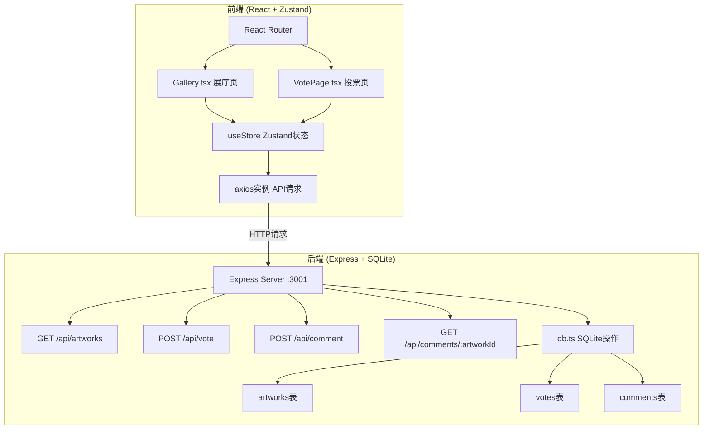
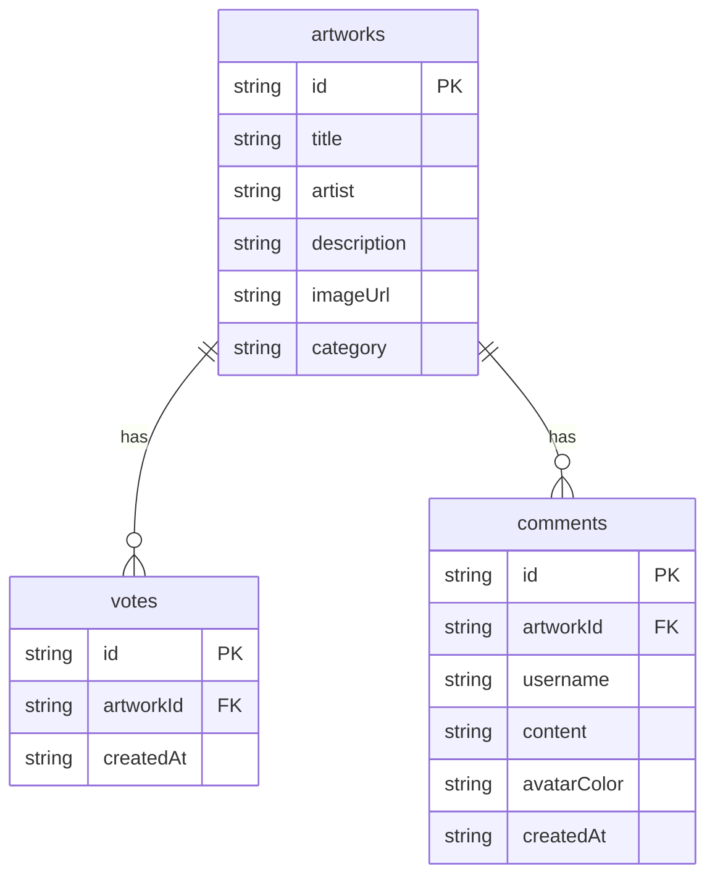

## 1. 架构设计



## 2. 技术说明
- 前端：React@18 + TypeScript + Zustand + React Router + Tailwind CSS + Vite
- 初始化工具：vite-init (react-express-ts模板)
- 后端：Express@4 + TypeScript + better-sqlite3 + cors + uuid
- 数据库：SQLite (better-sqlite3)
- 数据流向：前端Store通过axios → 后端API → SQLite数据库

## 3. 路由定义
| 路由 | 用途 |
|------|------|
| / | 虚拟展厅主页，瀑布流展示12件艺术品 |
| /vote | 投票与留言页，热度排行模式 |

## 4. API定义

### 4.1 TypeScript类型定义
```typescript
interface Artwork {
  id: string;
  title: string;
  artist: string;
  description: string;
  imageUrl: string;
  category: string;
  voteCount: number;
}

interface Vote {
  id: string;
  artworkId: string;
  createdAt: string;
}

interface Comment {
  id: string;
  artworkId: string;
  username: string;
  content: string;
  avatarColor: string;
  createdAt: string;
}
```

### 4.2 请求/响应模式
| 接口 | 方法 | 请求体 | 响应 |
|------|------|--------|------|
| /api/artworks | GET | - | { artworks: Artwork[] } |
| /api/vote | POST | { artworkId: string } | { success: boolean, voteCount: number } |
| /api/comment | POST | { artworkId: string, username: string, content: string } | { success: boolean, comment: Comment } |
| /api/comments/:artworkId | GET | - | { comments: Comment[] } |

## 5. 服务器架构图

```mermaid
flowchart LR
    "Router 路由层" --> "Controller 控制层"
    "Controller 控制层" --> "Service 服务层"
    "Service 服务层" --> "Repository 数据层"
    "Repository 数据层" --> "SQLite 数据库"
```

## 6. 数据模型

### 6.1 数据模型定义



### 6.2 数据定义语言
```sql
CREATE TABLE IF NOT EXISTS artworks (
  id TEXT PRIMARY KEY,
  title TEXT NOT NULL,
  artist TEXT NOT NULL,
  description TEXT NOT NULL,
  imageUrl TEXT NOT NULL,
  category TEXT NOT NULL
);

CREATE TABLE IF NOT EXISTS votes (
  id TEXT PRIMARY KEY,
  artworkId TEXT NOT NULL,
  createdAt TEXT NOT NULL,
  FOREIGN KEY (artworkId) REFERENCES artworks(id)
);

CREATE TABLE IF NOT EXISTS comments (
  id TEXT PRIMARY KEY,
  artworkId TEXT NOT NULL,
  username TEXT NOT NULL,
  content TEXT NOT NULL,
  avatarColor TEXT NOT NULL,
  createdAt TEXT NOT NULL,
  FOREIGN KEY (artworkId) REFERENCES artworks(id)
);

-- 初始数据：12件艺术品，使用picsum图片
INSERT INTO artworks (id, title, artist, description, imageUrl, category) VALUES
('1', '星夜', '梵高', '后印象派代表作品，旋涡般的夜空与宁静的村庄形成强烈对比', 'https://picsum.photos/seed/art1/640/480', '后印象派'),
('2', '睡莲', '莫奈', '印象派大师对光影与水面的极致追求', 'https://picsum.photos/seed/art2/640/480', '印象派'),
('3', '呐喊', '蒙克', '表现主义经典，扭曲的人形与血红天空', 'https://picsum.photos/seed/art3/640/480', '表现主义'),
('4', '记忆的永恒', '达利', '超现实主义代表作，融化的时钟象征时间的主观性', 'https://picsum.photos/seed/art4/640/480', '超现实主义'),
('5', '格尔尼卡', '毕加索', '立体主义反战巨作，控诉战争的残酷', 'https://picsum.photos/seed/art5/640/480', '立体主义'),
('6', '戴珍珠耳环的少女', '维米尔', '巴洛克时期经典肖像画，神秘少女的回眸', 'https://picsum.photos/seed/art6/640/480', '巴洛克'),
('7', '神奈川冲浪里', '葛饰北斋', '浮世绘名作，巨浪与远处富士山的对比', 'https://picsum.photos/seed/art7/640/480', '浮世绘'),
('8', '创世纪', '米开朗基罗', '文艺复兴壁画，上帝与亚当指尖相触的瞬间', 'https://picsum.photos/seed/art8/640/480', '文艺复兴'),
('9', '吻', '克里姆特', '新艺术运动金色时期杰作，金色装饰与爱侣', 'https://picsum.photos/seed/art9/640/480', '新艺术运动'),
('10', '大碗岛的星期天', '修拉', '点彩派开山之作，无数色点构成的午后', 'https://picsum.photos/seed/art10/640/480', '点彩派'),
('11', '自由引导人民', '德拉克罗瓦', '浪漫主义巨作，自由女神高举三色旗', 'https://picsum.photos/seed/art11/640/480', '浪漫主义'),
('12', '维纳斯的诞生', '波提切利', '文艺复兴早期神话画作，维纳斯从海中诞生', 'https://picsum.photos/seed/art12/640/480', '文艺复兴');
```

## 7. 文件结构与调用关系

```
project/
├── package.json              # 依赖与脚本
├── vite.config.ts            # Vite配置，代理/api到:3001
├── tsconfig.json             # TypeScript严格模式
├── index.html                # HTML入口
├── client/
│   └── src/
│       ├── main.tsx          # React入口，挂载Router→App
│       ├── App.tsx           # 路由配置 /→Gallery /vote→VotePage
│       ├── store/
│       │   └── useStore.ts   # Zustand状态(artworks,selectedArtwork,votes,comments)，axios请求
│       ├── pages/
│       │   ├── Gallery.tsx   # 展厅页，调用store获取artworks，渲染瀑布流+详情弹窗
│       │   └── VotePage.tsx  # 投票页，排行模式+留言墙，调用store投票/留言
│       └── components/
│           ├── Sidebar.tsx   # 左侧导航栏，Logo+路由切换
│           ├── ArtworkCard.tsx  # 作品卡片，封面+名称+艺术家+爱心
│           ├── DetailModal.tsx  # 详情弹窗，大图+热度条+留言区
│           ├── HeatBar.tsx   # 渐变热度条组件
│           ├── CommentList.tsx  # 留言流组件
│           └── MedalIcon.tsx # 金银铜奖牌SVG组件
├── server/
│   └── src/
│       ├── index.ts          # Express入口，初始化DB，注册路由，监听:3001
│       └── db.ts             # SQLite初始化，建表，查询函数
└── shared/
    └── types.ts              # 前后端共享类型定义
```

数据流向：
1. 前端store(useStore.ts) → axios → 后端API(server/src/index.ts)
2. 后端API → db.ts查询函数 → SQLite数据库
3. SQLite响应 → 后端API返回JSON → store更新 → 组件重渲染
