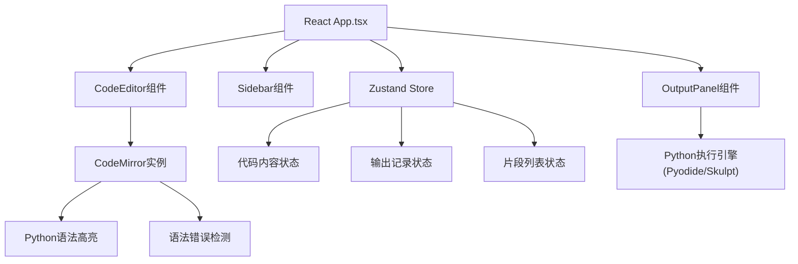

## 1. 架构设计



## 2. 技术描述
- 前端: React@18 + TypeScript + Vite
- 代码编辑: CodeMirror 6 + @codemirror/lang-python + @codemirror/theme-one-dark
- 状态管理: Zustand
- Python执行: 浏览器端沙盒执行
- 样式: 原生CSS + CSS Variables

## 3. 文件结构
```
src/
├── main.tsx          # React入口
├── App.tsx           # 主布局组件，三栏布局管理
├── store.ts          # Zustand状态管理
├── CodeEditor.tsx    # CodeMirror编辑器封装
├── OutputPanel.tsx   # 输出面板组件
└── Sidebar.tsx       # 侧边栏片段管理组件
```

## 4. 状态管理定义

### 4.1 核心数据模型

```typescript
interface Snippet {
  id: string;
  title: string;
  code: string;
  createdAt: number;
  updatedAt: number;
}

interface OutputRecord {
  id: string;
  type: 'stdout' | 'stderr';
  content: string;
  timestamp: number;
}

interface AppState {
  code: string;
  currentSnippetId: string | null;
  snippets: Snippet[];
  outputs: OutputRecord[];
  sidebarCollapsed: boolean;
  sidebarWidth: number;
  outputWidth: number;
  
  setCode: (code: string) => void;
  addOutput: (record: Omit<OutputRecord, 'id' | 'timestamp'>) => void;
  clearOutputs: () => void;
  createSnippet: () => void;
  deleteSnippet: (id: string) => void;
  renameSnippet: (id: string, title: string) => void;
  loadSnippet: (id: string) => void;
  exportSnippet: (id: string) => void;
  importSnippet: (file: File) => void;
  toggleSidebar: () => void;
  setSidebarWidth: (width: number) => void;
  setOutputWidth: (width: number) => void;
}
```

## 5. 组件接口

### 5.1 CodeEditor Props
```typescript
interface CodeEditorProps {
  value: string;
  onChange: (value: string) => void;
  onRun: () => void;
}
```

### 5.2 OutputPanel Props
```typescript
interface OutputPanelProps {
  outputs: OutputRecord[];
  onClear: () => void;
}
```

### 5.3 Sidebar Props
```typescript
interface SidebarProps {
  snippets: Snippet[];
  currentId: string | null;
  collapsed: boolean;
  width: number;
  onToggle: () => void;
  onSelect: (id: string) => void;
  onCreate: () => void;
  onDelete: (id: string) => void;
  onRename: (id: string, title: string) => void;
  onExport: (id: string) => void;
  onImport: (file: File) => void;
  onWidthChange: (width: number) => void;
}
```

## 6. 性能要求
- 编辑器键入延迟: <50ms
- 输出渲染延迟: <100ms
- 侧边栏滚动帧率: ≥50FPS
- 代码格式化处理时间: <200ms
- 编辑器支持: 50KB代码无卡顿
- 输出记录上限: 50条，自动清理最旧记录
