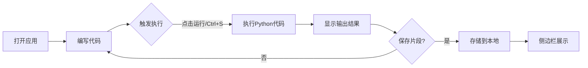

## 1. 产品概述
Python代码沙盒是一个面向开发者的交互式在线代码编辑器，允许用户在浏览器中编写、运行和管理Python代码片段，无需本地安装Python环境。主要解决快速试错、代码片段记录和分享的需求。

## 2. 核心功能

### 2.1 用户角色
| 角色 | 注册方式 | 核心权限 |
|------|----------|----------|
| 普通用户 | 无需注册 | 编写、运行、保存、管理代码片段 |

### 2.2 功能模块
1. **代码编辑器**: 多行代码输入、语法高亮、实时语法错误检测、快捷键执行
2. **输出面板**: print输出显示、Traceback错误提示、时间戳记录、清除/复制功能
3. **侧边栏管理**: 片段列表、新建/删除/重命名/导出/导入片段

### 2.3 页面详情
| 页面名称 | 模块名称 | 功能描述 |
|----------|----------|----------|
| 主页 | 侧边栏 | 展示代码片段列表，支持新建、删除、重命名、导出、导入操作 |
| 主页 | 功能栏 | 运行按钮、格式化按钮、清空按钮 |
| 主页 | 代码编辑器 | 支持多行Python代码编辑、语法高亮、语法错误实时标记 |
| 主页 | 输出面板 | 显示执行结果、错误信息、时间戳、清除和复制功能 |

## 3. 核心流程
用户打开应用 → 在编辑器编写Python代码 → 点击运行按钮或按Ctrl+S → 代码在浏览器沙盒中执行 → 输出结果显示在右侧面板 → 用户可通过侧边栏保存/加载/管理代码片段

## 4. 用户界面设计

### 4.1 设计风格
- 主背景色: #1e1e2e，辅背景色: #252526，侧栏背景: #333333
- 文字主色: #d4d4d4，注释绿色: #6a9955，关键字蓝色: #569cd6，字符串橙色: #ce9178，错误红色: #f44747
- 运行按钮: 蓝色渐变#007acc到#005a9e，圆角6px，悬停亮度+15%，点击缩放0.95
- 字体: 等宽字体，编辑器16px，行高1.6；输出14px；时间戳12px

### 4.2 页面设计概述
| 页面名称 | 模块名称 | UI元素 |
|----------|----------|--------|
| 主页 | 侧边栏 | 半透明模糊背景#333333，宽240px，列表展示片段，底部新建/导入按钮 |
| 主页 | 功能栏 | 高40px，深灰#333333，运行/格式化/清空按钮 |
| 主页 | 代码编辑器 | 背景#1e1e2e，行号显示，语法高亮，错误波浪线标记 |
| 主页 | 输出面板 | 背景#252526，宽400px，竖向滚动，时间戳+输出记录，底部清除/复制按钮 |

### 4.3 响应式
- 桌面端(≥1200px): 三栏布局(侧栏240px + 编辑器 + 输出400px)，可拖动分隔条调整宽度
- 平板(768px~1200px): 侧边栏折叠为图标按钮，展开时滑动动画0.3s
- 移动端(<768px): 输出面板置于编辑器下方，垂直布局

### 4.4 交互细节
- 分隔条: 宽4px，悬停显示#007acc高亮，拖拽时col-resize光标
- 新建片段按钮: 加号图标，绿色#2ecc71，悬停放大1.1倍
- 复制成功提示: 0.5s绿色#2ecc71提示"已复制到剪贴板"
- 清除动画: 面板内容渐隐消失0.3s
- 格式化动画: 1.5s运行状态动画
- 导出动画: 下载动画1s
