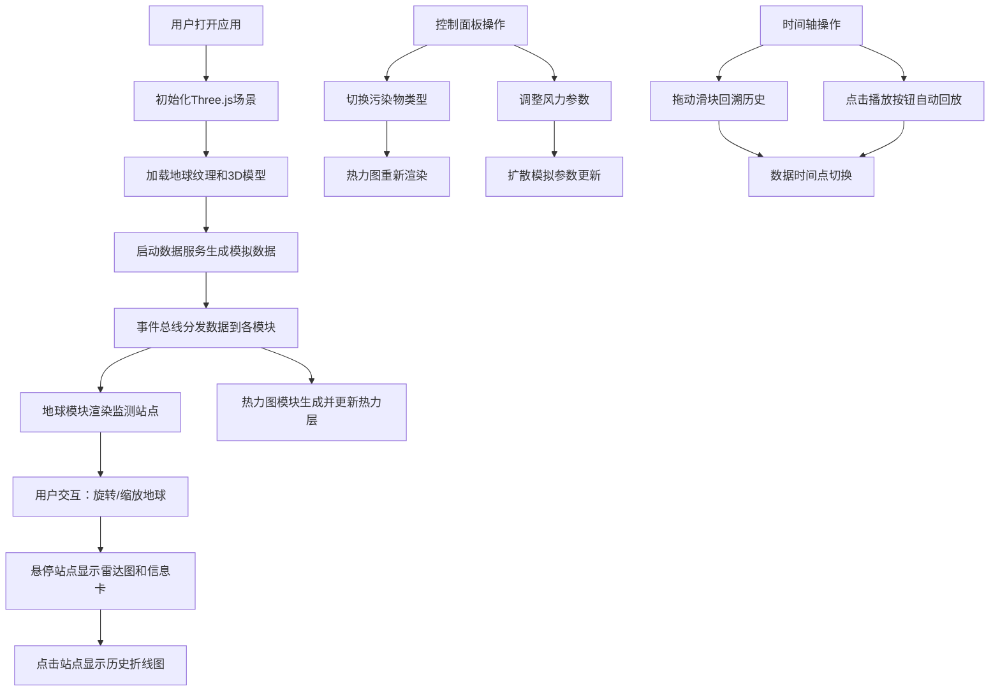

## 1. 产品概述

3D空气质量可视化系统是一个基于Web的交互式数据可视化应用，将城市实时空气质量监测数据动态映射到3D虚拟地球仪上，解决现有2D地图难以直观展现污染物在三维空间中扩散趋势与浓度梯度的问题。

- 主要用途：环境监测、污染分析、数据展示
- 目标用户：环境研究人员、城市规划者、普通公众
- 产品价值：通过沉浸式3D交互体验，直观展示空气质量数据的时空分布特征

## 2. 核心功能

### 2.1 用户角色
| 角色 | 注册方式 | 核心权限 |
|------|----------|----------|
| 访客用户 | 无需注册 | 浏览3D地球、查看监测数据、控制时间轴播放、调整风力参数 |

### 2.2 功能模块
1. **3D地球与数据注入模块**：高分辨率地球渲染、监测站点定位、污染物雷达图展示、悬浮信息卡
2. **热力图与扩散模拟模块**：3D表面热力图层、污染物切换、风力驱动扩散模拟
3. **时间轴回溯与动画播放模块**：24小时数据回放、播放控制、时间标签实时更新
4. **控制面板模块**：数据源选择、污染物切换、风力参数设置
5. **详细历史图表模块**：单个站点历史数据折线图展示

### 2.3 页面详情
| 页面名称 | 模块名称 | 功能描述 |
|----------|----------|----------|
| 主界面 | 3D地球渲染 | 高分辨率纹理贴图地球，支持自由旋转/缩放（鼠标拖拽旋转，滚轮缩放，阻尼系数0.95） |
| 主界面 | 监测站点展示 | 发光小球体随PM2.5浓度线性缩放（半径0.1-0.4单位），颜色从绿色#00e676到红色#ff1744渐变 |
| 主界面 | 雷达图悬浮卡 | 六边形雷达图（宽100px）展示6项污染物，过渡动画0.5s |
| 主界面 | 悬浮信息卡 | 鼠标悬停时小球膨胀1.5倍，弹出白底圆角信息卡（含站点名、AQI、各项浓度） |
| 主界面 | 热力图层 | 3D球体表面半透明热力图（透明度0.4），colormap渐变#00e676→#ffeb3b→#ff1744 |
| 主界面 | 扩散模拟 | 每帧根据风力方向（0-360°）和速度（0-20km/h）动态更新热力分布 |
| 左侧控制面板 | 数据源选择 | 下拉菜单选择不同城市/区域数据源 |
| 左侧控制面板 | 污染物切换 | 标签式按钮组切换PM2.5、PM10、O3、NO2、SO2、CO，活动态底部横线动画0.3s |
| 左侧控制面板 | 风力设置 | 方向角和速度两个滑块，实时调整扩散模拟参数 |
| 底部时间轴 | 时间控制 | 高30px滑块，轨道深灰#333，拖拽头圆形直径14px蓝色#42a5f5 |
| 底部时间轴 | 播放控制 | 24x24px播放按钮，悬浮背景#1565c0圆角50%，点击0.15s缩放反馈 |
| 底部时间轴 | 时间标签 | 字体14px Roboto Mono，实时显示当前时间点 |
| 右侧面板 | 历史折线图 | Canvas绘制单个站点24小时历史数据，线宽2px，圆点直径6px |

## 3. 核心流程

用户打开应用后，3D地球自动加载并开始接收实时监测数据。用户可以通过鼠标拖拽旋转地球、滚轮缩放查看不同区域，点击或悬停监测站点查看详细数据。通过左侧控制面板切换污染物类型、调整风力参数观察扩散效果，通过底部时间轴回放历史数据。

## 4. 用户界面设计

### 4.1 设计风格
- **主色调**：深色星空背景#0a0a1a，营造科技感和沉浸式体验
- **强调色**：蓝色#42a5f5（交互控件）、绿色#00e676（优）、黄色#ffeb3b（良）、红色#ff1744（差）
- **字体**：Roboto Mono（时间标签），系统默认sans-serif（正文）
- **控件风格**：半透明磨砂玻璃效果（backdrop-filter: blur 12px），圆角12px，边框1px solid #2a2a5a
- **交互反馈**：所有控件hover背景变亮10%，按钮点击有缩放动画

### 4.2 页面设计概述
| 页面名称 | 模块名称 | UI元素 |
|----------|----------|--------|
| 主界面 | 3D地球区域 | 全屏3D场景，深色星空背景，地球居中，发光监测站点分布 |
| 主界面 | 左侧控制面板 | 宽280px，半透明#12122a磨砂玻璃，包含下拉菜单、标签按钮组、滑块控件 |
| 主界面 | 底部时间轴 | 高30px，位于屏幕底部，包含播放按钮、滑块轨道、时间标签 |
| 主界面 | 右侧详情面板 | 按需显示，包含Canvas历史折线图，网格线灰#222 |
| 主界面 | 悬浮信息卡 | 白底圆角8px，阴影#00000040，跟随鼠标位置 |
| 主界面 | 雷达图 | 六边形，6个轴不同颜色，过渡动画0.5s |

### 4.3 响应式设计
- **桌面优先**：适配768px以上屏幕
- **布局调整**：小屏幕下控制面板可折叠，时间轴高度自适应
- **触摸优化**：支持触摸手势旋转和缩放地球

### 4.4 3D场景设计
- **环境**：深色星空背景，添加微弱星云粒子效果增强沉浸感
- **光照**：环境光+方向光模拟太阳光，站点小球使用自发光材质
- **相机**：PerspectiveCamera，初始距离地球3单位，支持阻尼平滑运动
- **合成**：后期添加轻微Bloom效果增强发光站点的视觉效果
- **性能**：50个站点粒子+热力图时帧率不低于25FPS，内存不超过300MB
