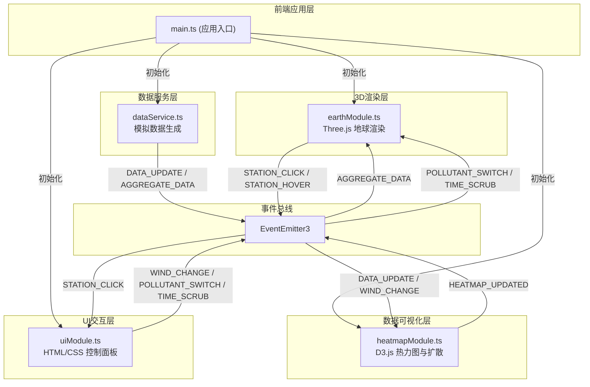

## 1. 架构设计



## 2. 技术描述

- **前端框架**：TypeScript + Vite
- **3D渲染**：Three.js @0.160.x
- **数据可视化**：D3.js @7.8.x (contourDensity用于热力图)
- **事件总线**：eventemitter3 @5.0.x
- **类型定义**：@types/three, @types/d3
- **构建工具**：Vite @5.0.x
- **代码规范**：TypeScript 严格模式，target ES2020

### 模块职责划分

| 模块 | 职责 | 依赖 | 发布事件 | 监听事件 |
|------|------|------|----------|----------|
| dataService.ts | 生成50个监测站的实时和24小时历史数据，每秒更新 | eventemitter3 | DATA_UPDATE, AGGREGATE_DATA | TIME_SCRUB |
| earthModule.ts | 3D地球渲染、监测站小球、雷达图、交互检测 | three, eventemitter3 | STATION_HOVER, STATION_CLICK | AGGREGATE_DATA, POLLUTANT_SWITCH, TIME_SCRUB |
| heatmapModule.ts | 热力图生成、扩散模拟、Canvas纹理更新 | d3, three, eventemitter3 | HEATMAP_UPDATED | DATA_UPDATE, WIND_CHANGE, POLLUTANT_SWITCH |
| uiModule.ts | 控制面板、时间轴、播放按钮、历史图表 | eventemitter3 | WIND_CHANGE, POLLUTANT_SWITCH, TIME_SCRUB, PLAY_TOGGLE | STATION_CLICK, HEATMAP_UPDATED |
| main.ts | 初始化所有模块、绑定事件、管理生命周期 | 所有模块 | - | - |

## 3. 核心数据结构

### 3.1 监测站数据类型

```typescript
interface PollutantData {
  pm25: number;      // PM2.5浓度 (μg/m³)
  pm10: number;      // PM10浓度 (μg/m³)
  o3: number;        // 臭氧浓度 (μg/m³)
  no2: number;       // 二氧化氮浓度 (μg/m³)
  so2: number;       // 二氧化硫浓度 (μg/m³)
  co: number;        // 一氧化碳浓度 (mg/m³)
}

interface Station {
  id: string;
  name: string;
  lat: number;       // 纬度
  lon: number;       // 经度
  current: PollutantData;
  aqi: number;       // 空气质量指数
  history: PollutantData[];  // 24小时历史数据 (1440个时间点)
}

interface WindParams {
  direction: number;  // 方向角 0-360°
  speed: number;      // 速度 0-20 km/h
}

type PollutantType = 'pm25' | 'pm10' | 'o3' | 'no2' | 'so2' | 'co';
```

### 3.2 事件定义

| 事件名 | 数据类型 | 触发时机 |
|--------|----------|----------|
| DATA_UPDATE | `{ stations: Station[], wind: WindParams, timestamp: number }` | 每秒数据更新时 |
| AGGREGATE_DATA | `{ stations: Station[], timestamp: number }` | 聚合数据用于地球模块 |
| WIND_CHANGE | `WindParams` | 用户调整风力滑块时 |
| POLLUTANT_SWITCH | `PollutantType` | 用户切换污染物类型时 |
| TIME_SCRUB | `{ timeIndex: number, isPlaying: boolean }` | 用户拖动时间轴或播放时 |
| PLAY_TOGGLE | `boolean` | 用户点击播放/暂停按钮时 |
| STATION_HOVER | `{ station: Station \| null, screenX: number, screenY: number }` | 鼠标悬停/离开站点时 |
| STATION_CLICK | `Station` | 用户点击站点时 |
| HEATMAP_UPDATED | `{ texture: THREE.CanvasTexture }` | 热力图纹理更新完成时 |

## 4. 性能优化策略

### 4.1 渲染性能
- **实例化渲染**：使用 `THREE.InstancedMesh` 渲染50个站点小球，减少Draw Call
- **纹理复用**：热力图使用单一CanvasTexture，每帧更新像素数据而非重建纹理
- **LOD策略**：地球使用2048x1024纹理，远距离时自动降级采样
- **阻尼动画**：使用OrbitControls的damping参数，避免每帧强制重绘
- **帧率控制**：扩散模拟使用固定时间步长，目标30FPS

### 4.2 内存管理
- **对象池**：监测站Mesh对象复用，避免频繁GC
- **纹理清理**：切换污染物时正确dispose旧纹理
- **数据裁剪**：历史数据按需加载，避免一次性加载全部1440个时间点

### 4.3 热力图优化
- **离屏Canvas**：使用OffscreenCanvas在Worker中计算热力图（可选降级方案）
- **密度网格**：使用D3的contourDensity生成等值线，而非逐像素计算
- **增量更新**：扩散模拟只更新变化区域，而非全图重绘

## 5. 关键实现方案

### 5.1 经纬度转3D坐标
```typescript
function latLonToVector3(lat: number, lon: number, radius: number): THREE.Vector3 {
  const phi = (90 - lat) * (Math.PI / 180);
  const theta = (lon + 180) * (Math.PI / 180);
  return new THREE.Vector3(
    -radius * Math.sin(phi) * Math.cos(theta),
    radius * Math.cos(phi),
    radius * Math.sin(phi) * Math.sin(theta)
  );
}
```

### 5.2 浓度颜色映射
```typescript
function getPollutantColor(value: number, type: PollutantType): THREE.Color {
  const max = getMaxValue(type);  // 不同污染物有不同阈值
  const t = Math.min(value / max, 1);
  // 三色渐变: #00e676 (绿) → #ffeb3b (黄) → #ff1744 (红)
  if (t < 0.5) {
    return new THREE.Color().lerpColors(
      new THREE.Color(0x00e676),
      new THREE.Color(0xffeb3b),
      t * 2
    );
  } else {
    return new THREE.Color().lerpColors(
      new THREE.Color(0xffeb3b),
      new THREE.Color(0xff1744),
      (t - 0.5) * 2
    );
  }
}
```

### 5.3 扩散模拟算法
```typescript
// 基于格子气自动机的简化扩散模型
function diffuse(grid: Float32Array, wind: WindParams, dt: number): Float32Array {
  const result = new Float32Array(grid.length);
  const windX = Math.sin(wind.direction * Math.PI / 180) * wind.speed * dt;
  const windY = Math.cos(wind.direction * Math.PI / 180) * wind.speed * dt;
  
  for (let i = 0; i < gridSize; i++) {
    for (let j = 0; j < gridSize; j++) {
      const idx = i * gridSize + j;
      // 平流项 (advection)
      const srcX = Math.max(0, Math.min(gridSize - 1, i - windX));
      const srcY = Math.max(0, Math.min(gridSize - 1, j - windY));
      // 扩散项 (diffusion)
      result[idx] = interpolate(grid, srcX, srcY) * 0.95;
      // 添加邻域扩散
      result[idx] += getNeighborsAverage(grid, i, j) * 0.05;
    }
  }
  return result;
}
```

## 6. 项目文件结构

```
auto184/
├── .trae/documents/
│   ├── PRD-3D空气质量可视化系统.md
│   └── TECH-3D空气质量可视化系统.md
├── index.html
├── package.json
├── vite.config.js
├── tsconfig.json
├── public/
│   └── earth_texture.jpg        (2048x1024 地球纹理)
└── src/
    ├── main.ts                  (应用入口)
    ├── earthModule.ts           (3D地球模块)
    ├── heatmapModule.ts         (热力图模块)
    ├── uiModule.ts              (UI模块)
    ├── dataService.ts           (数据服务)
    ├── types.ts                 (类型定义)
    └── styles.css               (全局样式)
```

## 7. 构建与运行

- **开发命令**：`npm run dev` → 启动Vite开发服务器
- **构建命令**：`npm run build` → 生产构建
- **依赖安装**：`npm install`
- **端口**：默认5173
