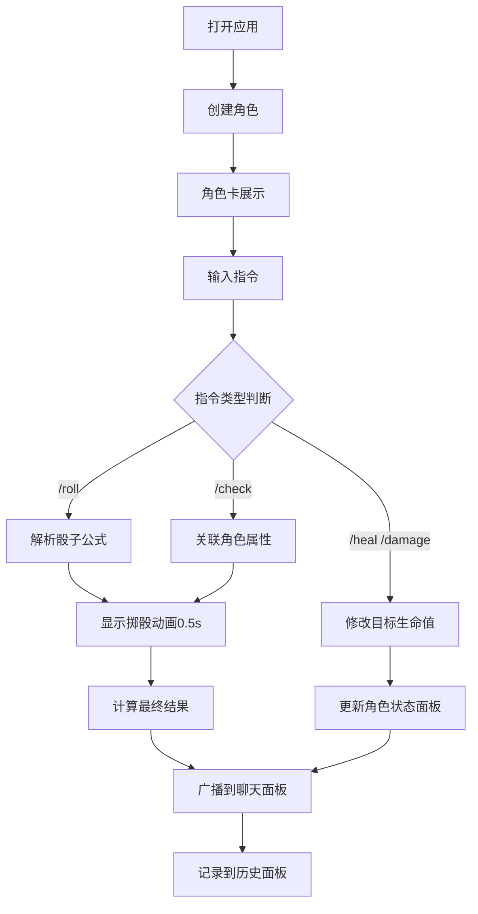

## 1. 产品概述
在线桌游掷骰判定与角色状态追踪工具，为桌游主持人和玩家提供自动化的骰子计算、角色管理和状态同步功能，让主持人专注于剧情推进而非繁琐计算。

- **主要目标用户**：桌游主持人（DM/GM）、在线桌游聚会玩家
- **解决的核心问题**：手动骰子计算繁琐、角色状态追踪困难、判定结果不透明
- **核心价值**：提升桌游体验流畅度，减少中断，增强沉浸感

---

## 2. 核心功能

### 2.1 用户角色
| 角色 | 使用方式 | 核心能力 |
|------|----------|----------|
| 主持人/玩家 | 本地浏览器访问 | 创建角色、掷骰判定、管理状态、查看记录 |

### 2.2 功能模块
1. **骰子引擎模块**：指令解析、随机数生成、结果计算
2. **角色管理模块**：角色卡创建编辑、属性维护、状态效果追踪
3. **聊天面板模块**：消息输入、指令执行、结果广播
4. **角色面板模块**：角色卡展示、属性可视化、状态图标
5. **历史记录模块**：掷骰记录存储、查询、删除

### 2.3 页面详情
| 模块名称 | 子模块 | 功能描述 |
|----------|--------|----------|
| 骰子引擎 | 指令解析 | 支持 `/roll NdM±K`、`/check 技能名`、`/heal`、`/damage` 四种指令格式 |
| 骰子引擎 | 随机生成 | 使用真随机算法生成骰子面值，返回每个骰子结果和总和 |
| 角色管理 | 角色创建 | 浮动按钮展开表单：姓名、职业、等级、6项属性（3-20滑块） |
| 角色管理 | 状态效果 | 中毒/麻痹/燃烧/护盾/隐身5种效果，带回合数倒计时和自动消失 |
| 角色管理 | 生命修改 | 支持点击编辑HP、通过 `/heal` `/damage` 指令增减生命值 |
| 聊天面板 | 消息列表 | 虚拟列表渲染，最多显示可见20条，带滑入动画 |
| 聊天面板 | 指令输入 | 底部固定输入框，支持回车发送，聚焦高亮 |
| 角色面板 | 角色列表 | 虚拟列表渲染6张可见卡片，支持拖拽排序 |
| 角色面板 | 属性可视化 | HP/MP/6项属性以横向柱状条展示，颜色随值变化 |
| 角色面板 | 状态图标 | 32x32px圆角图标，悬停显示详情，到期动画消失 |
| 历史记录 | 记录面板 | 可折叠侧边栏，显示最近50条记录，支持批量/单条删除 |
| 历史记录 | 记录详情 | 时间戳、角色头像、指令原文、骰子面值、最终结果 |

---

## 3. 核心流程

### 3.1 主要用户流程
1. 用户打开应用，看到初始空面板
2. 点击右下角浮动按钮创建角色，填写角色信息提交
3. 角色卡出现在左侧面板，可拖拽排序
4. 在中间聊天框输入骰子指令，如 `/roll 1d20+5`
5. 系统显示0.5s掷骰动画，然后弹出结果（弹跳放大动画）
6. 结果消息广播到聊天列表，同时记录到历史面板
7. 如输入 `/check 潜行`，系统自动关联选中角色的敏捷属性计算
8. 如输入 `/damage 角色A 10`，角色A的HP减少10并实时更新
9. 可给角色添加状态效果，每回合倒计时，归零时自动移除

### 3.2 流程图

---

## 4. 用户界面设计

### 4.1 设计风格
- **配色方案**：暗黑奇幻主题
  - 主背景：`#121220`
  - 次要背景：`#1a1a2e`
  - 强调色：`#6c63ff`（按钮、高亮边框）
  - 文字主色：`#e0e0e0`
  - 文字副色：`#a0a0b0`
  - 属性条渐变色：红 `#e74c3c` → 绿 `#2ecc71`
  - 状态效果色：中毒`#27ae60`、麻痹`#bdc3c7`、燃烧`#e67e22`、护盾`#3498db`、隐身`#9b59b6`
- **按钮风格**：渐变色浮动按钮（`#6c63ff`→`#3f3d9e`），悬停缩放1.05倍
- **字体**：系统无衬线字体栈，正文14px，按钮16px加粗
- **布局风格**：三栏式（左角色面板、中聊天区、右历史记录），卡片式组件
- **图标风格**：Lucide React 图标库，状态效果使用彩色圆角方形图标

### 4.2 页面设计概览
| 模块 | UI元素 | 设计细节 |
|------|--------|----------|
| 整体布局 | 三栏容器 | 角色面板300px固定宽+聊天区弹性宽+记录面板280px可折叠 |
| 角色面板 | 角色卡列表 | 圆形头像、属性柱状条、状态图标行、点击编辑HP、拖拽排序 |
| 浮动按钮 | 创建角色 | 右下角50x50px圆形，渐变紫色，点击展开表单弹窗 |
| 创建表单 | 属性滑块 | 6项属性3-20范围，轨道6px高，颜色渐变，悬浮数值提示 |
| 聊天面板 | 消息气泡 | 从底部滑入动画（translateY20→0，0.3s），步进延迟0.05s |
| 聊天输入框 | 固定底部 | 高60px，`#222233`背景，12px圆角，聚焦边框变紫色 |
| 掷骰结果 | 动画弹出 | 0.5倍→1倍弹性缩放（系数0.3），过渡0.4s |
| 掷骰动画 | 3D骰子旋转 | 4/6/8/10/12/20面骰子，旋转0.5s |
| 状态图标 | 悬停提示 | 半透明黑底白字，圆角4px，显示名称+剩余回合 |
| 历史记录 | 可折叠面板 | 左侧箭头展开收起，左滑删除动画0.3s |

### 4.3 响应式设计
- **桌面端（≥768px）**：标准三栏布局
- **移动端（<768px）**：
  - 左侧角色面板 → 底部横向滑动条（高120px，左右滑动）
  - 中间聊天区 → 占剩余高度
  - 右侧记录面板 → 顶部浮层（从顶部滑入动画）
- **触摸优化**：所有可点击区域≥44px，支持长按触发拖拽/删除

### 4.4 动画与交互
| 场景 | 动画细节 |
|------|----------|
| 列表项出现 | translateY(20px)→0，opacity 0→1，持续0.3s，步进0.05s延迟 |
| 按钮悬停 | scale(1.05)，过渡0.15s |
| 状态图标出现 | fade-in 0.2s |
| 状态图标消失 | scale(0.8) + opacity 0，持续0.3s |
| 记录删除 | 向左滑动移出，持续0.3s |
| 结果弹出 | scale 0.5→1，spring弹性系数0.3，过渡0.4s |
| 输入框聚焦 | 边框色过渡，0.2s |
| 角色拖拽 | 拖拽时半透明跟随，放下平滑过渡0.3s |

---

## 5. 性能需求
- 骰子结果计算：≤10ms完成
- 聊天列表虚拟化：仅渲染可见区域20条消息DOM
- 角色列表虚拟化：仅渲染可见区域6张卡片DOM
- 动画帧率：稳定60FPS，使用`requestAnimationFrame`驱动
