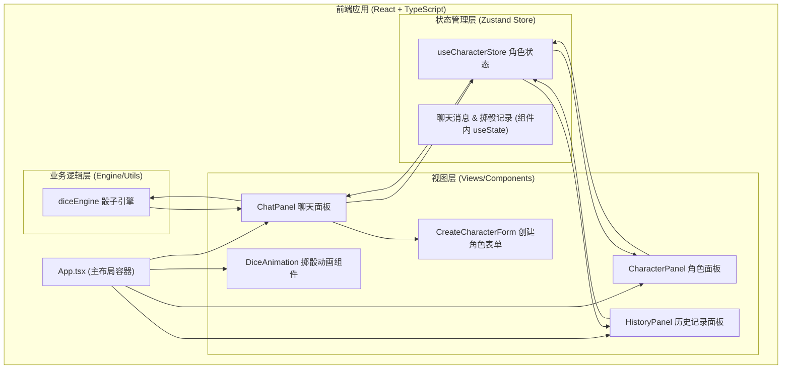

## 1. 架构设计



**数据流向说明：**
1. 用户通过 `ChatPanel` 输入指令 → `diceEngine.parseRollCommand()` 解析
2. `diceEngine.rollDice()` 生成随机结果 → 返回给 `ChatPanel`
3. `ChatPanel` 根据结果类型：
   - 纯骰子结果 → 添加到消息列表 + 添加到记录
   - 涉及角色属性（/check /heal /damage）→ 调用 `useCharacterStore` 方法
4. `useCharacterStore` 更新角色数据 → 自动触发 `CharacterPanel` 和 `HistoryPanel` 重渲染
5. `DiceAnimation` 接收掷骰事件 → 显示0.5s动画后展示结果

---

## 2. 技术说明

| 类别 | 选择 | 版本 | 说明 |
|------|------|------|------|
| 前端框架 | React | ^18.2.0 | 使用函数组件 + Hooks |
| 开发语言 | TypeScript | ^5.3.0 | 严格模式（strict: true） |
| 构建工具 | Vite | ^5.0.0 | 快速冷启动和HMR |
| 状态管理 | Zustand | ^4.4.0 | 轻量级store管理角色状态 |
| 图标库 | Lucide React | ^0.290.0 | 提供所有UI图标 |
| 消息提示 | react-hot-toast | ^2.4.0 | 操作反馈提示 |
| 唯一ID生成 | uuid | ^9.0.0 | 角色ID、消息ID生成 |
| 虚拟列表 | 自定义实现 | - | 使用IntersectionObserver或索引计算 |
| CSS方案 | 原生CSS + CSS变量 | - | 使用模块化组织样式 |

---

## 3. 项目文件结构

```
e:\solo\VersionFastPro\tasks\auto186\
├── package.json                          # 依赖与脚本配置
├── vite.config.js                        # Vite构建配置（路径别名@→src）
├── tsconfig.json                         # TS严格模式+路径别名
├── index.html                            # 入口HTML（预加载Inter字体）
└── src/
    ├── main.tsx                          # 应用入口（挂载React根节点）
    ├── App.tsx                           # 主应用组件（布局容器）
    ├── diceEngine.ts                     # 骰子引擎（导出parseRollCommand、rollDice）
    ├── characterStore.ts                 # 角色状态管理（导出useCharacterStore）
    ├── types.ts                          # 全局类型定义
    ├── styles/
    │   ├── global.css                    # 全局样式（CSS变量、重置、主题）
    │   ├── animations.css                # 动画关键帧定义
    │   └── responsive.css                # 响应式媒体查询
    └── components/
        ├── CharacterPanel.tsx            # 角色面板组件
        ├── CharacterCard.tsx             # 单个角色卡组件
        ├── ChatPanel.tsx                 # 聊天面板组件
        ├── ChatMessage.tsx               # 单条消息气泡组件
        ├── HistoryPanel.tsx              # 历史记录面板组件
        ├── HistoryItem.tsx               # 单条记录项组件
        ├── DiceAnimation.tsx             # 掷骰动画组件
        ├── DiceResultPopup.tsx           # 结果弹出动画组件
        ├── CreateCharacterModal.tsx      # 创建角色弹窗表单
        ├── StatBar.tsx                   # 属性柱状条组件
        ├── StatusEffectIcon.tsx          # 状态效果图标组件
        ├── FloatButton.tsx               # 浮动按钮组件
        └── VirtualList.tsx               # 虚拟列表复用组件
```

**模块调用关系：**
- `diceEngine.ts` → 独立模块，被 `ChatPanel.tsx` 调用
- `characterStore.ts` → 独立模块，被 `CharacterPanel.tsx`、`ChatPanel.tsx`、`HistoryPanel.tsx` 调用
- `App.tsx` → 组合所有面板组件，管理全局布局
- 各组件内部引用子组件（如 `CharacterPanel` 引用 `CharacterCard`）

---

## 4. 核心数据模型

### 4.1 类型定义（src/types.ts）

```typescript
// 职业类型
export type CharacterClass = '战士' | '法师' | '盗贼' | '牧师';

// 6项基础属性
export interface Attributes {
  strength: number;     // 力量 (3-20)
  agility: number;      // 敏捷 (3-20)
  constitution: number; // 体质 (3-20)
  intelligence: number; // 智力 (3-20)
  wisdom: number;       // 感知 (3-20)
  charisma: number;     // 魅力 (3-20)
}

// 状态效果类型
export type StatusEffectType = 'poison' | 'paralyze' | 'burn' | 'shield' | 'stealth';

// 状态效果
export interface StatusEffect {
  id: string;
  type: StatusEffectType;
  name: string;
  remainingTurns: number;
  color: string;
}

// 角色卡
export interface Character {
  id: string;
  name: string;
  characterClass: CharacterClass;
  level: number;
  avatar: string;          // 头像URL或emoji
  hp: number;              // 当前生命
  maxHp: number;           // 最大生命
  mp: number;              // 当前法力
  maxMp: number;           // 最大法力
  attributes: Attributes;
  statusEffects: StatusEffect[];
  order: number;           // 排序权重
}

// 技能-属性映射
export const SKILL_ATTRIBUTE_MAP: Record<string, keyof Attributes> = {
  '潜行': 'agility',
  '偷袭': 'agility',
  '闪避': 'agility',
  '力量': 'strength',
  '近战': 'strength',
  '举重': 'strength',
  '体质': 'constitution',
  '忍耐': 'constitution',
  '知识': 'intelligence',
  '奥术': 'intelligence',
  '侦查': 'wisdom',
  '感知': 'wisdom',
  '医疗': 'wisdom',
  '说服': 'charisma',
  '魅惑': 'charisma',
  '表演': 'charisma',
};

// 骰子结果
export interface DiceRollResult {
  originalCommand: string;
  rolls: Array<{
    count: number;
    sides: number;
    values: number[];
  }>;
  modifier: number;      // 加值
  total: number;         // 最终总和
  isCritical?: boolean;  // 大成功（d20出20）
  isFumble?: boolean;    // 大失败（d20出1）
}

// 指令解析结果
export type ParsedCommand = 
  | { type: 'roll'; diceNotation: string; modifier: number }
  | { type: 'check'; skillName: string; characterId?: string }
  | { type: 'heal'; targetName: string; amount: number }
  | { type: 'damage'; targetName: string; amount: number }
  | { type: 'invalid'; reason: string };

// 聊天消息类型
export type MessageType = 'system' | 'roll' | 'check' | 'heal' | 'damage' | 'status';

export interface ChatMessage {
  id: string;
  type: MessageType;
  timestamp: Date;
  senderName?: string;
  characterId?: string;
  content: string;
  diceResult?: DiceRollResult;
  metadata?: Record<string, unknown>;
}

// 历史记录项
export interface HistoryItem {
  id: string;
  timestamp: Date;
  characterId?: string;
  characterName?: string;
  characterAvatar?: string;
  command: string;
  diceResult?: DiceRollResult;
  finalResult: number | string;
}
```

---

## 5. 骰子引擎设计（src/diceEngine.ts）

### 5.1 导出函数

| 函数名 | 签名 | 说明 |
|--------|------|------|
| `parseRollCommand` | `(input: string): ParsedCommand` | 解析用户输入的指令字符串 |
| `rollDice` | `(count: number, sides: number, modifier: number): DiceRollResult` | 执行掷骰计算，返回详细结果 |
| `rollFromNotation` | `(notation: string): DiceRollResult` | 从骰子符号（如"2d6+3"）直接计算 |

### 5.2 指令解析规则
1. 以 `/roll ` 开头 → 提取骰子符号解析（正则：`/(\d+)d(\d+)\s*([+-]\s*\d+)?/`）
2. 以 `/check ` 开头 → 提取技能名，匹配 `SKILL_ATTRIBUTE_MAP`
3. 以 `/heal ` 开头 → 提取目标名+数值
4. 以 `/damage ` 开头 → 提取目标名+数值
5. 其他格式 → 返回 `invalid` 类型

### 5.3 真随机数生成
使用 `crypto.getRandomValues()` 生成加密级随机数：
```typescript
function cryptoRandomInt(min: number, max: number): number {
  const range = max - min + 1;
  const randomBuffer = new Uint32Array(1);
  crypto.getRandomValues(randomBuffer);
  return min + (randomBuffer[0] % range);
}
```

---

## 6. 角色状态管理（src/characterStore.ts）

### 6.1 Zustand Store 结构

```typescript
interface CharacterState {
  // 数据
  characters: Character[];
  selectedCharacterId: string | null;
  
  // 角色CRUD
  addCharacter: (data: Omit<Character, 'id' | 'statusEffects' | 'order'>) => void;
  removeCharacter: (id: string) => void;
  updateCharacter: (id: string, updates: Partial<Character>) => void;
  reorderCharacters: (fromIndex: number, toIndex: number) => void;
  selectCharacter: (id: string | null) => void;
  
  // 生命值操作
  healCharacter: (id: string, amount: number) => number;  // 返回实际治疗量
  damageCharacter: (id: string, amount: number) => number; // 返回实际伤害量
  setHp: (id: string, hp: number) => void;
  setMp: (id: string, mp: number) => void;
  
  // 状态效果操作
  addStatusEffect: (characterId: string, effect: Omit<StatusEffect, 'id'>) => void;
  removeStatusEffect: (characterId: string, effectId: string) => void;
  decrementAllStatusTurns: () => void; // 每个角色所有效果回合数-1，归零自动清除
  
  // 查询
  findCharacterByName: (name: string) => Character | undefined;
  getSelectedCharacter: () => Character | undefined;
  getAttributeModifier: (attr: keyof Attributes) => number; // 属性修正值（值-10）/2向下取整
}
```

---

## 7. 组件设计要点

### 7.1 VirtualList 虚拟列表
- props：`items: unknown[]`, `itemHeight: number`, `visibleCount: number`, `renderItem: (item, index) => ReactNode`
- 使用 `useRef` 获取滚动容器，`useState` 跟踪 `scrollTop`
- 计算可见范围：`startIndex = floor(scrollTop / itemHeight)`，`endIndex = startIndex + visibleCount`
- 设置容器 `paddingTop = startIndex * itemHeight`，`paddingBottom = (total - endIndex) * itemHeight`

### 7.2 DiceAnimation 掷骰动画
- 使用 CSS 3D transforms 实现骰子旋转：`rotateX`、`rotateY`
- 骰子面数对应不同形状（d4三角锥、d6立方体等，简化为CSS 3D立方体展示不同面值）
- 使用 `requestAnimationFrame` 驱动0.5s动画
- 动画结束回调显示结果弹出组件

### 7.3 DiceResultPopup 结果弹出
- 使用 CSS keyframes 实现弹性动画：
  ```css
  @keyframes bounceIn {
    0%   { transform: scale(0.5); opacity: 0; }
    60%  { transform: scale(1.1); }
    100% { transform: scale(1); opacity: 1; }
  }
  animation: bounceIn 0.4s cubic-bezier(0.175, 0.885, 0.32, 1.275);
  ```

### 7.4 响应式布局断点
- 桌面端 `≥768px`：三栏布局
  - 左栏：`width: 300px; flex-shrink: 0;`
  - 中栏：`flex: 1; min-width: 0;`
  - 右栏：`width: 280px; flex-shrink: 0;`（默认可折叠）
- 移动端 `<768px`：
  - 左栏 → 固定底部：`position: fixed; bottom: 0; left: 0; right: 0; height: 120px; overflow-x: auto;`
  - 中栏 → `padding-bottom: 140px; padding-top: 60px;`
  - 右栏 → 绝对定位顶部：`position: absolute; top: 0; left: 0; right: 0; z-index: 50;`

---

## 8. 性能优化措施

1. **Zustand 选择器优化**：组件使用 `useCharacterStore(state => state.xxx)` 浅订阅，避免不必要重渲染
2. **React.memo**：`CharacterCard`、`ChatMessage`、`HistoryItem`、`StatBar` 等列表项包装 memo
3. **useCallback**：事件处理函数和传递给子组件的回调均使用 useCallback
4. **虚拟列表**：消息列表和角色列表仅渲染可见DOM节点
5. **防抖节流**：滚动事件使用 requestAnimationFrame 节流
6. **CSS优化**：动画使用 transform 和 opacity，避免触发 layout/paint
7. **骰子算法**：使用位运算和预计算加速，单次计算目标<10ms

---

## 9. 测试计划

| 测试类型 | 测试内容 | 验证方式 |
|----------|----------|----------|
| 骰子引擎 | 解析所有合法指令格式 | 单元测试覆盖各种边界情况 |
| 骰子引擎 | 1d6、2d20+5、1d4-1 等结果正确 | 执行1000次统计分布均匀 |
| 骰子引擎 | 计算耗时 < 10ms | console.time 测量 |
| 角色Store | 增删改查操作数据一致 | 集成测试操作验证 |
| 角色Store | 生命值不会超过上限低于下限 | 边界值测试 |
| 虚拟列表 | DOM节点数量恒等于可见数 | DevTools Elements面板检查 |
| 动画 | 帧率稳定60FPS | Chrome Performance面板录制 |
| 响应式 | 768px断点布局切换正确 | DevTools Device Toolbar |
