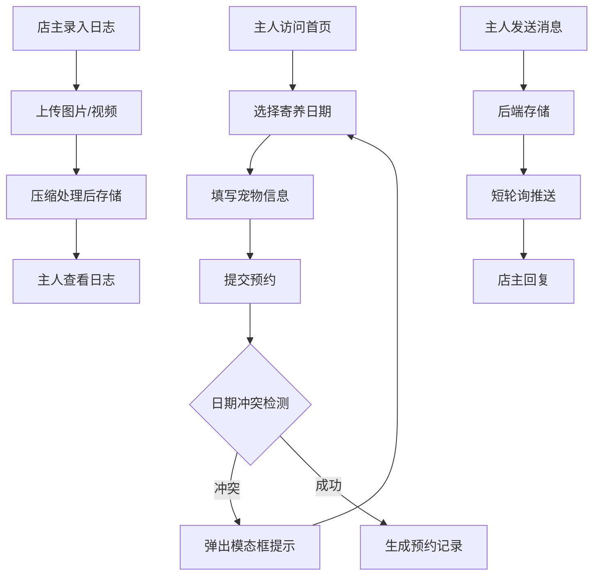

## 1. 产品概述

宠物寄养店管理系统是一款专为小型独立宠物寄养店设计的全栈应用，解决店主用纸质表格和微信聊天记录管理寄养信息容易漏单、无法追踪宠物每日状态以及主人担心宠物的核心痛点。

- **核心目标**：实现寄养预约自动化、宠物日常记录数字化、主人沟通实时化
- **目标用户**：宠物寄养店主（管理员端）和宠物主人（用户端）
- **市场价值**：提升寄养店运营效率，增强主人信任度，减少管理疏漏

## 2. 核心功能

### 2.1 用户角色

| 角色 | 登录方式 | 核心权限 |
|------|----------|----------|
| 宠物主人 | 手机号+验证码 | 预约寄养、查看宠物日志、与店主聊天 |
| 店主（管理员） | 预留管理入口 | 管理预约、录入每日日志、回复聊天、查看统计 |

### 2.2 功能模块

1. **用户前端页面**：首页轮播、寄养预约表单、宠物日志查看、实时聊天窗口
2. **管理员后台页面**：日历视图管理、宠物日志录入、聊天回复、统计概览

### 2.3 页面详情

| 页面名称 | 模块名称 | 功能描述 |
|----------|----------|----------|
| 用户前端 | 首页轮播 | 全屏大图自动轮播展示寄养环境，4s切换间隔，0.5s淡入淡出 |
| 用户前端 | 预约表单 | 日历选择起止日期（30天内可约），填写宠物信息，选择寄养套餐，提交预约 |
| 用户前端 | 宠物日志 | 手机号验证码登录后查看专属日志，按日期倒序展示卡片 |
| 用户前端 | 聊天窗口 | 气泡式聊天界面，发送文字和表情，5秒短轮询，未读计数提示 |
| 管理员后台 | 日历视图 | 可视化预约管理，已预约橙色圆点，已满日期灰显 |
| 管理员后台 | 日志录入 | 每日记录文字备注，上传压缩图片（800px宽，质量0.8）和短视频（15秒720p） |
| 管理员后台 | 聊天回复 | 查看并回复所有主人消息 |
| 管理员后台 | 统计概览 | 展示寄养预约、宠物数量等关键数据 |

## 3. 核心流程

### 3.1 预约流程
主人浏览首页 → 选择寄养起止日期 → 填写宠物信息和套餐 → 提交预约 → 后端检查日期冲突 → 冲突提示重新选择 / 预约成功

### 3.2 日志查看流程
主人进入日志入口 → 输入手机号 → 获取验证码（5分钟有效）→ 登录成功 → 查看宠物专属日志页面

### 3.3 聊天流程
主人/店主发送消息 → 后端存储消息 → 接收方5秒轮询获取新消息 → 页面标题显示未读计数

## 4. 用户界面设计

### 4.1 设计风格
- **主背景色**：柔和温暖的米色 #faf3e0
- **点缀色**：深棕 #5d4037，橄榄绿 #689f38
- **按钮样式**：圆角 24px，悬停亮度变化 10%，点击缩小到 0.95 倍（过渡 0.1s）
- **字体选择**：使用圆润友好的中文字体，搭配清晰易读的无衬线字体
- **布局风格**：卡片式设计，柔和阴影，营造轻松宠物友好氛围
- **图标风格**：使用 lucide-react 图标库，线条圆润简洁

### 4.2 页面设计概述

| 页面名称 | 模块名称 | UI 元素 |
|----------|----------|----------|
| 用户前端 | 首页轮播 | 全屏宽度，圆角 0，4s 自动播放，0.5s 淡入淡出过渡 |
| 用户前端 | 预约日历 | 可选日期高亮，已预约橙色圆点 #ff9800，已满日期灰显 #bdbdbd |
| 用户前端 | 冲突模态框 | 背景半透明 #00000080，圆角 8px，白色内容区 #ffffff，按钮 #ef5350 取消 / #4caf50 重新选择 |
| 用户前端 | 日志卡片 | 圆角 12px，白色背景，阴影 0 1px 4px #00000010，悬停阴影加深 0 4px 12px #00000020，过渡 0.3s |
| 用户前端 | 宠物头像 | 圆形 96x96px，边框 #eceff1，阴影 0 2px 8px #00000020 |
| 聊天界面 | 消息气泡 | 主人消息蓝色 #1976d2，店主消息灰色 #f5f5f5，圆角 20px，最大宽度 70% |
| 表单输入框 | 焦点状态 | 边框颜色从 #bdbdbd 变为 #689f38（过渡 0.2s） |
| 表单输入框 | 验证失败 | 边框变红 #e53935 并抖动 0.3s |

### 4.3 响应式设计
- **桌面端**（>=768px）：两列 grid 布局，gap 20px
- **移动端**（<768px）：单列布局
- **适配范围**：iPhone SE（375px）到桌面 1920px 宽
- **触摸优化**：按钮最小点击区域 44x44px，表单元素间距合理

### 4.4 动画与过渡
- **页面加载**：淡入动画（opacity: 0→1，duration 0.3s）
- **列表加载**：骨架屏或脉冲动画
- **悬停效果**：卡片阴影加深，按钮亮度变化
- **加载状态**：所有异步操作均有加载提示

### 4.5 性能指标
- 页面初始加载时间 < 2s
- 聊天消息发送响应 < 200ms
- 日志图片上传后 1s 内显示
- 图片压缩：宽 800px，质量 0.8，JPEG 格式
- 视频压缩：720p，最长 15 秒
