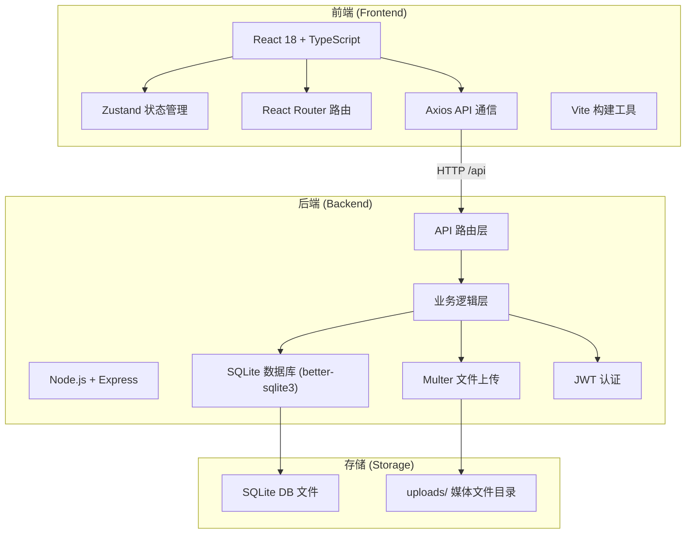
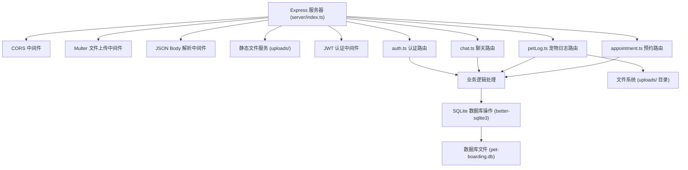
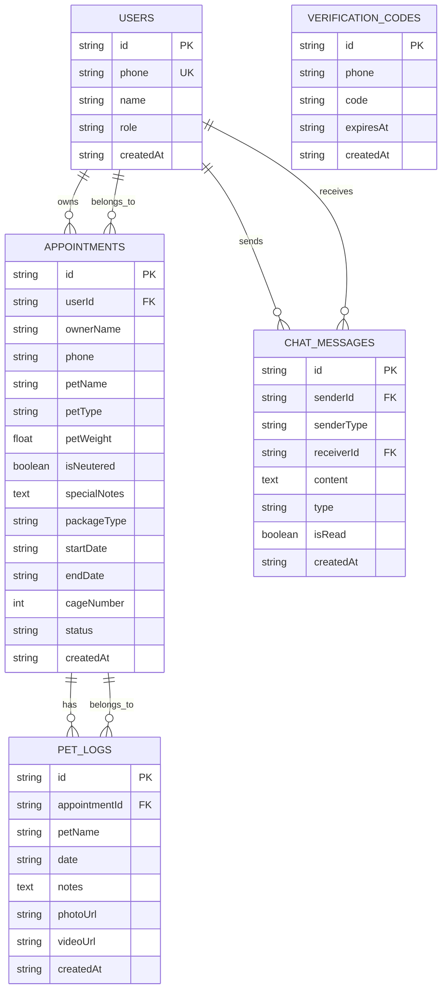

## 1. 架构设计



## 2. 技术描述

- **前端**：React 18 + TypeScript + Vite + Zustand + React Router + Axios
- **构建工具**：Vite 5.x，配置代理 /api 到 http://localhost:3001
- **后端**：Node.js + Express 4.x + TypeScript
- **数据库**：SQLite（better-sqlite3 同步驱动）
- **文件上传**：Multer，存储到 uploads/ 目录
- **认证**：JWT + 手机号验证码（5分钟有效）
- **图片压缩**：前端 Canvas 压缩（宽 800px，质量 0.8，JPEG）
- **实时通信**：短轮询（间隔 5 秒）

## 3. 路由定义

| 路由路径 | 页面/用途 |
|----------|-----------|
| / | 用户首页（轮播 + 预约 + 日志入口） |
| /login | 手机号验证码登录 |
| /pet-log | 宠物日志查看页面 |
| /chat | 聊天窗口页面 |
| /admin | 管理员后台首页 |
| /admin/calendar | 预约日历管理 |
| /admin/pet-logs | 宠物日志录入 |
| /admin/chat | 管理员聊天回复 |
| /admin/stats | 统计概览 |

## 4. API 定义

### 4.1 类型定义

```typescript
// 预约相关类型
interface Appointment {
  id: string;
  ownerName: string;
  phone: string;
  petName: string;
  petType: string;
  petWeight: number;
  isNeutered: boolean;
  specialNotes: string;
  packageType: 'basic' | 'luxury';
  startDate: string;
  endDate: string;
  cageNumber: number;
  status: 'pending' | 'confirmed' | 'cancelled';
  createdAt: string;
}

// 宠物日志类型
interface PetLog {
  id: string;
  appointmentId: string;
  petName: string;
  date: string;
  notes: string;
  photoUrl?: string;
  videoUrl?: string;
  createdAt: string;
}

// 聊天消息类型
interface ChatMessage {
  id: string;
  senderId: string;
  senderType: 'owner' | 'admin';
  receiverId: string;
  content: string;
  type: 'text' | 'emoji';
  isRead: boolean;
  createdAt: string;
}

// 用户类型
interface User {
  id: string;
  phone: string;
  name: string;
  role: 'owner' | 'admin';
}
```

### 4.2 API 接口

| 方法 | 路径 | 描述 | 请求体 | 响应 |
|------|------|------|--------|------|
| POST | /api/auth/send-code | 发送验证码 | `{ phone: string }` | `{ success: boolean }` |
| POST | /api/auth/login | 手机号验证码登录 | `{ phone: string, code: string }` | `{ token: string, user: User }` |
| POST | /api/appointments | 创建预约 | `AppointmentCreate` | `{ appointment: Appointment }` |
| GET | /api/appointments | 查询预约列表 | 查询参数 | `{ appointments: Appointment[] }` |
| GET | /api/appointments/available | 查询可用日期 | `{ startDate, endDate }` | `{ availableDates: string[], bookedDates: string[] }` |
| DELETE | /api/appointments/:id | 取消预约 | - | `{ success: boolean }` |
| POST | /api/pet-logs | 创建宠物日志 | `FormData` | `{ petLog: PetLog }` |
| GET | /api/pet-logs/:petId | 查询宠物日志列表 | - | `{ petLogs: PetLog[] }` |
| GET | /api/pet-logs/:id/media | 获取媒体文件 | - | 文件流 |
| POST | /api/chat/messages | 发送消息 | `{ receiverId, content, type }` | `{ message: ChatMessage }` |
| GET | /api/chat/messages/:userId | 获取消息列表 | `{ since?: string }` | `{ messages: ChatMessage[] }` |

## 5. 服务器架构图



## 6. 数据模型

### 6.1 ER 图



### 6.2 DDL 语句

```sql
-- 用户表
CREATE TABLE IF NOT EXISTS users (
  id TEXT PRIMARY KEY,
  phone TEXT UNIQUE NOT NULL,
  name TEXT NOT NULL,
  role TEXT NOT NULL DEFAULT 'owner',
  created_at TEXT DEFAULT CURRENT_TIMESTAMP
);

-- 预约表
CREATE TABLE IF NOT EXISTS appointments (
  id TEXT PRIMARY KEY,
  user_id TEXT,
  owner_name TEXT NOT NULL,
  phone TEXT NOT NULL,
  pet_name TEXT NOT NULL,
  pet_type TEXT NOT NULL,
  pet_weight REAL NOT NULL,
  is_neutered INTEGER NOT NULL DEFAULT 0,
  special_notes TEXT,
  package_type TEXT NOT NULL DEFAULT 'basic',
  start_date TEXT NOT NULL,
  end_date TEXT NOT NULL,
  cage_number INTEGER NOT NULL,
  status TEXT NOT NULL DEFAULT 'pending',
  created_at TEXT DEFAULT CURRENT_TIMESTAMP,
  FOREIGN KEY (user_id) REFERENCES users(id)
);

-- 宠物日志表
CREATE TABLE IF NOT EXISTS pet_logs (
  id TEXT PRIMARY KEY,
  appointment_id TEXT NOT NULL,
  pet_name TEXT NOT NULL,
  date TEXT NOT NULL,
  notes TEXT NOT NULL,
  photo_url TEXT,
  video_url TEXT,
  created_at TEXT DEFAULT CURRENT_TIMESTAMP,
  FOREIGN KEY (appointment_id) REFERENCES appointments(id)
);

-- 聊天消息表
CREATE TABLE IF NOT EXISTS chat_messages (
  id TEXT PRIMARY KEY,
  sender_id TEXT NOT NULL,
  sender_type TEXT NOT NULL,
  receiver_id TEXT NOT NULL,
  content TEXT NOT NULL,
  type TEXT NOT NULL DEFAULT 'text',
  is_read INTEGER NOT NULL DEFAULT 0,
  created_at TEXT DEFAULT CURRENT_TIMESTAMP
);

-- 验证码表
CREATE TABLE IF NOT EXISTS verification_codes (
  id TEXT PRIMARY KEY,
  phone TEXT NOT NULL,
  code TEXT NOT NULL,
  expires_at TEXT NOT NULL,
  created_at TEXT DEFAULT CURRENT_TIMESTAMP
);

-- 索引
CREATE INDEX IF NOT EXISTS idx_appointments_dates ON appointments(start_date, end_date);
CREATE INDEX IF NOT EXISTS idx_appointments_phone ON appointments(phone);
CREATE INDEX IF NOT EXISTS idx_pet_logs_appointment ON pet_logs(appointment_id);
CREATE INDEX IF NOT EXISTS idx_pet_logs_date ON pet_logs(date);
CREATE INDEX IF NOT EXISTS idx_chat_messages_users ON chat_messages(sender_id, receiver_id);
CREATE INDEX IF NOT EXISTS idx_chat_messages_created ON chat_messages(created_at);
```

## 7. 项目文件结构

```
.
├── package.json          # 根依赖和脚本
├── vite.config.js        # Vite 构建配置
├── tsconfig.json         # TypeScript 配置
├── index.html            # 入口 HTML
├── src/
│   ├── main.tsx          # React 应用入口
│   ├── store/
│   │   └── useStore.ts   # Zustand 状态管理
│   ├── api/
│   │   └── apiClient.ts  # API 通信模块
│   └── pages/
│       ├── UserPage.tsx  # 用户前端页面
│       └── AdminPage.tsx # 管理员后台页面
├── server/
│   ├── index.ts          # Express 服务器入口
│   ├── routes/
│   │   ├── appointment.ts
│   │   ├── petLog.ts
│   │   ├── chat.ts
│   │   └── auth.ts
│   └── db.ts             # 数据库初始化
└── uploads/              # 媒体文件存储目录
```

## 8. 依赖列表

### 前端依赖
- react, react-dom
- typescript
- zustand
- axios
- react-router-dom
- lucide-react

### 后端依赖
- express
- cors
- better-sqlite3
- multer
- uuid
- bcryptjs
- jsonwebtoken
- @types/express
- @types/cors
- @types/multer
- @types/bcryptjs
- @types/jsonwebtoken

### 开发依赖
- vite
- @vitejs/plugin-react
- ts-node / tsx (用于运行 TypeScript 后端)
- @types/react
- @types/react-dom
