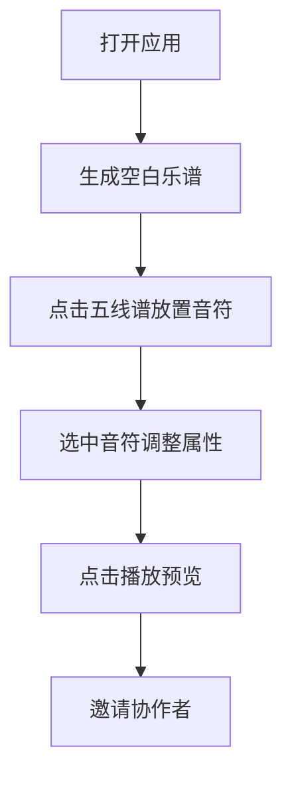
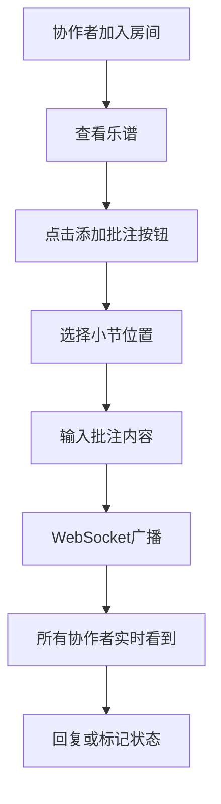

## 1. 产品概述

交互式在线乐谱编辑器与协作批注应用，让音乐创作者和学习者可以在网页上创建、编辑和播放五线谱音乐，并邀请协作者对乐谱的特定小节添加批注和修改建议。

- 解决音乐创作协作效率低、传统乐谱编辑软件学习成本高的问题
- 目标用户：音乐教师、学生、作曲爱好者、音乐团队
- 产品价值：轻量级Web端乐谱编辑 + 实时协作批注 + 即时音频预览

## 2. 核心功能

### 2.1 用户角色

| 角色 | 说明 | 核心权限 |
|------|------|----------|
| 乐谱编辑者 | 创建和编辑乐谱的用户 | 创建/编辑/删除音符、播放预览、添加批注 |
| 协作者 | 受邀参与批注的用户 | 查看乐谱、添加批注、回复批注、标记状态 |

### 2.2 功能模块

1. **乐谱编辑器**：五线谱渲染、音符放置与编辑、小节管理、缩放控制
2. **属性面板**：音符属性编辑（音高、时长、力度）
3. **播放控制**：节拍播放、BPM调节、当前音符高亮
4. **协作批注**：添加批注、回复批注、状态管理、实时同步
5. **工具栏**：新建乐谱、添加/删除小节、缩放、播放控制、添加批注

### 2.3 页面详情

| 页面名称 | 模块名称 | 功能描述 |
|-----------|-------------|---------------------|
| 主编辑页 | 顶部工具栏 | 新建乐谱、小节增删、缩放控制、播放按钮、添加批注按钮 |
| 主编辑页 | 乐谱渲染区 | Canvas绘制五线谱，显示音符，支持点击放置、拖拽调整 |
| 主编辑页 | 右侧属性面板 | 显示选中音符的属性，支持音高、时长、力度编辑 |
| 主编辑页 | 批注系统 | 小节上方的批注标签，展开面板显示详情和回复 |
| 主编辑页 | 底部播放控制 | BPM滑块、播放/暂停按钮、当前进度指示 |

## 3. 核心流程

### 3.1 乐谱编辑流程

用户打开应用 → 自动生成空白乐谱（4/4拍、高音谱号、4小节）→ 点击五线谱放置音符 → 选中音符调整属性 → 点击播放预览 → 保存/邀请协作

### 3.2 协作批注流程

协作者加入房间 → 查看乐谱 → 点击"添加批注"按钮 → 选择小节位置 → 输入批注内容 → 发送 → 实时同步给所有协作者 → 回复/修改状态

## 4. 用户界面设计

### 4.1 设计风格

- **主题**：深色专业音乐编辑器风格
- **主背景**：#121212
- **五线谱区域**：#1e1e1e
- **次要卡片**：#2c2c2c
- **强调色**：蓝紫色 #7c4dff、青色 #00e5ff
- **播放按钮**：绿色 #4caf50，悬停 #43a047
- **高亮色**：黄色 #ffeb3b
- **选中音符**：蓝色 #2979ff

### 4.2 视觉元素

- **按钮风格**：圆角4px，工具栏图标20px，hover时背景 #ffffff10
- **播放按钮**：圆形50%圆角，绿色背景
- **批注标签**：圆角8px，阴影 #00000026，彩色背景（根据用户ID哈希）
- **音符**：实心椭圆，直径6px，选中时放大1.1倍

### 4.3 排版与布局

- **工具栏高度**：48px
- **属性面板宽度**：260px
- **批注展开面板宽度**：320px
- **字体**：现代无衬线字体，清晰可读

### 4.4 动画效果

- 音符放置：弹性动画 0.15s cubic-bezier(0.34, 1.56, 0.64, 1)
- 批注标签出现：淡入动画 0.2s ease-out
- 播放高亮：发光扩散效果 box-shadow 0 0 8px #ffeb3b
- 按钮悬停：过渡 0.2s ease

### 4.5 响应式设计

- **桌面端（≥768px）**：右侧属性面板展开，工具栏图标+文字
- **移动端（<768px）**：属性面板折叠为底部抽屉（高度150px），工具栏仅显示图标

### 4.6 页面设计概览

| 页面名称 | 模块名称 | UI元素 |
|-----------|-------------|-------------|
| 主编辑页 | 顶部工具栏 | 深色背景、图标按钮、播放按钮（圆形绿色）、缩放控制 |
| 主编辑页 | 乐谱画布 | 五线谱、音符、小节线、播放高亮、批注标签 |
| 主编辑页 | 属性面板 | 浅灰背景、音高选择、时长选择、力度选择 |
| 主编辑页 | 批注面板 | 白色卡片、用户头像、时间戳、回复列表、状态下拉 |

## 5. 性能要求

- 编辑操作延迟：< 16ms（60FPS）
- 乐谱重绘（Canvas）：音符数量≤256时单次渲染 < 8ms
- WebSocket批注同步延迟（发送到接收）：< 100ms
