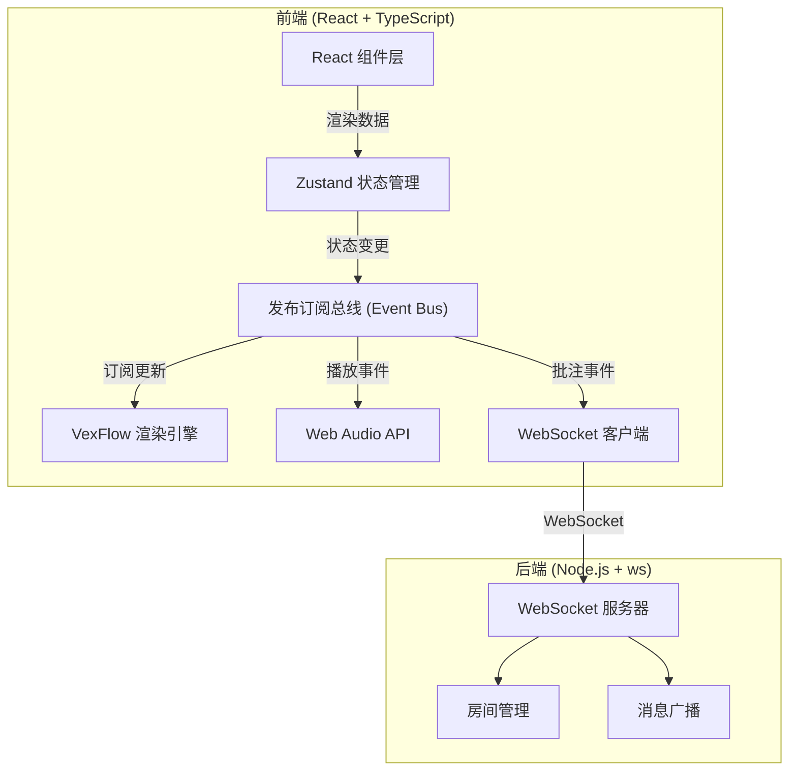

## 1. 架构设计

### 1.1 整体架构



### 1.2 模块通信

各模块通过发布订阅总线进行通信，降低耦合度：

- `editorStore` 作为唯一数据源
- 组件通过订阅 store 变化进行重绘
- 协作服务通过事件总线同步远程变更

## 2. 技术选型

| 类别 | 技术 | 版本 | 说明 |
|------|------|------|------|
| 前端框架 | React | 18 | 用户界面构建 |
| 语言 | TypeScript | 5 | 类型安全 |
| 构建工具 | Vite | 5 | 快速开发构建 |
| 状态管理 | Zustand | 4 | 轻量级状态管理 |
| 乐谱渲染 | VexFlow | 4 | 专业音乐符号渲染 |
| 样式方案 | 原生CSS / CSS Modules | - | 组件级样式隔离 |
| 实时通信 | socket.io-client | 4 | WebSocket客户端 |
| 后端 | Node.js + ws | - | WebSocket服务器 |
| 图标 | lucide-react | 最新 | 图标库 |

## 3. 项目结构

```
.
├── package.json
├── vite.config.js
├── tsconfig.json
├── index.html
├── src/
│   ├── main.tsx                 # 应用入口
│   ├── App.tsx                  # 根组件
│   ├── stores/
│   │   └── editorStore.ts       # Zustand 状态管理
│   ├── components/
│   │   ├── SheetRenderer.tsx    # 乐谱渲染组件
│   │   ├── EditorCanvas.tsx     # 编辑器交互组件
│   │   ├── PropertyPanel.tsx    # 属性面板
│   │   ├── Toolbar.tsx          # 工具栏
│   │   ├── PlaybackControls.tsx # 播放控制
│   │   ├── AnnotationTag.tsx    # 批注标签
│   │   └── AnnotationPanel.tsx  # 批注详情面板
│   ├── services/
│   │   ├── collaborationService.ts  # 协作服务
│   │   └── audioService.ts          # 音频服务
│   ├── utils/
│   │   ├── eventBus.ts          # 发布订阅总线
│   │   └── musicUtils.ts        # 音乐工具函数
│   └── types/
│       └── index.ts             # TypeScript 类型定义
└── src/server/
    └── server.ts                # WebSocket 服务器
```

## 4. 数据模型

### 4.1 核心类型定义

```typescript
// 音符
interface Note {
  id: string;
  measureIndex: number;   // 小节索引
  beat: number;           // 拍位（0-4）
  pitch: string;          // 音高，如 "C4"
  duration: NoteDuration; // 时值
  dotted: boolean;        // 是否附点
  dynamic?: Dynamic;      // 力度标记
  selected?: boolean;     // 是否选中
}

// 时值类型
type NoteDuration = 'whole' | 'half' | 'quarter' | 'eighth' | 'sixteenth';

// 力度标记
type Dynamic = 'ppp' | 'pp' | 'p' | 'mp' | 'mf' | 'f' | 'ff' | 'fff';

// 小节
interface Measure {
  index: number;
  timeSignature: [number, number]; // 拍号，如 [4, 4]
  clef: 'treble' | 'bass';
  notes: Note[];
}

// 批注
interface Annotation {
  id: string;
  measureIndex: number;
  beat: number;
  authorId: string;
  authorName: string;
  content: string;
  timestamp: number;
  status: 'open' | 'resolved' | 'discussing';
  replies: AnnotationReply[];
  suggestion?: NoteSuggestion;
}

// 批注回复
interface AnnotationReply {
  id: string;
  authorId: string;
  authorName: string;
  content: string;
  timestamp: number;
  depth: number; // 嵌套层级（0-2）
}

// 修改建议
interface NoteSuggestion {
  measureIndex: number;
  beat: number;
  originalNote: string;
  suggestedNote: string;
}

// 编辑器状态
interface EditorState {
  measures: Measure[];
  selectedNoteId: string | null;
  annotations: Annotation[];
  playbackState: PlaybackState;
  bpm: number;
  scale: number;
  currentUserId: string;
  currentUserName: string;
}

// 播放状态
interface PlaybackState {
  isPlaying: boolean;
  currentNoteIndex: number;
  currentMeasureIndex: number;
}
```

## 5. 关键模块说明

### 5.1 SheetRenderer 组件

- 职责：使用 VexFlow 将音符数据渲染为 Canvas 五线谱
- 输入：measures 数组、scale 缩放比例、选中音符ID、播放位置
- 输出：Canvas 元素
- 优化：使用 requestAnimationFrame 批量重绘，避免频繁渲染

### 5.2 EditorCanvas 组件

- 职责：处理鼠标交互，将用户操作转换为音符操作
- 功能：点击放置音符、拖拽调整音高和时长、长按显示微调
- 事件：click、mousedown、mousemove、mouseup、contextmenu

### 5.3 editorStore (Zustand)

- 职责：管理所有编辑器状态
- Action：addNote、removeNote、updateNote、addMeasure、removeMeasure、addAnnotation、updateAnnotation
- 选择器：使用 selectors 优化渲染性能

### 5.4 collaborationService

- 职责：管理 WebSocket 连接，同步批注数据
- 事件：annotation:add、annotation:update、annotation:reply
- 策略：乐观更新 + 冲突解决

### 5.5 WebSocket 服务器

- 职责：管理房间、广播消息、维护在线用户列表
- 技术：Node.js + ws 库
- 消息格式：JSON，包含 type、payload、roomId

## 6. 性能优化策略

1. **Canvas 渲染优化**
   - 仅在数据变更时重绘
   - 使用脏标记（dirty flag）机制
   - 离屏Canvas缓存静态元素

2. **状态管理优化**
   - Zustand selectors 避免不必要的重渲染
   - 批量更新减少重绘次数

3. **动画优化**
   - 使用 CSS transform 和 opacity 实现动画
   - 避免布局抖动（layout thrashing）

4. **内存管理**
   - 及时清理事件监听器
   - WebSocket 连接池管理
