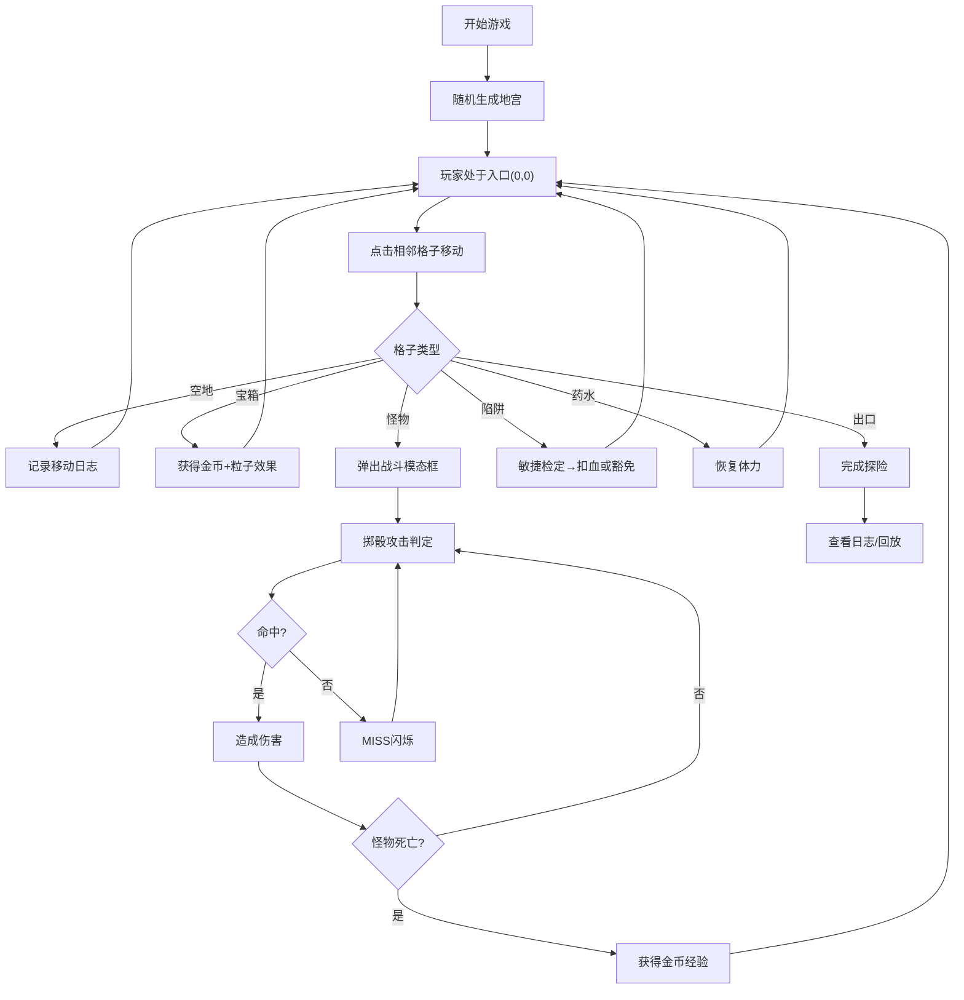

## 1. 产品概述

贪婪地牢探险者是一款桌游跑团辅助应用，模拟地牢探险者在地宫中搜寻宝藏、遭遇随机事件并逐步决策的过程。主要解决桌游跑团时地牢生成、遭遇判定与资源管理繁琐且缺乏戏剧张力的问题。

- 目标用户：桌游跑团爱好者、DM（地下城主）、玩家
- 产品价值：提供自动化地宫生成、回合制战斗判定、资源管理和历史回放功能，增强桌游跑团体验

## 2. 核心功能

### 2.1 功能模块

1. **地宫自动生成模块**：随机生成N×M网格地宫（6-8行×6-8列），包含6种格子类型（空地、宝箱、怪物、陷阱、药水、出口）
2. **回合制移动与骰子系统**：玩家点击相邻格子移动，触发格子事件，3D骰子战斗判定
3. **背包与资源管理系统**：角色状态显示（体力、金币、经验、等级），8格背包系统
4. **历史记录与重放模块**：事件日志记录、清空、导出JSON、回放功能

### 2.2 页面详情

| 页面名称 | 模块名称 | 功能描述 |
|-----------|-------------|---------------------|
| 主游戏界面 | 地宫Canvas | 渲染地宫网格、玩家位置、格子淡入动画、点击移动 |
| 主游戏界面 | 状态面板 | 体力条、金币数、经验条、等级显示、背包格 |
| 主游戏界面 | 日志区域 | 事件历史记录、时间戳、颜色区分、自动滚动、导出清空 |
| 主游戏界面 | 战斗模态框 | 怪物信息、血量条、掷骰攻击按钮、骰子动画、伤害/MISS显示 |

## 3. 核心流程

玩家进入游戏 → 随机生成地宫（入口左上、出口右下）→ 玩家点击相邻格子移动（消耗体力）→ 触发格子事件（宝箱/怪物/陷阱/药水）→ 处理事件（获得金币/战斗/扣血/回血）→ 到达出口完成探险 → 可查看日志或回放

## 4. 用户界面设计

### 4.1 设计风格

- **主色调**：暗夜奇幻风格 - 深蓝渐变背景(#0d1b2a → #1b2838)，钢蓝色按钮(#42a5f5)
- **格子配色**：空地(#e0e0e0)、宝箱金(#ffc107)、怪物暗红(#d32f2f)、陷阱暗紫(#9c27b0)、药水翠绿(#4caf50)、出口亮绿(#76ff03)
- **按钮样式**：高36px、圆角6px、主色调钢蓝、悬停变亮、点击下压(scale 0.96, 0.1s)
- **字体**：无衬线体(sans-serif)，标题18px bold #e0e0e0，正文14px #b0bec5
- **布局**：左侧地宫Canvas + 右侧状态面板(220px) + 底部日志区
- **磨砂玻璃效果**：背景rgba(255,255,255,0.08)，边框1px solid rgba(255,255,255,0.12)，圆角8px，backdrop-filter: blur(8px)

### 4.2 页面设计概述

| 页面名称 | 模块名称 | UI元素 |
|-----------|-------------|-------------|
| 主游戏界面 | 地宫Canvas | 格子逐个淡入动画(0.03s间隔)、玩家蓝色三角(边长20px、弹性过渡0.15s)、网格线亮蓝(#3a5a8c) |
| 主游戏界面 | 状态面板 | 体力绿条(#66bb6a, 12px高)、金币金(#f57f17)、经验紫条(#7e57c2)、8格背包(40×40px, 圆角4px) |
| 主游戏界面 | 日志区 | 背景#f5f5f5、高160px、滚动条自动到底、移动灰(#757575)、战斗红(#e53935)、拾取金(#ffb300) |
| 主游戏界面 | 战斗模态 | 半透明黑(#00000080)、面板400px白圆角12px、怪物血量条、3D骰子旋转1s动画、MISS红闪0.3s |

### 4.3 响应式

- 桌面优先设计
- 视口宽度<768px时：地宫格子边长缩至40px，右侧栏变为底部横条，日志区可折叠
- 触摸设备优化：点击区域扩大

## 5. 性能要求

- 回合间响应延迟<50ms
- 动画帧率稳定60fps
- 骰子旋转动画不卡顿
- 所有状态更新在500ms内反映到UI
