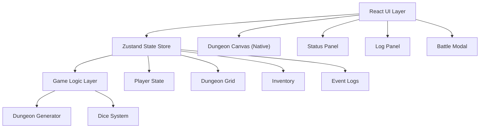

## 1. 架构设计



## 2. 技术描述

- **前端框架**：React 18 + TypeScript
- **状态管理**：Zustand（轻量级状态管理）
- **构建工具**：Vite（快速开发构建）
- **渲染方式**：原生Canvas（地宫渲染）+ React DOM（UI面板）
- **样式**：原生CSS（模块化）+ CSS变量

**依赖列表**：
- react
- react-dom
- typescript
- zustand
- vite
- @types/react
- @types/react-dom

## 3. 项目文件结构

```
.
├── package.json
├── vite.config.js
├── tsconfig.json
├── index.html
└── src/
    ├── main.tsx              # ReactDOM渲染入口
    ├── App.tsx               # 主应用组件
    ├── store/
    │   └── useGameStore.ts   # Zustand状态管理
    ├── game/
    │   ├── dungeonGenerator.ts  # 地宫生成逻辑
    │   └── diceSystem.ts        # 骰子系统
    └── components/
        ├── DungeonCanvas.tsx    # Canvas地宫渲染
        ├── StatusPanel.tsx      # 状态面板
        ├── LogPanel.tsx         # 日志面板
        ├── BattleModal.tsx      # 战斗模态框
        ├── Inventory.tsx        # 背包组件
        └── Dice.tsx             # 骰子动画组件
```

## 4. 数据模型定义

### 4.1 格子类型定义

```typescript
enum CellType {
  EMPTY = 'empty',
  TREASURE = 'treasure',
  MONSTER = 'monster',
  TRAP = 'trap',
  POTION = 'potion',
  EXIT = 'exit',
  ENTRANCE = 'entrance'
}

interface Cell {
  type: CellType;
  revealed: boolean;
  data?: {
    gold?: number;
    monsterHp?: number;
    monsterMaxHp?: number;
    monsterDefense?: number;
    trapDamage?: number;
    potionHeal?: number;
  };
}
```

### 4.2 玩家状态定义

```typescript
interface PlayerState {
  x: number;
  y: number;
  hp: number;
  maxHp: number;
  stamina: number;
  maxStamina: number;
  gold: number;
  exp: number;
  level: number;
  attackBonus: number;
  inventory: InventoryItem[];
}

interface InventoryItem {
  id: string;
  type: 'potion' | 'key' | 'rune';
  name: string;
  effect?: number;
}
```

### 4.3 日志定义

```typescript
interface LogEntry {
  id: string;
  timestamp: string;
  type: 'move' | 'battle' | 'pickup' | 'system';
  message: string;
}
```

### 4.4 游戏状态定义

```typescript
interface GameState {
  dungeon: Cell[][];
  rows: number;
  cols: number;
  player: PlayerState;
  logs: LogEntry[];
  isPlaying: boolean;
  isReplaying: boolean;
  battleState: BattleState | null;
}

interface BattleState {
  monsterIndex: { x: number; y: number };
  monsterHp: number;
  monsterMaxHp: number;
  monsterDefense: number;
  lastRoll: number | null;
  lastHit: boolean | null;
  isAnimating: boolean;
}
```

## 5. 核心API定义（Store Actions）

```typescript
interface GameActions {
  initGame: () => void;
  movePlayer: (x: number, y: number) => void;
  rollDice: () => number;
  attackMonster: () => void;
  useItem: (itemId: string) => void;
  discardItem: (itemId: string) => void;
  addLog: (type: LogEntry['type'], message: string) => void;
  clearLogs: () => void;
  exportLogs: () => string;
  startReplay: () => void;
  stepReplay: () => void;
  stopReplay: () => void;
}
```

## 6. 动画与性能优化

- Canvas使用requestAnimationFrame渲染循环
- CSS transitions用于UI动画（格子淡入、按钮效果）
- 玩家移动使用CSS transform transition实现弹性效果
- 骰子旋转使用CSS 3D transforms
- Zustand浅比较避免不必要的重渲染
- Canvas采用脏矩形渲染优化（仅重绘变化区域）
