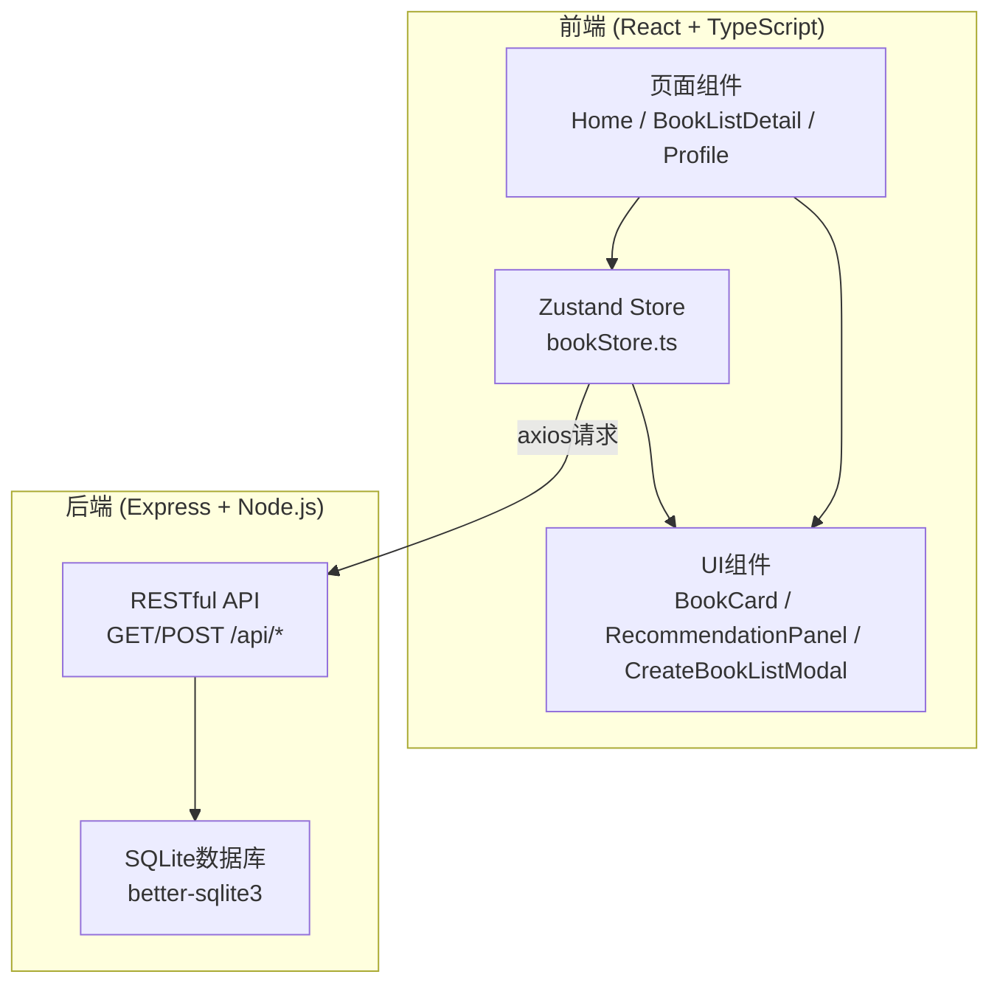
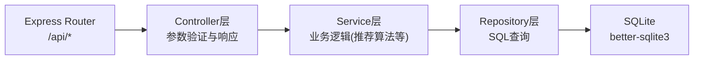
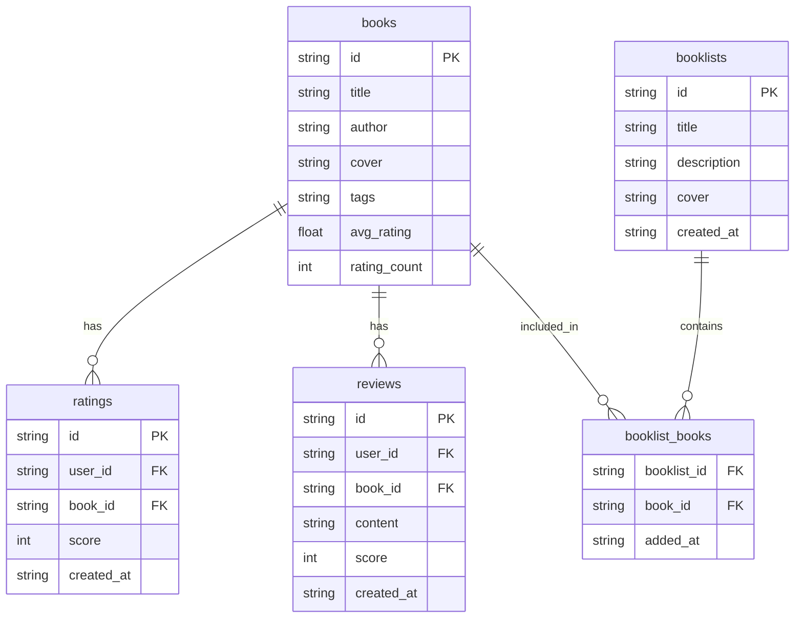

## 1. 架构设计



## 2. 技术说明

- 前端：React@18 + TypeScript + Zustand + Vite + TailwindCSS
- 初始化工具：vite-init (react-express-ts 模板)
- 后端：Express@4 + TypeScript + cors
- 数据库：SQLite (better-sqlite3)
- 路由：react-router-dom
- HTTP客户端：axios

## 3. 路由定义

| 路由 | 用途 |
|------|------|
| / | 首页：书单网格、搜索、推荐面板、创建书单 |
| /booklist/:id | 书单详情页：书籍列表、评分、短评 |
| /profile | 个人中心：评分历史、统计数据 |

## 4. API定义

### 4.1 TypeScript类型定义

```typescript
interface Book {
  id: string;
  title: string;
  author: string;
  cover: string;
  tags: string;
  avg_rating: number;
  rating_count: number;
}

interface BookList {
  id: string;
  title: string;
  description: string;
  cover: string;
  created_at: string;
  book_ids: string;
  avg_rating: number;
  book_count: number;
}

interface Rating {
  id: string;
  user_id: string;
  book_id: string;
  score: number;
  created_at: string;
}

interface Review {
  id: string;
  user_id: string;
  book_id: string;
  content: string;
  score: number;
  created_at: string;
  book_title?: string;
  book_cover?: string;
  book_author?: string;
}
```

### 4.2 请求/响应

| 方法 | 路径 | 请求体 | 响应 |
|------|------|--------|------|
| GET | /api/books | - | Book[] |
| GET | /api/books/:id | - | Book |
| GET | /api/booklists | - | BookList[] |
| GET | /api/booklists/:id | - | BookList (含books详情) |
| POST | /api/booklists | { title, description, bookIds } | BookList |
| POST | /api/ratings | { userId, bookId, score } | Rating |
| POST | /api/reviews | { userId, bookId, content, score } | Review |
| GET | /api/recommendations/:userId | - | Book[] |
| GET | /api/user/:userId/ratings | - | (Rating & BookInfo)[] |
| GET | /api/user/:userId/stats | - | { totalRatings, avgRating, topAuthors } |

## 5. 服务器架构



## 6. 数据模型

### 6.1 数据模型定义



### 6.2 数据定义语言

```sql
CREATE TABLE IF NOT EXISTS books (
  id TEXT PRIMARY KEY,
  title TEXT NOT NULL,
  author TEXT NOT NULL,
  cover TEXT NOT NULL,
  tags TEXT DEFAULT '',
  avg_rating REAL DEFAULT 0,
  rating_count INTEGER DEFAULT 0
);

CREATE TABLE IF NOT EXISTS booklists (
  id TEXT PRIMARY KEY,
  title TEXT NOT NULL,
  description TEXT DEFAULT '',
  cover TEXT DEFAULT '',
  created_at TEXT NOT NULL
);

CREATE TABLE IF NOT EXISTS booklist_books (
  booklist_id TEXT NOT NULL,
  book_id TEXT NOT NULL,
  added_at TEXT NOT NULL,
  PRIMARY KEY (booklist_id, book_id),
  FOREIGN KEY (booklist_id) REFERENCES booklists(id),
  FOREIGN KEY (book_id) REFERENCES books(id)
);

CREATE TABLE IF NOT EXISTS ratings (
  id TEXT PRIMARY KEY,
  user_id TEXT NOT NULL,
  book_id TEXT NOT NULL,
  score INTEGER NOT NULL CHECK(score >= 1 AND score <= 5),
  created_at TEXT NOT NULL,
  UNIQUE(user_id, book_id),
  FOREIGN KEY (book_id) REFERENCES books(id)
);

CREATE TABLE IF NOT EXISTS reviews (
  id TEXT PRIMARY KEY,
  user_id TEXT NOT NULL,
  book_id TEXT NOT NULL,
  content TEXT NOT NULL,
  score INTEGER NOT NULL,
  created_at TEXT NOT NULL,
  FOREIGN KEY (book_id) REFERENCES books(id)
);
```

### 6.3 初始数据

预置12本经典书籍和3个主题书单，覆盖推理、文学、科幻等类型，确保首页有丰富的展示内容和推荐算法有足够的数据基础。
