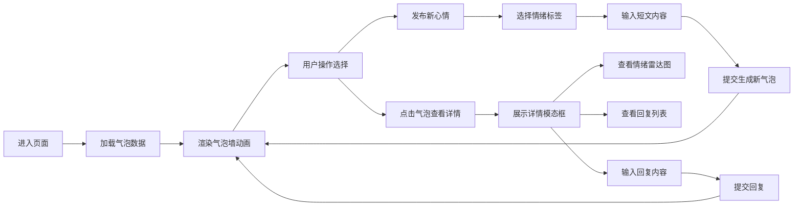

## 1. 产品概述

情绪回声墙是一个匿名心情分享平台，用户可以发布带情绪标签的短文，以动态气泡的形式展示在深色背景墙上，营造温暖治愈的情感共鸣空间。

- 核心价值：为用户提供一个安全、匿名的情感宣泄和共鸣平台
- 目标用户：需要情感表达、寻求共鸣和安慰的互联网用户
- 差异化特色：动态气泡视觉效果、情绪可视化分析、即时互动回复

## 2. 核心功能

### 2.1 用户角色

| 角色 | 注册方式 | 核心权限 |
|------|----------|----------|
| 匿名用户 | 无需注册 | 发布心情气泡、查看详情、回复互动 |

### 2.2 功能模块

1. **气泡墙主界面**：动态气泡展示、情绪发布入口、实时动画效果
2. **详情模态框**：完整文字展示、情绪雷达图、回复列表、回复输入
3. **情绪统计侧边栏**：情绪分布柱状图、时间范围滑块、数据统计展示

### 2.3 页面详情

| 页面名称 | 模块名称 | 功能描述 |
|----------|----------|----------|
| 主页面 | 标题栏 | 展示"情绪回声墙"标题，居中显示 |
| 主页面 | 发布表单 | 5个情绪标签选择、200字短文输入、提交按钮 |
| 主页面 | 气泡墙区域 | 动态气泡悬浮、碰撞检测、hover放大、点击触发详情 |
| 主页面 | 详情模态框 | 完整文字、Canvas雷达图、回复列表滚动、回复输入 |
| 主页面 | 情绪侧边栏 | 5情绪柱状图、24小时时间滑块、总数统计 |

## 3. 核心流程

用户进入页面后，浏览浮动的情绪气泡，可选择发布新心情或点击现有气泡查看详情并回复。

## 4. 用户界面设计

### 4.1 设计风格

- **主色调**：深色主题 #0f0f1a，营造沉浸式情感空间
- **情绪配色**：高兴#ffeb3b、悲伤#3f51b5、愤怒#f44336、焦虑#ff9800、平静#4caf50
- **辅助色**：#6366f1 到 #a78bfa 渐变，用于侧边栏边框和图表
- **字体**：现代无衬线字体，标题20px #e0e0e0，气泡文字14px #ffffff
- **动效**：requestAnimationFrame驱动60fps动画，所有过渡0.25s ease
- **视觉效果**：磨砂玻璃模态框、渐变背景、柔和阴影

### 4.2 页面设计概述

| 页面名称 | 模块名称 | UI元素 |
|----------|----------|----------|
| 主页面 | 发布表单 | 情绪标签彩色按钮、圆角输入框、渐变提交按钮 |
| 主页面 | 气泡墙 | 随机大小彩色气泡、上下浮动旋转动画、hover放大效果 |
| 主页面 | 详情模态框 | 磨砂玻璃效果、圆角16px、Canvas雷达图、滚动回复列表 |
| 主页面 | 侧边栏 | 深色面板、渐变左边框、柱状图、自定义滑块、统计数字 |

### 4.3 响应式

- 桌面端优先设计，主内容区自适应，侧边栏固定宽度280px
- 气泡墙区域占左侧剩余宽度，左右边距20px
- 气泡数量上限200个，超出按时间移除最早气泡

### 4.4 交互体验

- 气泡悬停：scale 1.15倍，停止运动，过渡0.3s ease
- 滑块拖动：实时过滤气泡可见性，柱状图同步更新
- 回复提交：回复列表实时刷新，气泡下方小字显示
