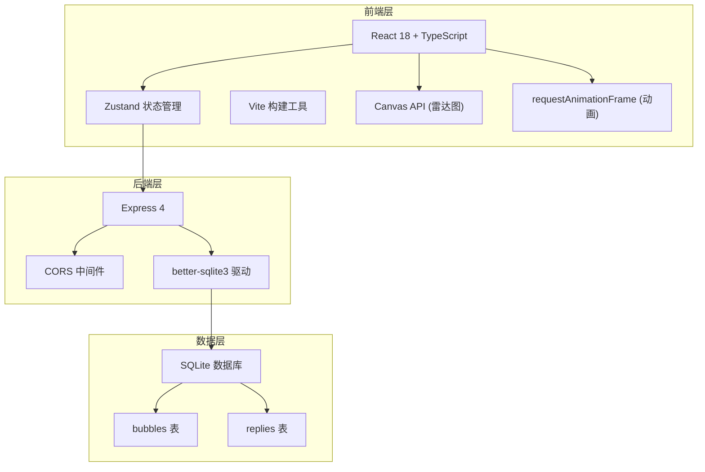
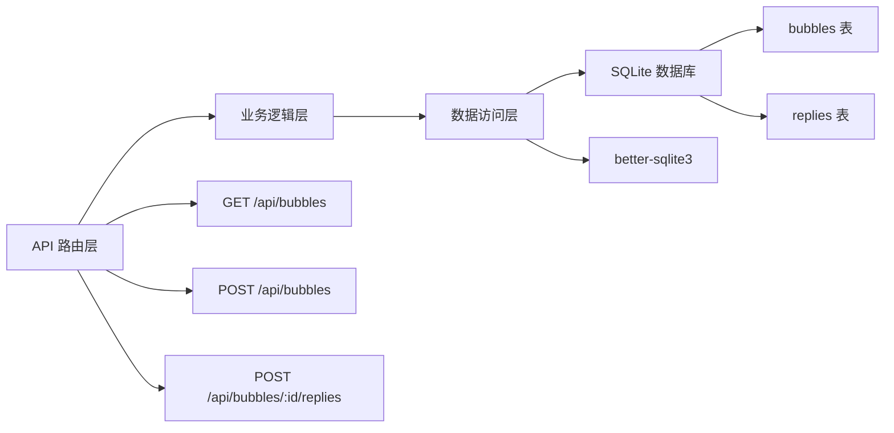
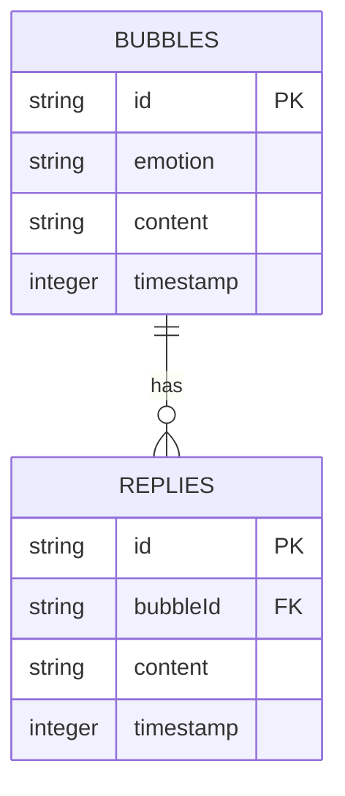

## 1. 架构设计



## 2. 技术描述

- **前端**：React@18 + TypeScript@5 + Zustand@4 + Axios@1
- **构建工具**：Vite@5 + @vitejs/plugin-react@4
- **后端**：Express@4 + better-sqlite3@11
- **数据库**：SQLite（本地文件存储）
- **工具库**：uuid@9 + concurrently@8
- **样式**：原生CSS + CSS变量 + CSS动画
- **动画**：requestAnimationFrame驱动60fps气泡动画
- **图表**：原生Canvas API绘制雷达图和柱状图

## 3. 目录结构

```
emotion-echo-wall/
├── src/
│   ├── App.tsx              # 主组件，布局管理
│   ├── BubbleWall.tsx       # 气泡墙组件（动画、碰撞检测）
│   ├── DetailModal.tsx      # 详情模态框（雷达图、回复）
│   ├── EmotionSidebar.tsx   # 情绪统计侧边栏
│   ├── store.ts             # Zustand 全局状态管理
│   └── main.tsx             # 应用入口
├── server/
│   └── server.ts            # Express 后端 API
├── index.html               # HTML 入口
├── vite.config.ts           # Vite 配置
├── tsconfig.json            # TypeScript 配置
└── package.json             # 项目依赖和脚本
```

## 4. API 定义

### 4.1 类型定义

```typescript
type EmotionType = 'happy' | 'sad' | 'angry' | 'anxious' | 'calm';

interface Bubble {
  id: string;
  emotion: EmotionType;
  content: string;
  timestamp: number;
  x: number;
  y: number;
  size: number;
  rotation: number;
  vy: number;
  vr: number;
}

interface Reply {
  id: string;
  bubbleId: string;
  content: string;
  timestamp: number;
}

interface EmotionStats {
  happy: number;
  sad: number;
  angry: number;
  anxious: number;
  calm: number;
  total: number;
  totalReplies: number;
}
```

### 4.2 API 接口

| 方法 | 路由 | 描述 | 请求参数 | 响应格式 |
|------|------|------|----------|----------|
| GET | `/api/bubbles?since={timestamp}` | 获取气泡列表 | `since` - 可选时间戳 | `{ bubbles: Bubble[], replies: Reply[] }` |
| POST | `/api/bubbles` | 创建新气泡 | `{ emotion: EmotionType, content: string }` | `Bubble` |
| POST | `/api/bubbles/:id/replies` | 添加回复 | `{ content: string }` | `Reply` |

## 5. 服务器架构



## 6. 数据模型

### 6.1 ER 图



### 6.2 DDL 语句

```sql
CREATE TABLE IF NOT EXISTS bubbles (
  id TEXT PRIMARY KEY,
  emotion TEXT NOT NULL,
  content TEXT NOT NULL,
  timestamp INTEGER NOT NULL
);

CREATE TABLE IF NOT EXISTS replies (
  id TEXT PRIMARY KEY,
  bubbleId TEXT NOT NULL,
  content TEXT NOT NULL,
  timestamp INTEGER NOT NULL,
  FOREIGN KEY (bubbleId) REFERENCES bubbles(id)
);

CREATE INDEX IF NOT EXISTS idx_bubbles_timestamp ON bubbles(timestamp);
CREATE INDEX IF NOT EXISTS idx_replies_bubbleId ON replies(bubbleId);
```

## 7. 核心算法

### 7.1 气泡碰撞检测

```typescript
function checkCollision(b1: Bubble, b2: Bubble): boolean {
  const dx = b1.x - b2.x;
  const dy = b1.y - b2.y;
  const distance = Math.sqrt(dx * dx + dy * dy);
  return distance < (b1.size + b2.size) / 2 + 10;
}
```

### 7.2 气泡位置生成

迭代尝试最多100次，寻找无碰撞的随机位置。

### 7.3 动画循环

使用 requestAnimationFrame 实现60fps动画，每帧更新气泡位置和旋转角度。

## 8. 性能优化

- 气泡数量上限200个，超出按时间戳移除最早的
- 使用 transform 和 opacity 实现GPU加速动画
- 时间过滤时使用CSS opacity而非DOM操作
- Canvas绘图时合理使用clearRect减少重绘
