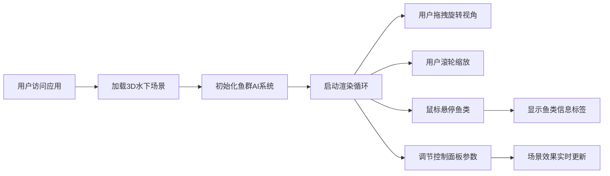

## 1. 产品概述

深海探索者是一个3D水下生态环境可视化应用，通过沉浸式交互展示海洋生物多样性，解决传统海洋科普展示方式单一、缺乏沉浸感与交互性的问题。目标用户包括海洋爱好者、学生和教育工作者。

- 通过Three.js实现真实感水下3D场景，包含动态海底地形、珊瑚礁、浮游生物等元素
- 提供交互式海洋生物观察体验，支持鱼类信息查看和环境参数调节
- 市场价值：创新的海洋科普教育工具，提升公众海洋保护意识

## 2. 核心功能

### 2.1 用户角色

| 角色 | 注册方式 | 核心权限 |
|------|----------|----------|
| 普通用户 | 无需注册 | 自由探索3D场景、观察鱼类、调节环境参数 |

### 2.2 功能模块

1. **3D水下场景生成模块**：Perlin噪声海底地形、珊瑚礁/海草/岩石分布、浮游生物粒子系统、水下光柱效果
2. **海洋生物AI与路径系统**：5种鱼类群游、Bezier曲线路径、障碍物绕行、悬停信息展示
3. **交互式控制面板**：光照强度/水体浑浊度/洋流速度调节、圆形仪表盘实时显示
4. **水下相机控制**：鼠标拖拽旋转视角、滚轮缩放、十字准星引导

### 2.3 页面详情

| 页面名称 | 模块名称 | 功能描述 |
|-----------|-------------|---------------------|
| 主场景页面 | 3D场景渲染 | 实时渲染水下环境，包含地形、植被、粒子和光柱效果 |
| 主场景页面 | 鱼群系统 | 5种不同鱼类按AI路径游动，支持悬停交互 |
| 主场景页面 | 控制面板 | 右下角浮动面板，环境参数滑块和仪表盘 |
| 主场景页面 | 相机控制 | 鼠标交互控制视角，十字准星引导 |

## 3. 核心流程

用户打开应用 → 3D水下场景自动加载渲染 → 鱼群开始按AI路径游动 → 用户通过鼠标拖拽/滚轮调整视角 → 鼠标悬停鱼类显示信息 → 调节控制面板参数实时改变场景效果

## 4. 用户界面设计

### 4.1 设计风格

- **主色调**：深蓝（#0a2a4a）到青色（#00d4ff）的渐变
- **辅助色**：白色半透明（rgba(255,255,255,0.8)）
- **按钮/滑块样式**：圆角设计（8-16px），毛玻璃背景（backdrop-filter: blur(10px)）
- **字体**：展示字体使用Orbitron（科技感），正文字体使用Roboto
- **布局**：全屏3D场景 + 右下角浮动控制面板 + 中央十字准星
- **图标风格**：线性简约风格，青色描边

### 4.2 页面设计概述

| 页面名称 | 模块名称 | UI元素 |
|-----------|-------------|-------------|
| 主场景页面 | 3D场景 | 深蓝色渐变海底地形、动态珊瑚礁、摇摆海草、浮动粒子、光柱效果 |
| 主场景页面 | 鱼群系统 | 5种不同颜色/大小鱼类，白色光晕悬停效果，半透明信息标签（逐字显示） |
| 主场景页面 | 控制面板 | 毛玻璃背景面板（rgba(10,30,50,0.6)），3个渐变弧线仪表盘，3个参数滑块 |
| 主场景页面 | 相机控制 | 中央半透明十字准星（直径6px），脉冲光晕动画（周期1.5秒） |

### 4.3 响应式

- **桌面端**：最小宽度1024px，右下角展开式控制面板
- **移动端**：最小宽度768px，控制面板折叠为底部导航栏，点击展开
- **触摸优化**：支持双指缩放和单指拖拽旋转

### 4.4 3D场景指导

- **环境与氛围**：深海蓝色调，光线从水面射下形成体积光，营造神秘深邃的水下氛围
- **光照设置**：
  - 环境光：HemisphereLight，天空色浅蓝，地面色深蓝
  - 方向光：模拟太阳光，从上方斜射，开启阴影
  - 点光源：多盏水下补光，形成散射效果
  - 光柱效果：使用SpotLight + 体积光着色器
- **相机设置**：
  - 初始位置：(0, 10, 40)，看向场景中心
  - 控制方式：OrbitControls，禁用平移
  - 缩放范围：10-80单位，缓动效果（ease-out，0.6秒）
- **构图与焦点元素**：场景中心为鱼群活动密集区，周围分布珊瑚礁群，引导用户视线
- **交互与动画**：
  - 鱼类游动：Bezier曲线平滑移动，身体摆动动画
  - 海草摇摆：sin函数控制，频率0.8-1.5Hz
  - 粒子浮动：缓慢上下移动，随机速度
  - 光柱移动：随时间轻微摆动
- **后处理效果**：Bloom光晕、水下雾效、轻微色彩校正
- **资源与性能预算**：
  - 总三角形数控制在10万以内
  - 鱼群使用实例化渲染（InstancedMesh）
  - 粒子系统使用Points
  - 目标帧率55-60FPS

