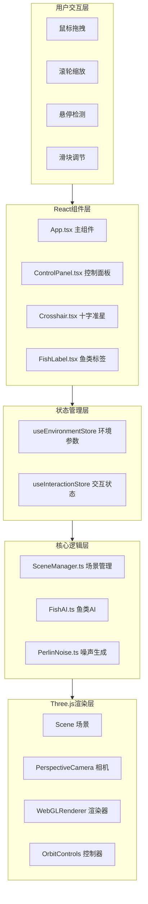

## 1. 架构设计



## 2. 技术描述

- **前端框架**：React@18 + TypeScript
- **构建工具**：Vite@5
- **3D渲染**：Three.js@0.160
- **状态管理**：Zustand@4
- **工具库**：uuid@9
- **CSS方案**：原生CSS + CSS变量 + Tailwind CSS@3
- **初始化方式**：Vite官方React+TypeScript模板

## 3. 目录结构与文件定义

```
e:\solo\VersionFastPro\tasks\auto2\
├── index.html                              # 入口HTML
├── package.json                            # 项目依赖
├── vite.config.js                          # Vite配置（路径别名@/）
├── tsconfig.json                           # TypeScript配置
├── .trae/
│   └── documents/
│       ├── prd.md                          # 产品需求文档
│       └── technical-architecture.md       # 技术架构文档
└── src/
    ├── main.tsx                            # React入口
    ├── App.tsx                             # 主组件
    ├── index.css                           # 全局样式
    ├── store/
    │   └── useEnvironmentStore.ts          # Zustand环境状态管理
    ├── core/
    │   ├── SceneManager.ts                 # 场景管理器
    │   ├── FishAI.ts                       # 鱼类AI系统
    │   └── utils/
    │       ├── PerlinNoise.ts              # Perlin噪声算法
    │       └── BezierCurve.ts              # Bezier曲线工具
    ├── components/
    │   ├── ControlPanel.tsx                # 控制面板组件
    │   ├── Gauge.tsx                       # 圆形仪表盘组件
    │   ├── Crosshair.tsx                   # 十字准星组件
    │   └── FishInfoLabel.tsx               # 鱼类信息标签组件
    └── types/
        └── index.ts                        # 全局类型定义
```

## 4. 核心模块数据流

### 4.1 场景渲染数据流
```
Zustand Store (环境参数)
    ↓ (读取)
SceneManager.updateEnvironment()
    ↓ (更新)
Three.js Scene / Lights / Fog
    ↓ (渲染)
WebGLRenderer.render()
```

### 4.2 鱼类AI数据流
```
SceneManager.getObstacleMeshes()
    ↓ (获取碰撞体)
FishAI.update(deltaTime)
    ↓ (计算路径/避障)
FishAI.getFishStates()
    ↓ (返回位置/旋转)
SceneManager.updateFishMeshes()
    ↓ (更新)
InstancedMesh.instanceMatrix
```

### 4.3 用户交互数据流
```
用户鼠标/触摸事件
    ↓
React事件处理器
    ↓ (更新)
Zustand Store
    ↓ (订阅变化)
SceneManager / FishAI 响应更新
    ↓ (UI反馈)
ControlPanel / FishInfoLabel 重渲染
```

## 5. 类型定义

```typescript
// src/types/index.ts

export interface EnvironmentParams {
  lightIntensity: number;      // 光照强度 0-100
  waterTurbidity: number;      // 水体浑浊度 0-100
  currentSpeed: number;        // 洋流速度 0-5
}

export interface FishSpecies {
  id: string;
  name: string;
  description: string;
  color: number;
  size: number;
  speed: number;
  count: number;               // 鱼群个体数 3-8
}

export interface FishState {
  id: string;
  speciesId: string;
  position: THREE.Vector3;
  rotation: THREE.Euler;
  pathProgress: number;
  pathPoints: THREE.Vector3[];
  isHovered: boolean;
}

export interface CoralConfig {
  type: number;                // 珊瑚类型 0-2
  position: THREE.Vector3;
  scale: number;
  rotation: number;
}

export interface SeaweedConfig {
  position: THREE.Vector3;
  height: number;
  swayFrequency: number;       // 摆动频率 0.8-1.5Hz
  swayPhase: number;
}
```

## 6. 性能优化策略

### 6.1 渲染性能
- **实例化渲染**：鱼群使用 `THREE.InstancedMesh`，减少Draw Call
- **LOD**：远处珊瑚和岩石使用低多边形模型
- **视锥体剔除**：Three.js内置，确保只渲染可见物体
- **粒子系统**：浮游生物使用 `THREE.Points`，单个Draw Call渲染

### 6.2 计算性能
- **空间分区**：障碍物使用Grid Spatial Hash，加速碰撞检测
- **对象池**：路径点和临时向量对象复用，避免GC
- **AI计算**：每帧控制在2ms以内，使用向量运算代替三角函数
- **requestAnimationFrame**：所有动画统一驱动，减少重排重绘

### 6.3 内存管理
- **Geometry复用**：相同形态的珊瑚/岩石共享BufferGeometry
- **Material复用**：同类物体共享Material，通过uniform区分
- **资源清理**：组件卸载时dispose所有Three.js对象

## 7. 响应式适配

| 断点 | 控制面板布局 | 交互方式 |
|------|-------------|----------|
| ≥1024px (桌面) | 右下角浮动，完全展开 | 鼠标拖拽+滚轮 |
| 768-1024px (平板) | 右下角浮动，紧凑布局 | 触摸+鼠标双支持 |
| <768px (手机) | 底部导航栏，点击展开 | 触摸手势（单指拖拽，双指缩放） |

## 8. 关键算法

### 8.1 Perlin噪声地形生成
- 多层octave噪声叠加，生成自然的海底起伏
- 深度范围：-20到-50单位
- 地形分辨率：128x128顶点

### 8.2 Bezier曲线路径
- 三次Bezier曲线生成平滑游动路径
- 路径点在场景边界内随机生成
- 每5秒重新计算一条新路径

### 8.3 障碍物绕行
- 基于射线检测的平滑绕行算法
- 绕行半径：2单位
- 使用Steering Behaviors实现自然避障

### 8.4 缓动函数
- 相机缩放：ease-out cubic，持续0.6秒
- 参数过渡：lerp线性插值，持续0.5秒
- UI动画：cubic-bezier(0.4, 0, 0.2, 1)

