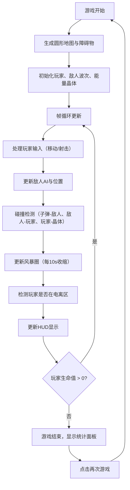

## 1. 产品概述

"电磁风暴生存战"是一款俯视角2D射击生存游戏，玩家需要在动态收缩的电磁风暴区域内躲避并反击机械敌人，同时收集能量晶体为武器充能。游戏融合了大逃杀类的缩圈机制与射击生存玩法，为独立游戏爱好者提供紧张刺激的游戏体验。

- 核心玩法：在不断缩小的安全区内生存，消灭敌人，收集能量晶体维持武器火力
- 目标用户：独立游戏爱好者、俯视角射击游戏玩家
- 市场价值：提供轻量化、快节奏的生存射击体验，适合碎片化时间游玩

## 2. 核心功能

### 2.1 用户角色
| 角色 | 注册方式 | 核心权限 |
|------|----------|----------|
| 玩家 | 无需注册 | 完整游戏体验，查看得分统计 |

### 2.2 功能模块
1. **地图生成模块**：圆形区域划分、障碍物随机摆放、电磁风暴动态收缩
2. **战斗系统模块**：敌人波次生成、AI追击、碰撞检测、得分计算
3. **充能系统模块**：能量晶体生成、拾取机制、武器能量管理
4. **HUD界面模块**：得分显示、生命值显示、能量槽、游戏结束面板

### 2.3 页面详情
| 页面名称 | 模块名称 | 功能描述 |
|----------|----------|----------|
| 游戏主页面 | 地图渲染 | 显示圆形游戏区域、障碍物、风暴边界 |
| 游戏主页面 | 角色控制 | WASD移动，鼠标左键射击 |
| 游戏主页面 | HUD界面 | 左上角得分、右上角生命值、底部能量槽 |
| 游戏结束面板 | 统计展示 | 显示最终得分、存活时间、击败敌人数量，重新开始按钮 |

## 3. 核心流程

## 4. 用户界面设计

### 4.1 设计风格
- **配色方案**：深色科技风，背景#1a1a2e，地图外纯黑#000000
  - 玩家：绿色#4caf50
  - 敌人：红色#d32f2f
  - 子弹：黄色#ffeb3b
  - 能量晶体：青色#00bcd4
  - 障碍物：灰色#808080
  - 风暴边界：半透明蓝色#2196f380
  - 警告效果：红色#f44336
- **按钮风格**：游戏结束面板按钮，圆角设计，悬停变亮
- **字体**：monospace等宽字体，数字带发光效果
- **布局**：16:9响应式画布，上下左右黑边填充

### 4.2 页面设计概述
| 页面名称 | 模块名称 | UI元素 |
|----------|----------|----------|
| 游戏主页面 | 地图区域 | 圆形游戏区、灰色障碍物、蓝色风暴边界粒子、红色闪烁警告环 |
| 游戏主页面 | 玩家角色 | 18x18绿色矩形，能量不足时显示红色能量波纹 |
| 游戏主页面 | 敌人 | 20x20红色矩形，向玩家移动 |
| 游戏主页面 | 子弹 | 4px黄色圆形 |
| 游戏主页面 | 能量晶体 | 10px蓝色菱形，拾取时缩小动画 |
| 游戏主页面 | HUD | 左上角得分（白色24px带发光）、右上角生命值（红色24px，低于30%抖动放大）、底部能量槽（200px宽，低于20%闪烁） |
| 游戏结束面板 | 统计面板 | 半透明黑色背景、圆角12px、内边距24px，显示最终得分/存活时间/击败数、"再次游戏"按钮 |

### 4.3 响应式设计
- 采用桌面优先设计，canvas保持16:9长宽比
- 根据窗口尺寸自适应缩放，不足部分用黑边填充
- 支持鼠标和键盘操作

### 4.4 视觉特效
- 游戏开始淡入动画（2秒）
- 风暴收缩粒子效果（10-15个蓝色小圆点沿边界移动）
- 能量不足警告音效（AudioContext短促蜂鸣）
- 电离区红色闪烁边框（透明度0-0.3周期变化）
- 生命值低于30%时字体抖动放大动画
- 能量低于20%时能量槽闪烁
