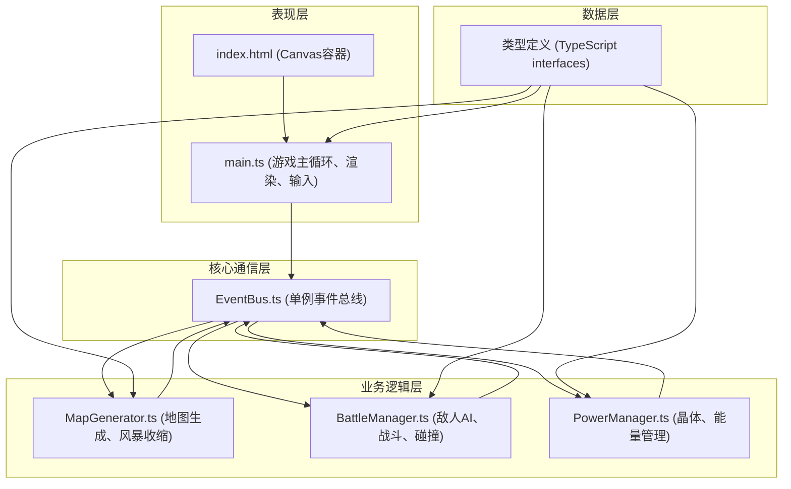

## 1. 架构设计



**数据流向说明：**
1. 输入事件 → main.ts → EventBus.emit → 各模块处理
2. 模块状态更新 → EventBus.emit → main.ts → 渲染更新
3. 模块间通信通过EventBus松耦合

## 2. 技术描述

- **前端框架**：纯TypeScript + Canvas 2D API（不使用React/Vue，按用户要求）
- **构建工具**：Vite 5.x
- **编程语言**：TypeScript 5.x（strict模式，target ES2020）
- **状态管理**：单例事件总线（发布-订阅模式）
- **对象池**：自定义实现，用于子弹和敌人对象复用
- **音频**：Web Audio API（AudioContext生成音效）
- **动画**：requestAnimationFrame驱动

**核心设计模式：**
- **单例模式**：EventBus、各Manager类
- **发布-订阅模式**：模块间通信
- **对象池模式**：子弹和敌人对象复用
- **模块化设计**：按职责分离地图、战斗、充能三大模块

## 3. 文件结构与调用关系

```
e:\solo\VersionFastPro\tasks\auto200\
├── package.json              # 项目依赖与脚本
├── vite.config.js            # Vite构建配置
├── tsconfig.json             # TypeScript配置
├── index.html                # 入口HTML
└── src/
    ├── main.ts               # 游戏主入口，调用关系：
    │                         #   ↓ 初始化
    │                         #   MapGenerator.generateMap()
    │                         #   BattleManager.init()
    │                         #   PowerManager.init()
    │                         #   ↓ 帧循环
    │                         #   更新各模块 → 渲染
    ├── core/
    │   └── EventBus.ts       # 事件总线单例，被所有模块引用
    ├── types/
    │   └── index.ts          # 全局类型定义，被所有模块引用
    ├── utils/
    │   ├── ObjectPool.ts     # 对象池工具类
    │   └── Collision.ts      # 碰撞检测工具函数
    ├── map/
    │   └── MapGenerator.ts   # 地图生成模块
    │                         # 调用：EventBus.emit/on
    │                         # 被调用：main.ts初始化
    ├── battle/
    │   └── BattleManager.ts  # 战斗模块
    │                         # 调用：EventBus.emit/on, ObjectPool, Collision
    │                         # 被调用：main.ts初始化与更新
    └── power/
        └── PowerManager.ts   # 充能模块
                                  # 调用：EventBus.emit/on, Collision
                                  # 被调用：main.ts初始化与更新
```

## 4. 核心数据模型

### 4.1 类型定义

```typescript
// 位置接口
interface Position {
  x: number;
  y: number;
}

// 玩家状态
interface Player {
  x: number;
  y: number;
  width: number;
  height: number;
  speed: number;
  health: number;
  maxHealth: number;
  energy: number;
  maxEnergy: number;
  lastShotTime: number;
  shootCooldown: number;
}

// 敌人状态
interface Enemy {
  id: number;
  x: number;
  y: number;
  width: number;
  height: number;
  speed: number;
  active: boolean;
}

// 子弹状态
interface Bullet {
  id: number;
  x: number;
  y: number;
  radius: number;
  speed: number;
  dx: number;
  dy: number;
  active: boolean;
}

// 障碍物
interface Obstacle {
  x: number;
  y: number;
  radius: number;
}

// 能量晶体
interface Crystal {
  id: number;
  x: number;
  y: number;
  size: number;
  active: boolean;
  pickupProgress: number; // 0-1, 拾取动画进度
}

// 风暴圈状态
interface Storm {
  centerX: number;
  centerY: number;
  radius: number;
  targetRadius: number;
  shrinkStartTime: number;
  shrinkDuration: number;
  isShrinking: boolean;
}

// 游戏状态
interface GameState {
  score: number;
  wave: number;
  enemiesKilled: number;
  survivalTime: number;
  isGameOver: boolean;
  isPaused: boolean;
}
```

### 4.2 事件定义

```typescript
// 事件总线事件类型
enum GameEvent {
  // 输入事件
  KEY_DOWN = 'key:down',
  KEY_UP = 'key:up',
  MOUSE_MOVE = 'mouse:move',
  MOUSE_DOWN = 'mouse:down',
  
  // 玩家事件
  PLAYER_MOVE = 'player:move',
  PLAYER_SHOOT = 'player:shoot',
  PLAYER_HIT = 'player:hit',
  PLAYER_HEALTH_CHANGE = 'player:healthChange',
  
  // 敌人事件
  ENEMY_SPAWN = 'enemy:spawn',
  ENEMY_DESTROY = 'enemy:destroy',
  WAVE_START = 'wave:start',
  
  // 能量事件
  CRYSTAL_PICKUP = 'crystal:pickup',
  ENERGY_CHANGE = 'energy:change',
  ENERGY_LOW = 'energy:low',
  
  // 风暴事件
  STORM_SHRINK = 'storm:shrink',
  PLAYER_IN_STORM = 'player:inStorm',
  
  // 游戏事件
  SCORE_CHANGE = 'score:change',
  GAME_OVER = 'game:over',
  GAME_RESTART = 'game:restart',
}
```

## 5. 性能优化策略

### 5.1 对象池技术
- 子弹和敌人对象使用对象池管理，避免频繁GC
- 初始池大小：子弹50个，敌人50个
- 对象复用通过active标志位控制

### 5.2 碰撞检测优化
- 空间分区：将地图划分为网格，只检测相邻网格内的对象
- 圆形与矩形碰撞优化算法
- 提前距离检测过滤不可能碰撞的对象

### 5.3 渲染优化
- 离屏canvas预渲染静态元素（障碍物）
- 脏矩形渲染：只重绘变化区域
- requestAnimationFrame驱动，固定逻辑帧率30FPS

### 5.4 内存管理
- 及时解除事件监听
- 大对象引用手动置null
- 避免闭包内存泄漏

## 6. 性能指标

| 指标 | 目标值 |
|------|--------|
| 帧率 | ≥ 30 FPS |
| 敌人数量上限 | 50个（800x600分辨率） |
| 内存占用 | < 100MB |
| 响应延迟 | < 50ms |
