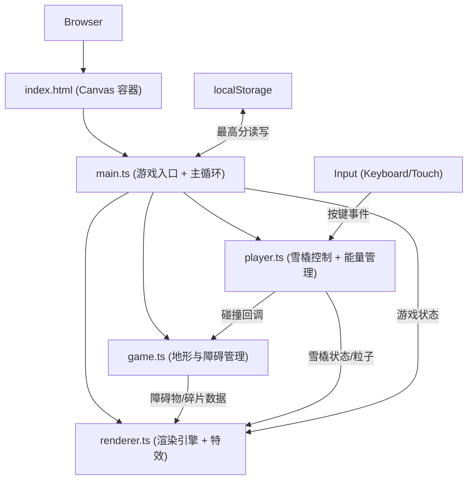

## 1. 架构设计



## 2. 技术描述

- **前端框架**：纯 TypeScript + HTML5 Canvas 2D（无 React/Vue，用户明确要求）
- **构建工具**：Vite 5.x（快速开发服务器 + TypeScript 编译）
- **开发语言**：TypeScript 5.x（strict 严格模式）
- **字体**：Google Fonts - Press Start 2P（像素风格字体，CDN 引入）
- **数据存储**：浏览器 localStorage（存储最高分记录）

### 2.1 依赖清单

| 包名 | 版本范围 | 用途 |
|------|----------|------|
| typescript | ^5.4.0 | TypeScript 编译器 |
| vite | ^5.2.0 | 构建工具 + 开发服务器 |
| @types/node | ^20.11.0 | Node.js 类型定义（Vite 配置用） |

### 2.2 启动脚本

```json
{
  "scripts": {
    "dev": "vite",
    "build": "tsc && vite build",
    "preview": "vite preview"
  }
}
```

## 3. 文件结构

```
auto201/
├── index.html              # 入口页面，全屏黑色，引入 Canvas + Google Fonts
├── package.json            # 项目依赖与脚本
├── vite.config.js          # Vite 构建配置
├── tsconfig.json           # TypeScript 严格模式配置
└── src/
    ├── main.ts             # 游戏入口：初始化 + requestAnimationFrame 主循环 + 状态机
    ├── game.ts             # 地形/障碍/碎片：生成、滚动、碰撞检测、对象回收
    ├── player.ts           # 雪橇：输入控制、物理运动、尾迹粒子、收集动画、能量
    └── renderer.ts         # 渲染器：所有绘制函数、极光带、脉冲波、光晕、粒子爆炸
```

## 4. 核心类型定义

```typescript
// 游戏状态枚举
type GameState = 'idle' | 'playing' | 'gameover';

// 地形段
interface TerrainSegment {
  x: number;
  y: number;
  width: number;   // 150
  height: number;  // 50
  hasCrack: boolean;
  crackX?: number;
  crackWidth?: number;
}

// 冰块障碍
interface IceBlock {
  id: number;
  x: number;
  y: number;
  size: number;  // 25
  active: boolean;
}

// 极光碎片
interface AuroraShard {
  id: number;
  x: number;
  y: number;
  radius: number;  // 8
  rotation: number;
  pulsePhase: number;
  driftVx: number;
  active: boolean;
}

// 粒子（尾迹/爆炸）
interface Particle {
  x: number;
  y: number;
  vx: number;
  vy: number;
  life: number;
  maxLife: number;
  color: string;
  size: number;
}

// 玩家状态
interface PlayerState {
  x: number;
  y: number;
  vx: number;       // 水平速度
  rotation: number; // 倾斜角度（弧度）
  targetRotation: number;
  energy: number;   // 0-100
  shardsCollected: number;  // 当前周期收集计数（每5个+10%能量）
  invincible: boolean;
  speedBoost: boolean;
  burstTimer: number;       // 加速剩余时间（秒）
  collectFlash: number;     // 收集特效剩余时间（秒）
}
```

## 5. 关键算法与参数

### 5.1 物理参数

| 参数 | 值 | 说明 |
|------|-----|------|
| MOVE_SPEED | 6 px/frame | 目标水平移动速度 |
| ACCELERATION | 0.3 | 水平加速度 |
| DAMPING | 0.85 | 松开按键后的阻尼系数 |
| MAX_ROTATION | ±15° (±0.2618 rad) | 雪橇最大倾斜角 |
| ROTATION_SPEED | 0.3 rad/s | 倾斜角速度 |
| SCROLL_SPEED_BASE | 4 px/frame | 基础滚动速度（随分数递增） |

### 5.2 障碍生成

- 初始刷新间隔：2.0s
- 每 30 分缩短：0.1s
- 间隔下限：0.5s
- 对象池阈值：>200 个时回收屏幕外对象
- 类型概率：裂缝 40%，冰块 40%，碎片 20%

### 5.3 能量系统

- 每收集 5 个碎片：能量 +10%
- 能量满 100%：触发极光爆发
- 爆发效果：
  - 紫色全屏光晕 2s（0→0.6→0）
  - 雪橇速度翻倍 3s
  - 清除所有障碍和碎片
  - 雪橇为中心的脉冲波扩散
  - 持续 3s 无敌

### 5.4 碰撞检测

- 雪橇：AABB 矩形（60×25），旋转时使用缩小的安全盒
- 冰块：菱形 → 外接圆半径 17.7px（25/√2），使用圆-矩形检测
- 碎片：六角星 → 半径 8px，圆-矩形检测
- 裂缝：矩形条带，与雪橇底部 AABB 检测

### 5.5 渲染性能

- 分层绘制：背景层（夜空+极光带）→ 地形层 → 游戏层 → UI 层
- 极光带：离屏 Canvas 预渲染正弦波路径，每帧更新透明度和偏移
- 粒子池：固定上限 300 个，循环复用
- 对象回收：遍历 active=false 的对象复用，避免 GC 抖动
