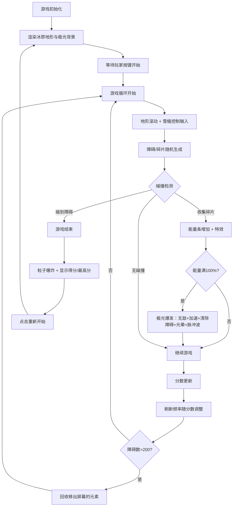

## 1. 产品概述

荒野极光探索是一款 2D 横版跑酷类网页游戏，玩家控制发光雪橇在极光笼罩的冰原地带高速滑行，躲避裂缝与冰块障碍，收集极光碎片积累能量，触发极光爆发获得短暂无敌与加速效果。

- 目标用户：休闲游戏爱好者、极光主题视觉爱好者
- 核心价值：沉浸式极光视觉体验 + 紧张刺激的躲避收集玩法

## 2. 核心功能

### 2.1 功能模块

1. **主游戏界面**：地形渲染、障碍物、雪橇玩家、极光碎片、能量条、分数显示
2. **地形与障碍生成**：分段冰原地面、随机裂缝、随机冰块、动态刷新频率
3. **雪橇控制**：A/D 或左右方向键控制、平滑加减速、倾斜旋转动画、收集特效
4. **极光能量与爆发**：能量条、碎片收集、极光爆发特效（紫色光晕、脉冲波、无敌加速）、障碍清除
5. **游戏结束界面**：粒子爆炸、最终得分、最高分记录（localStorage）

### 2.2 页面详情

| 页面名称 | 模块名称 | 功能描述 |
|-----------|-------------|---------------------|
| 主游戏界面 | 冰原地形 | 分段矩形条组成（150×50px），#0a1628 到 #1a2a5e 渐变，半透明冰纹边缘 |
| 主游戏界面 | 障碍系统 | 裂缝（20-40px 暗色条带 #2a1a4e，发光边缘 #6a3a9e）、冰块（边长 25px 菱形 #b0d0ff80） |
| 主游戏界面 | 雪橇玩家 | 圆角矩形（60×25px）#ffd700，发光光晕，粒子尾迹，收集时缩放闪白 |
| 主游戏界面 | 极光碎片 | 六角星（外接圆半径 8px）#00e5ff，缓慢旋转脉动 |
| 主游戏界面 | 能量条 | 顶部渐变条（400×12px），深蓝底色，青到紫渐变填充，圆角 6px |
| 主游戏界面 | 极光带 | 屏幕上方正弦波飘动的半透明绿到紫渐变条带 |
| 主游戏界面 | UI 文字 | Press Start 2P 像素字体，分数、最高分显示 |
| 游戏结束界面 | 结束面板 | 粒子爆炸效果，最终得分，最高分，重新开始按钮 |

## 3. 核心流程

## 4. 用户界面设计

### 4.1 设计风格
- **主色调**：深蓝到紫黑的夜空渐变背景（#0a1628 → #1a0a2e → #0a0518）
- **点缀色**：金色雪橇 #ffd700，青色极光 #00e5ff，紫色光晕 #9c27b0
- **按钮风格**：圆角像素按钮，霓虹发光效果
- **字体**：Press Start 2P 像素风格字体
- **布局**：Canvas 全屏渲染，UI 元素绝对定位叠加
- **动效**：正弦波极光飘动、粒子尾迹、能量脉动、爆发脉冲波

### 4.2 页面设计概述

| 页面名称 | 模块名称 | UI 元素 |
|-----------|-------------|-------------|
| 主游戏界面 | 背景层 | 垂直渐变夜空，正弦波极光带（2-3层半透明），稀疏星星 |
| 主游戏界面 | 地形层 | 分段矩形冰原条，边缘冰纹，随机裂缝发光边缘 |
| 主游戏界面 | 游戏层 | 雪橇（含光晕、尾迹粒子）、冰块（菱形高光）、碎片（六角星旋转脉动） |
| 主游戏界面 | UI 层 | 顶部能量条、左上角分数、右上角最高分、暂停/开始提示 |
| 游戏结束界面 | 结束层 | 粒子爆炸扩散、半透明遮罩、最终得分（大）、最高分（中）、重新开始按钮 |

### 4.3 响应性
- **桌面优先**：Canvas 自适应窗口大小，游戏逻辑坐标独立于屏幕分辨率
- **触控优化**：移动端支持左右半屏触控替代键盘
- **性能目标**：稳定 60fps，requestAnimationFrame 驱动，对象池/回收机制
