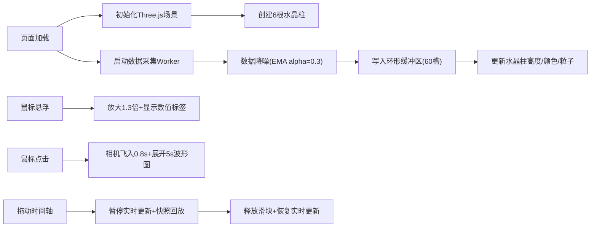

## 1. 产品概述

3D水晶塔性能可视化应用，将浏览器实时性能数据（FPS、CPU占用、内存使用、网络延迟、帧渲染时间、GPU）动态映射到6根参数化3D水晶柱上，解决传统2D图表在展示多维性能指标时缺乏立体感和空间关联性的问题。

- 目标用户：前端开发者、性能优化工程师、Web应用监控人员
- 核心价值：通过沉浸式3D可视化直观展示多维度性能数据，提升性能问题诊断效率

## 2. 核心功能

### 2.1 用户角色
| 角色 | 注册方式 | 核心权限 |
|------|----------|----------|
| 普通用户 | 无需注册 | 查看实时性能数据、交互操作水晶柱、回溯历史数据 |

### 2.2 功能模块
1. **3D水晶塔群**：6根参数化水晶柱实时展示6项性能指标
2. **数据采集与处理**：从浏览器API获取性能数据，经Worker缓冲降噪
3. **交互聚焦系统**：悬浮放大显示数值、点击飞入展示历史波形
4. **全局时间轴**：60秒历史回溯，拖动滑块查看任意时间点快照
5. **UI叠加层**：顶部FPS显示、悬浮标签、波形图、磨砂玻璃风格

### 2.3 页面详情
| 页面名称 | 模块名称 | 功能描述 |
|---------|----------|----------|
| 主页面 | 3D场景渲染 | Three.js场景、相机、渲染器初始化，6根水晶柱环形排列 |
| 主页面 | 数据采集模块 | Performance API、Memory API数据采集，环形缓冲区存储 |
| 主页面 | 交互系统 | Raycaster检测悬浮/点击，相机飞行动画，波形图展开 |
| 主页面 | 时间轴控制 | 60秒范围滑块拖动，数据快照回放与恢复 |
| 主页面 | UI叠加层 | HTML+CSS悬浮标签、波形Canvas、磨砂玻璃效果 |

## 3. 核心流程

用户打开页面 → 初始化3D场景和数据采集 → 实时性能数据驱动水晶柱动画 → 鼠标悬浮查看数值 → 点击查看历史波形 → 拖动时间轴回溯历史数据 → 松开恢复实时更新

## 4. 用户界面设计

### 4.1 设计风格
- **主题色**：深邃宇宙背景（径向渐变#0a0a1a到#1a1a2e）
- **柱体渐变**：低负载浅青#80cbc4 → 中负载琥珀#ffb74d → 高负载猩红#e53935
- **UI风格**：半透明磨砂玻璃质感（背景#1e1e2e80，边框#45475a40，圆角8px）
- **字体**：monospace等宽字体，数值使用#cdd6f4，辅助文字#6c7086
- **动画**：所有交互平滑过渡（200ms ease-out），相机飞行0.8s easeOutQuad

### 4.2 页面设计概述
| 页面名称 | 模块名称 | UI元素 |
|---------|----------|--------|
| 主页面 | 3D场景 | 环形基座（半径3单位，半透明圆环#ffffff08）、6根水晶柱等间距排列、星点纹理旋转 |
| 主页面 | 顶部FPS | 48px大字，monospace字体，#cdd6f4，微弱发光效果 |
| 主页面 | 悬浮标签 | 160px宽，磨砂玻璃#1e1e2e，圆角8px，14px#cdd6f4文字 |
| 主页面 | 波形图 | 240x60px Canvas，波形线色与柱体一致，背景#11111b |
| 主页面 | 时间轴 | 横向滑块，菱形#cba6f7滑块，每10秒刻度，两端"60秒前"/"现在"文字 |

### 4.3 响应式设计
- 桌面端（≥768px）：柱体间距3单位，顶部FPS字号48px
- 移动端（<768px）：柱体间距缩小至2单位，顶部FPS字号32px，时间轴高度压缩

### 4.4 3D场景设计
- **环境**：深邃宇宙径向渐变背景，缓慢旋转的星点纹理
- **光照**：环境光#ffffff强度0.3，斜上方点光源强度0.8
- **相机**：透视相机75度FOV，近裁面0.1，远裁面100，初始位置(0, 5, 10)
- **材质**：MeshPhysicalMaterial（transparent, roughness:0.1, metalness:0.2）
- **粒子**：50-80个AdditiveBlending光点，螺旋上升速度与指标值正相关
- **性能**：单帧主线程处理≤8ms，确保60FPS不丢帧

## 5. 技术约束

- **数据更新**：每帧获取数据，指数移动平均降噪alpha=0.3
- **环形缓冲区**：60个槽位，每槽存储6项指标快照
- **波形图**：双缓冲Canvas减少闪烁，展示最近60帧数据
- **柱体结构**：底部八边形棱柱高0.5单位，顶部尖锥高1-8单位
- **交互阈值**：悬浮放大1.3倍，相机飞行0.8s easeOutQuad
