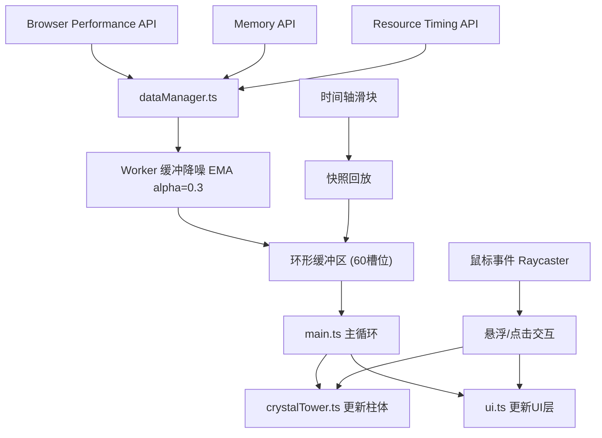

## 1. 架构设计



## 2. 技术栈说明

- **前端框架**：原生 TypeScript + Three.js v0.160+
- **构建工具**：Vite v5.x
- **类型系统**：TypeScript 严格模式（strict: true）
- **3D渲染**：Three.js WebGLRenderer
- **数据处理**：Web Worker + 指数移动平均（EMA）
- **UI层**：HTML + CSS 叠加层 + Canvas 2D

### 依赖清单
| 依赖包 | 版本 | 用途 |
|--------|------|------|
| three | ^0.160.0 | 3D渲染引擎 |
| @types/three | ^0.160.0 | Three.js类型定义 |
| typescript | ^5.3.0 | TypeScript编译器 |
| vite | ^5.0.0 | 构建工具和开发服务器 |

## 3. 文件结构定义

```
auto202/
├── package.json          # 项目依赖和脚本
├── vite.config.js        # Vite配置
├── tsconfig.json         # TypeScript配置
├── index.html            # 入口HTML
└── src/
    ├── main.ts           # 主入口：场景初始化、渲染循环
    ├── crystalTower.ts   # 水晶柱工厂：createCrystalTower()
    ├── dataManager.ts    # 数据管理：startDataCollection, getCurrentData, getSnapshot
    └── ui.ts             # UI管理：createUI, 悬浮标签, 时间轴, 波形图
```

## 4. 核心数据结构

### 4.1 性能指标类型
```typescript
type MetricType = 'fps' | 'cpu' | 'memory' | 'network' | 'frameTime' | 'gpu';

interface PerformanceData {
  fps: number;        // 0-60+
  cpu: number;        // 0-100%
  memory: number;     // 0-100%
  network: number;    // 0-500ms
  frameTime: number;  // 0-50ms
  gpu: number;        // 0-100%
}

interface Snapshot {
  timestamp: number;
  data: PerformanceData;
}
```

### 4.2 水晶柱接口
```typescript
interface CrystalTower {
  mesh: THREE.Group;
  metric: MetricType;
  update: (value: number, isSnapshot?: boolean) => void;
  particles: THREE.Points;
  getCurrentValue: () => number;
  getCurrentColor: () => THREE.Color;
  getHistory: () => number[];
}
```

### 4.3 环形缓冲区
```typescript
const BUFFER_SIZE = 60;
interface RingBuffer {
  slots: Snapshot[];
  writeIndex: number;
  write(snapshot: Snapshot): void;
  read(offset: number): Snapshot | null;
  getRange(start: number, end: number): Snapshot[];
}
```

## 5. 核心算法

### 5.1 指数移动平均降噪
```typescript
const ALPHA = 0.3;
function ema(prev: number, current: number): number {
  return ALPHA * current + (1 - ALPHA) * prev;
}
```

### 5.2 颜色渐变映射
```typescript
// 低负载#80cbc4 → 中负载#ffb74d → 高负载#e53935
function getColorByValue(normalizedValue: number): THREE.Color {
  // normalizedValue: 0-1
  if (normalizedValue < 0.5) {
    return interpolateColor('#80cbc4', '#ffb74d', normalizedValue * 2);
  } else {
    return interpolateColor('#ffb74d', '#e53935', (normalizedValue - 0.5) * 2);
  }
}
```

### 5.3 螺旋粒子位置计算
```typescript
function getSpiralPosition(
  height: number, 
  index: number, 
  total: number, 
  rotation: number
): THREE.Vector3 {
  const angle = (index / total) * Math.PI * 4 + rotation;
  const radius = 0.3;
  const y = (index / total) * height;
  return new THREE.Vector3(
    Math.cos(angle) * radius,
    y,
    Math.sin(angle) * radius
  );
}
```

### 5.4 缓动函数
```typescript
function easeOutQuad(t: number): number {
  return t * (2 - t);
}
```

## 6. 数据采集策略

### 6.1 FPS计算
```typescript
let lastTime = performance.now();
let frameCount = 0;
function calculateFPS(): number {
  const now = performance.now();
  frameCount++;
  if (now - lastTime >= 1000) {
    const fps = frameCount;
    frameCount = 0;
    lastTime = now;
    return fps;
  }
  return 0; // 非更新帧返回0，由EMA平滑
}
```

### 6.2 CPU估算
```typescript
// 通过navigator.hardwareConcurrency和主线程忙碌时间估算
function estimateCPU(): number {
  const cores = navigator.hardwareConcurrency || 4;
  const busyTime = performance.now() - lastFrameStart;
  return Math.min(100, (busyTime / 16.67) * (100 / cores) * 4);
}
```

### 6.3 内存获取
```typescript
function getMemoryUsage(): number {
  const mem = (performance as any).memory;
  if (mem) {
    return (mem.usedJSHeapSize / mem.jsHeapSizeLimit) * 100;
  }
  // 模拟数据
  return 30 + Math.sin(Date.now() / 5000) * 20 + Math.random() * 10;
}
```

### 6.4 网络延迟
```typescript
function getNetworkLatency(): number {
  const resources = performance.getEntriesByType('resource');
  if (resources.length > 0) {
    const latencies = resources.map(r => r.responseEnd - r.requestStart);
    return latencies.reduce((a, b) => a + b, 0) / latencies.length;
  }
  // 模拟数据
  return 50 + Math.random() * 100;
}
```

## 7. 性能优化策略

### 7.1 主线程性能预算（≤8ms/帧）
| 任务 | 时间预算 |
|------|----------|
| 数据采集 | ≤1ms |
| EMA降噪处理 | ≤0.5ms |
| 6根柱体高度更新 | ≤1ms |
| 粒子位置计算(6×80) | ≤3ms |
| UI更新 | ≤1.5ms |
| 缓冲区写入 | ≤0.5ms |
| **合计** | **≤7.5ms** |

### 7.2 渲染优化
- 复用BufferGeometry，避免每帧重建
- 使用InstancedMesh渲染粒子（备选方案）
- 材质transparent启用但关闭depthWrite
- Canvas波形图使用双缓冲技术

### 7.3 内存管理
- 环形缓冲区固定大小60，避免内存泄漏
- 及时dispose不再使用的Geometry和Material
- 事件监听器在组件销毁时移除

## 8. 交互事件流

### 8.1 悬浮检测
```
mousemove → Raycaster.setFromCamera → intersectObjects
         → 命中柱体 → scale.set(1.3, 1.3, 1.3) + 显示标签
         → 未命中 → 恢复scale + 隐藏标签
```

### 8.2 点击飞入
```
click → 检测命中目标 → 记录目标世界坐标
      → 启动相机飞行动画(0.8s, easeOutQuad)
      → 目标位置: (柱体x, 柱体y+2, 柱体z+4)
      → 动画完成 → 展开波形图Canvas
```

### 8.3 时间轴控制
```
input事件 → 暂停实时数据更新
         → 计算offset = (1 - value/100) * 59
         → getSnapshot(offset)获取历史数据
         → 更新所有柱体到历史状态
change事件 → 恢复实时数据更新
```
