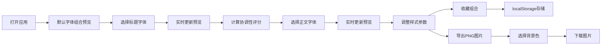

## 1. 产品概述

TypePair 是一款在线字体配对与实时预览工具，帮助设计师快速为标题和正文寻找视觉和谐的中西文字体组合。用户可从预设字体库中选择标题与正文字体，实时预览渲染效果，并获得基于字体特征的协调性评分建议。

- **目标用户**：网页设计师、UI 设计师、前端开发者、排版爱好者
- **核心价值**：降低字体搭配试错成本，提供数据驱动的配对建议，提升设计效率

## 2. 核心功能

### 2.1 用户角色
| 角色 | 注册方式 | 核心权限 |
|------|----------|----------|
| 访客用户 | 无需注册 | 浏览字体、预览配对、查看评分、本地收藏、导出图片 |

### 2.2 功能模块
1. **字体选择面板**：标题字体选择器、正文字体选择器、字体预览列表
2. **实时预览画布**：博客文章样式预览、样式微调面板、协调性评分展示
3. **收藏管理**：本地收藏列表、一键应用、缩略图预览
4. **导出功能**：PNG 图片导出、背景色选择

### 2.3 页面详情
| 页面名称 | 模块名称 | 功能描述 |
|----------|----------|----------|
| 主页 | 顶部导航栏 | Logo 展示、收藏入口、响应式菜单切换 |
| 主页 | 左侧字体选择面板 | 标题字体下拉选择（15+中英文字体）、正文字体下拉选择、字体预览、收藏列表展示 |
| 主页 | 右侧预览画布 | 博客文章样式实时渲染、样式参数微调、协调性评分色带、文字建议 |
| 主页 | 导出功能 | PNG 图片导出、背景色选择弹窗 |

## 3. 核心流程

用户打开应用 → 默认字体组合自动预览 → 用户选择标题字体 → 实时更新预览与评分 → 用户选择正文字体 → 实时更新预览与评分 → 用户调整样式参数 → 实时更新 → 用户收藏组合 → localStorage 保存 → 用户导出 PNG → 选择背景色 → 下载图片

## 4. 用户界面设计

### 4.1 设计风格
- **主题**：深灰白极简风格，专业工具感
- **主色**：#1a1a2e（深靛蓝导航栏）
- **背景色**：左侧面板 #f5f5f5，右侧画布 #ffffff
- **评分色带**：绿色 #4caf50（85-100分）、橙色 #ff9800（70-84分）、红色 #f44336（<70分）
- **分割线**：#e0e0e0
- **文字颜色**：标题 #1a1a2e，正文 #444，引用 #666
- **字体风格**：现代简洁，标题使用展示性字体，正文使用易读性字体

### 4.2 页面设计概览
| 页面名称 | 模块名称 | UI 元素 |
|----------|----------|---------|
| 主页 | 顶部导航栏 | 高度 56px，背景 #1a1a2e，Logo "TypePair" 22px 700 白色，收藏图标 |
| 主页 | 左侧字体面板 | 宽度 320px，背景 #f5f5f5，两个自定义下拉选择器，收藏列表卡片 |
| 主页 | 预览画布 | 白色背景，博客文章布局，标题 24px，正文 16px，引用 14px 斜体 |
| 主页 | 评分区 | 24px 高度色带条，圆角 4px，CSS transition 动画 0.5s，文字建议 |
| 主页 | 样式微调面板 | 字号、行高、字间距滑块/输入框 |
| 主页 | 收藏列表 | 圆角 4px 卡片，阴影 #00000015，hover 上移 2px |

### 4.3 响应式设计
- **桌面端（>=1024px）**：左右分栏布局，左侧固定 320px，右侧自适应
- **平板端（768-1023px）**：左侧面板折叠为可展开侧滑菜单，滑入时长 0.3s，缓动 ease-out
- **手机端（<768px）**：字体列表使用全屏模态框，背景半透明黑色 #00000050，列表圆角 12px，列表项高度 48px

### 4.4 动效与交互
- 评分色带：宽度过渡动画 0.5s ease
- 收藏卡片 hover：上移 2px + 阴影加深
- 侧滑菜单：translateX 过渡 0.3s ease-out
- 字体下拉展开：平滑展开动画
- 导出按钮：点击反馈动画
