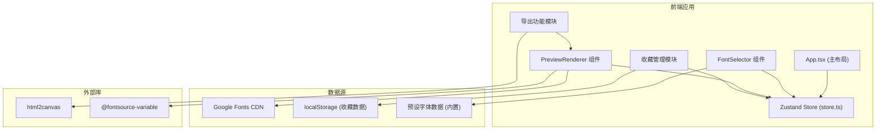

## 1. 架构设计



**数据流向：**
1. 用户在 FontSelector 选择字体 → 调用 store.updateFontPair() → 更新 fontTitle/fontBody 状态
2. store 状态变化 → PreviewRenderer 订阅状态 → 重新渲染预览
3. store.getCompatibilityScore() → 基于字体预设数据计算评分
4. 收藏操作 → store 管理收藏列表 → 持久化到 localStorage
5. 导出操作 → PreviewRenderer 提供 DOM 节点 → html2canvas 截图 → 下载

## 2. 技术描述

- **前端框架**：React 18 + TypeScript 5
- **构建工具**：Vite 5
- **状态管理**：Zustand 4
- **样式方案**：CSS Modules / 内联样式 (动态字体样式)
- **字体加载**：Google Fonts CDN + @fontsource-variable 包
- **图片导出**：html2canvas
- **数据存储**：localStorage (收藏数据)

## 3. 文件结构

```
src/
├── App.tsx              # 主布局组件，组合所有模块
├── main.tsx             # 应用入口
├── store.ts             # Zustand store，全局状态管理
├── fonts.ts             # 字体预设数据与评分算法
├── types.ts             # TypeScript 类型定义
├── FontSelector.tsx     # 字体选择模块
├── PreviewRenderer.tsx  # 预览渲染模块
├── FavoritesList.tsx    # 收藏列表组件
├── StylePanel.tsx       # 样式微调面板
├── ScoreBar.tsx         # 评分色带组件
└── ExportButton.tsx     # 导出按钮组件
```

**文件调用关系：**
- `App.tsx` → 引用 `store.ts`、`FontSelector.tsx`、`PreviewRenderer.tsx`、`FavoritesList.tsx`
- `FontSelector.tsx` → 引用 `store.ts`（读取/更新字体状态）、`fonts.ts`（字体列表）
- `PreviewRenderer.tsx` → 引用 `store.ts`（读取字体/样式状态）、`ScoreBar.tsx`、`StylePanel.tsx`
- `store.ts` → 引用 `fonts.ts`（评分计算）、`types.ts`（类型定义）
- `FavoritesList.tsx` → 引用 `store.ts`（收藏管理）

## 4. 数据模型

### 4.1 字体数据模型

```typescript
interface FontItem {
  id: string;
  name: string;         // 字体显示名称
  fontFamily: string;   // CSS font-family 值
  type: 'chinese' | 'english';  // 字体类型
  xHeight: number;      // x-height 相对值 (0-1)
  widthRatio: number;   // 字面率 (0-1)
  avgKerning: number;   // 平均字偶间距 (em)
  previewText: string;  // 预览文字
  isGoogleFont?: boolean; // 是否为 Google Fonts
  weights?: number[];   // 支持的字重
}
```

### 4.2 收藏数据模型

```typescript
interface FavoriteItem {
  id: string;
  titleFontId: string;
  bodyFontId: string;
  titleFontName: string;
  bodyFontName: string;
  thumbnail: string;     // base64 缩略图
  createdAt: number;
}
```

### 4.3 样式参数模型

```typescript
interface StyleParams {
  titleFontSize: number;  // px
  bodyFontSize: number;   // px
  lineHeight: number;     // 倍数
  letterSpacing: number;  // em
  titleColor: string;
  bodyColor: string;
  quoteColor: string;
}
```

### 4.4 Store 状态模型

```typescript
interface FontStore {
  fontTitle: FontItem;
  fontBody: FontItem;
  styleParams: StyleParams;
  favorites: FavoriteItem[];
  
  updateFontPair: (type: 'title' | 'body', font: FontItem) => void;
  updateStyleParams: (params: Partial<StyleParams>) => void;
  getCompatibilityScore: () => number;
  getCompatibilityAdvice: () => string;
  addFavorite: (item: Omit<FavoriteItem, 'id' | 'createdAt'>) => void;
  removeFavorite: (id: string) => void;
  applyFavorite: (id: string) => void;
}
```

## 5. 核心算法

### 5.1 协调性评分算法

评分基于三个维度加权计算，归一化到 0-100 分：

1. **x-height 差异（40% 权重）**：标题与正文字体 x-height 的相对差异
2. **字面率差异（30% 权重）**：中文字体字面率的匹配度
3. **字偶间距差异（30% 权重）**：字体默认字间距的协调性

```
score = 100 - (
  |xH1 - xH2| * 40 + 
  |wR1 - wR2| * 30 + 
  |k1 - k2| * 30
) * 100
```

### 5.2 性能优化策略

- 使用 requestAnimationFrame 批量更新预览样式，避免每帧多次重绘
- 字体列表使用虚拟滚动（如超过 50 项）
- 收藏缩略图懒加载，仅在可见时生成
- CSS transition 实现动画，避免 JS 动画

## 6. 响应式断点

| 断点 | 布局模式 | 左侧面板行为 |
|------|----------|--------------|
| >= 1024px | 左右分栏 | 固定 320px 宽，常驻显示 |
| 768-1023px | 侧滑菜单 | 默认隐藏，点击按钮从左侧滑入（0.3s ease-out） |
| < 768px | 全屏模态框 | 字体选择使用全屏模态框展示 |
