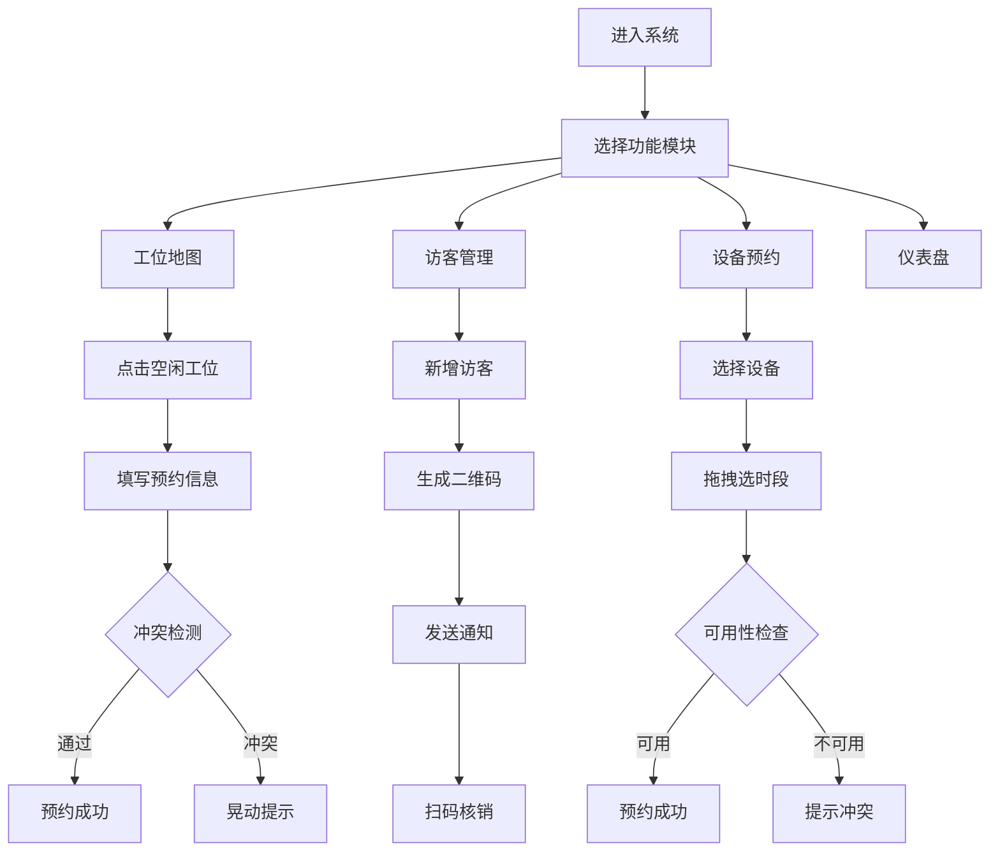

## 1. 产品概述

共享办公空间智能管理系统，为小型共享办公空间管理者提供工位分配、访客预约和设备预约的一站式解决方案。解决传统手工登记和Excel表格管理效率低、工位使用冲突频发、访客来访流程繁琐的痛点。

- 核心价值：通过可视化管理和自动化流程，提升空间利用率，减少管理成本，优化用户体验
- 目标用户：共享办公空间管理员、入驻企业员工、访客

## 2. 核心功能

### 2.1 用户角色

| 角色 | 注册方式 | 核心权限 |
|------|----------|----------|
| 管理员 | 系统预设 | 工位管理、访客核销、设备预约、数据仪表盘查看 |
| 会员 | 管理员添加 | 工位预约、访客邀请、设备预约 |
| 访客 | 无需注册 | 预约到访、扫码签到 |

### 2.2 功能模块

1. **工位地图页面**：俯视平面图展示、工位状态管理、预约面板、冲突检测
2. **访客管理页面**：访客列表、新增预约、二维码凭证、扫码核销、消息通知
3. **设备预约页面**：会议室设备列表、时间线选择、拖拽预约、可用性检查
4. **仪表盘页面**：工位占用率环形图、访客统计折线图、设备预约排行柱状图

### 2.3 页面详情

| 页面名称 | 模块名称 | 功能描述 |
|-----------|-------------|---------------------|
| 工位地图 | 平面图渲染 | 12个工位按A/B/C区分组，矩形块80x100px，状态色区分 |
| 工位地图 | 预约交互 | 点击空闲工位弹出预约面板，选择日期时长，后端验证冲突 |
| 工位地图 | 状态动画 | 状态变化淡入淡出0.4s，冲突时晃动动画0.3s |
| 访客管理 | 访客列表 | 显示姓名、公司、手机、到访时间、状态、被访人 |
| 访客管理 | 预约表单 | 下拉选择会员作为被访人，提交生成二维码凭证 |
| 访客管理 | 扫码核销 | 管理员扫码，状态从未签到变为已签到，颜色从紫变绿 |
| 设备预约 | 设备列表 | 4个会议室，含投影仪、白板、视频会议系统 |
| 设备预约 | 时间线 | 横向滚动30分钟粒度，拖拽选择时段，已预约淡紫色覆盖 |
| 仪表盘 | 环形进度条 | 今日工位占用率，直径120px，描边12px |
| 仪表盘 | 折线图 | 最近7天访客数，点色#42a5f5，线宽2px，悬停显示数值 |
| 仪表盘 | 柱状图 | 设备预约排行，横向渐变柱，最高80px |

## 3. 核心流程

### 工位预约流程
管理员点击空闲工位 → 弹出预约面板 → 选择日期和时长（1-8小时）→ 提交后端 → 验证无冲突 → 工位状态变为预定 → 地图自动刷新

### 访客预约流程
填写访客信息 → 选择被访会员 → 提交后端 → 生成二维码凭证 → 发送通知给被访人 → 访客到访扫码 → 管理员核销 → 状态变为已签到

### 设备预约流程
选择会议室设备 → 拖拽时间线选择时段 → 提交后端 → 检查设备可用性 → 预约成功 → 时间线显示已预约

## 4. 用户界面设计

### 4.1 设计风格
- 主色调：白色#ffffff，背景浅灰#f5f5f5，辅助色蓝灰#78909c
- 状态色：空闲#c8e6c9、占用#ffcc80、预定#bbdefb、维修#e0e0e0
- 按钮风格：主操作#1976d2蓝色填充，圆角6px，内边距8px 20px；次操作透明边框
- 布局：卡式布局，卡片间距16px，圆角8px，阴影0 2px 8px rgba(0,0,0,0.08)
- 动画：状态过渡0.4s cubic-bezier(0.4, 0, 0.2, 1)，页面切换左滑0.3s

### 4.2 页面设计概述

| 页面名称 | 模块名称 | UI元素 |
|-----------|-------------|-------------|
| 工位地图 | 平面图 | 区域分组标签、工位矩形块、状态色、hover效果、点击动画 |
| 工位地图 | 预约面板 | 320px宽白色面板、圆角12px、阴影、日期选择器、时长滑块、提交按钮 |
| 访客管理 | 列表 | 卡片式列表、状态标签、二维码预览、核销按钮 |
| 访客管理 | 表单 | 输入框、下拉选择、提交按钮、成功反馈 |
| 设备预约 | 时间线 | 横向滚动容器、30分钟粒度格子、拖拽选择、已预约覆盖层 |
| 仪表盘 | 环形图 | Canvas绘制、渐变色彩、中心百分比显示 |
| 仪表盘 | 折线图 | Canvas绘制、数据点、悬停tooltip、动画加载 |
| 仪表盘 | 柱状图 | 横向渐变柱、数值标签、排序显示 |

### 4.3 响应式设计
- 桌面端（>=1024px）：四栏布局，侧边导航，工位卡片80x100px
- 平板端（768-1023px）：底部导航栏56px高，四个图标切换，工位卡片缩小至60x75px，文字14px
- 页面切换：滑动过渡动画，方向左滑，时长0.3s

## 5. 性能要求
- 工位地图首次渲染：<= 800ms（20个工位以内）
- 仪表盘API响应：<= 300ms
- 数据刷新：长轮询每10秒自动刷新
