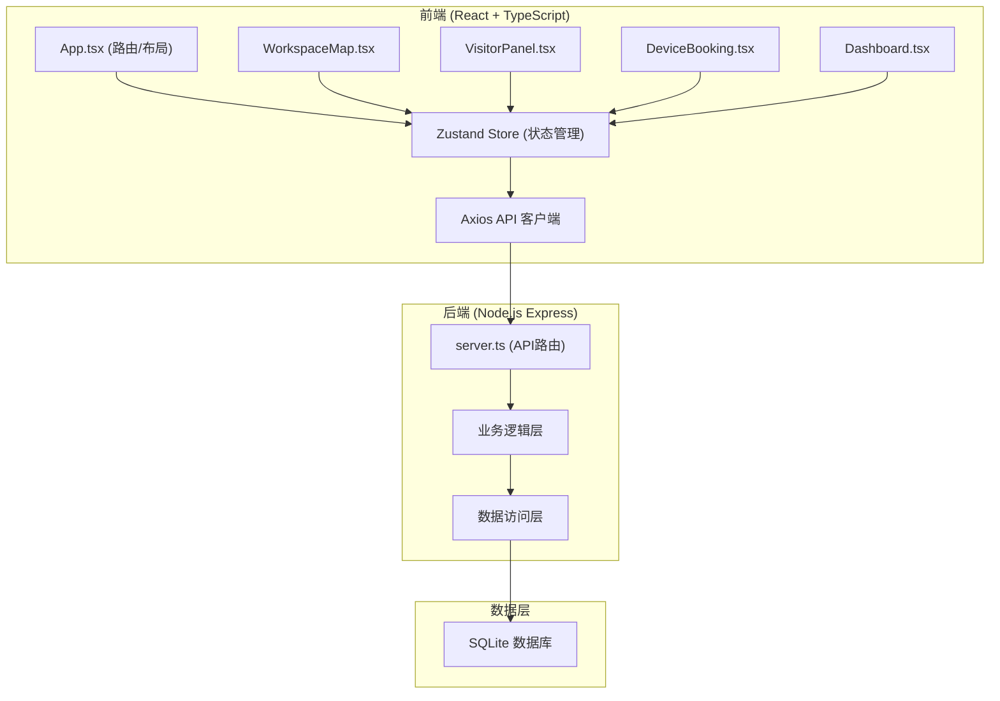
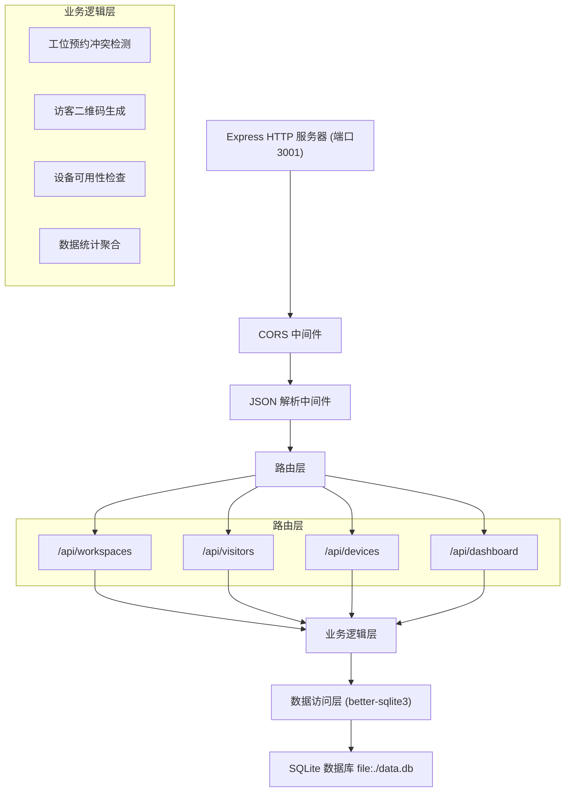
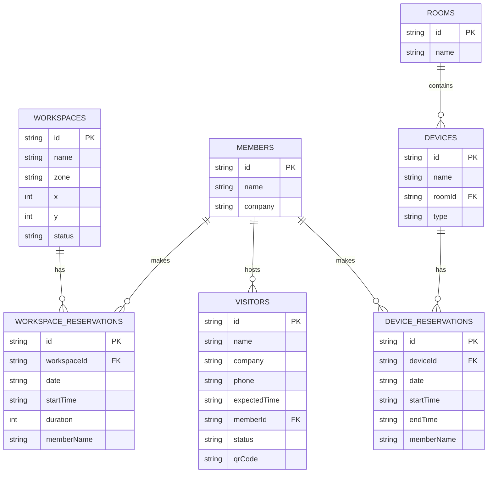

## 1. 架构设计



## 2. 技术描述

- **前端**：React@18 + TypeScript + Vite + Zustand + Axios + React Router DOM
- **后端**：Express@4 + TypeScript + better-sqlite3 + cors + uuid + qrcode
- **构建工具**：Vite 5.x，代理/api到后端3001端口
- **状态管理**：Zustand 4.x，管理工位、访客、设备、仪表盘全局状态
- **图表渲染**：纯Canvas 2D API，不依赖额外图表库
- **二维码**：qrcode库生成，150x150px

## 3. 路由定义

| 路由 | 用途 |
|-------|---------|
| / | 工位地图页面（默认首页） |
| /visitors | 访客管理页面 |
| /devices | 设备预约页面 |
| /dashboard | 仪表盘页面 |

## 4. API 定义

```typescript
// 工位类型
interface Workspace {
  id: string;
  name: string;
  zone: 'A' | 'B' | 'C';
  x: number;
  y: number;
  status: 'idle' | 'occupied' | 'reserved' | 'maintenance';
}

interface WorkspaceReservation {
  id: string;
  workspaceId: string;
  date: string;
  startTime: string;
  duration: number;
  memberName: string;
}

// 访客类型
interface Visitor {
  id: string;
  name: string;
  company: string;
  phone: string;
  expectedTime: string;
  memberId: string;
  memberName: string;
  status: 'pending' | 'checked_in';
  qrCode: string;
}

// 会员类型
interface Member {
  id: string;
  name: string;
  company: string;
}

// 设备类型
interface Device {
  id: string;
  name: string;
  roomId: string;
  roomName: string;
  type: 'projector' | 'whiteboard' | 'video_conference';
}

interface DeviceReservation {
  id: string;
  deviceId: string;
  date: string;
  startTime: string;
  endTime: string;
  memberName: string;
}

// 仪表盘数据
interface DashboardData {
  workspaceOccupancy: number;
  visitorStats: { date: string; count: number }[];
  deviceRanking: { name: string; count: number }[];
}

// API 请求响应
type ApiResponse<T> = { success: boolean; data?: T; error?: string };
```

### API 端点

| 方法 | 端点 | 描述 |
|------|------|------|
| GET | /api/workspaces | 获取所有工位列表 |
| POST | /api/workspaces/reserve | 预约工位 |
| GET | /api/visitors | 获取访客列表 |
| POST | /api/visitors | 创建访客预约 |
| POST | /api/visitors/checkin | 访客签到核销 |
| GET | /api/devices | 获取设备列表及预约 |
| POST | /api/devices/reserve | 预约设备 |
| GET | /api/dashboard | 获取仪表盘统计数据 |

## 5. 服务器架构



## 6. 数据模型

### 6.1 ER 图



### 6.2 DDL 语句

```sql
-- 工位表
CREATE TABLE IF NOT EXISTS workspaces (
  id TEXT PRIMARY KEY,
  name TEXT NOT NULL,
  zone TEXT NOT NULL CHECK (zone IN ('A', 'B', 'C')),
  x INTEGER NOT NULL,
  y INTEGER NOT NULL,
  status TEXT NOT NULL DEFAULT 'idle' CHECK (status IN ('idle', 'occupied', 'reserved', 'maintenance'))
);

-- 工位预约表
CREATE TABLE IF NOT EXISTS workspace_reservations (
  id TEXT PRIMARY KEY,
  workspace_id TEXT NOT NULL,
  date TEXT NOT NULL,
  start_time TEXT NOT NULL,
  duration INTEGER NOT NULL,
  member_name TEXT NOT NULL,
  FOREIGN KEY (workspace_id) REFERENCES workspaces(id)
);

-- 会员表
CREATE TABLE IF NOT EXISTS members (
  id TEXT PRIMARY KEY,
  name TEXT NOT NULL,
  company TEXT NOT NULL
);

-- 访客表
CREATE TABLE IF NOT EXISTS visitors (
  id TEXT PRIMARY KEY,
  name TEXT NOT NULL,
  company TEXT NOT NULL,
  phone TEXT NOT NULL,
  expected_time TEXT NOT NULL,
  member_id TEXT NOT NULL,
  status TEXT NOT NULL DEFAULT 'pending' CHECK (status IN ('pending', 'checked_in')),
  qr_code TEXT NOT NULL,
  FOREIGN KEY (member_id) REFERENCES members(id)
);

-- 会议室表
CREATE TABLE IF NOT EXISTS rooms (
  id TEXT PRIMARY KEY,
  name TEXT NOT NULL
);

-- 设备表
CREATE TABLE IF NOT EXISTS devices (
  id TEXT PRIMARY KEY,
  name TEXT NOT NULL,
  room_id TEXT NOT NULL,
  type TEXT NOT NULL CHECK (type IN ('projector', 'whiteboard', 'video_conference')),
  FOREIGN KEY (room_id) REFERENCES rooms(id)
);

-- 设备预约表
CREATE TABLE IF NOT EXISTS device_reservations (
  id TEXT PRIMARY KEY,
  device_id TEXT NOT NULL,
  date TEXT NOT NULL,
  start_time TEXT NOT NULL,
  end_time TEXT NOT NULL,
  member_name TEXT NOT NULL,
  FOREIGN KEY (device_id) REFERENCES devices(id)
);

-- 索引
CREATE INDEX IF NOT EXISTS idx_wr_date ON workspace_reservations(date);
CREATE INDEX IF NOT EXISTS idx_wr_workspace ON workspace_reservations(workspace_id);
CREATE INDEX IF NOT EXISTS idx_visitors_time ON visitors(expected_time);
CREATE INDEX IF NOT EXISTS idx_dr_date ON device_reservations(date);
CREATE INDEX IF NOT EXISTS idx_dr_device ON device_reservations(device_id);
```

### 6.3 初始数据

```sql
-- 初始化12个工位 (A区靠窗4个, B区中间4个, C区靠门4个)
INSERT OR IGNORE INTO workspaces (id, name, zone, x, y, status) VALUES
('ws-001', 'A01', 'A', 50, 50, 'idle'),
('ws-002', 'A02', 'A', 150, 50, 'idle'),
('ws-003', 'A03', 'A', 250, 50, 'idle'),
('ws-004', 'A04', 'A', 350, 50, 'idle'),
('ws-005', 'B01', 'B', 50, 200, 'idle'),
('ws-006', 'B02', 'B', 150, 200, 'idle'),
('ws-007', 'B03', 'B', 250, 200, 'idle'),
('ws-008', 'B04', 'B', 350, 200, 'idle'),
('ws-009', 'C01', 'C', 50, 350, 'idle'),
('ws-010', 'C02', 'C', 150, 350, 'idle'),
('ws-011', 'C03', 'C', 250, 350, 'idle'),
('ws-012', 'C04', 'C', 350, 350, 'idle');

-- 初始化4个会议室
INSERT OR IGNORE INTO rooms (id, name) VALUES
('room-001', '会议室A'),
('room-002', '会议室B'),
('room-003', '会议室C'),
('room-004', '会议室D');

-- 初始化设备 (每个会议室3个设备)
INSERT OR IGNORE INTO devices (id, name, room_id, type) VALUES
('dev-001', '投影仪-A', 'room-001', 'projector'),
('dev-002', '白板-A', 'room-001', 'whiteboard'),
('dev-003', '视频会议-A', 'room-001', 'video_conference'),
('dev-004', '投影仪-B', 'room-002', 'projector'),
('dev-005', '白板-B', 'room-002', 'whiteboard'),
('dev-006', '视频会议-B', 'room-002', 'video_conference'),
('dev-007', '投影仪-C', 'room-003', 'projector'),
('dev-008', '白板-C', 'room-003', 'whiteboard'),
('dev-009', '视频会议-C', 'room-003', 'video_conference'),
('dev-010', '投影仪-D', 'room-004', 'projector'),
('dev-011', '白板-D', 'room-004', 'whiteboard'),
('dev-012', '视频会议-D', 'room-004', 'video_conference');

-- 初始化会员
INSERT OR IGNORE INTO members (id, name, company) VALUES
('m-001', '张三', '科技公司A'),
('m-002', '李四', '设计公司B'),
('m-003', '王五', '咨询公司C'),
('m-004', '赵六', '互联网公司D');
```

## 7. 项目文件结构

```
auto206/
├── package.json
├── vite.config.js
├── tsconfig.json
├── index.html
├── server.ts
├── src/
│   ├── App.tsx
│   ├── main.tsx
│   ├── WorkspaceMap.tsx
│   ├── VisitorPanel.tsx
│   ├── DeviceBooking.tsx
│   ├── Dashboard.tsx
│   ├── store.ts
│   ├── types.ts
│   └── index.css
└── .trae/
    └── documents/
        ├── PRD.md
        └── TECH_ARCHITECTURE.md
```
