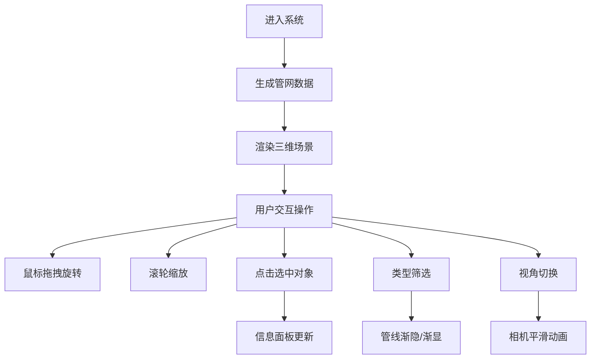

## 1. 产品概述

城市地下管网三维可视化系统，面向城市运维人员，提供排水、燃气、电力、通信四种地下管线的直观三维展示与实时监控。系统通过三维可视化技术解决地下管网不可见、难以管理的痛点，提升城市基础设施运维效率。

## 2. 核心功能

### 2.1 用户角色

| 角色 | 注册方式 | 核心权限 |
|------|----------|----------|
| 运维人员 | 系统账号登录 | 查看管网分布、传感器状态、筛选管线类型、切换视角 |

### 2.2 功能模块

1. **三维场景视图**：管网三维渲染、相机导航、地表半透明展示
2. **管网数据模拟**：自动生成管网拓扑数据、传感器实时读数模拟
3. **交互选中系统**：管段/节点选中高亮、详情面板展示
4. **类型筛选工具栏**：按管线类型筛选显示/隐藏
5. **视角切换系统**：俯视/剖面视角切换
6. **信息面板**：选中对象详情、传感器历史数据折线图

### 2.3 页面详情

| 页面名称 | 模块名称 | 功能描述 |
|---------|----------|----------|
| 主页面 | 3D场景视图 | 全屏三维场景，展示地下管网分布，支持鼠标旋转缩放 |
| 主页面 | 左侧工具栏 | 四个管线类型复选框，控制各类管线的显示与隐藏 |
| 主页面 | 右侧信息面板 | 显示选中管段或传感器的详细信息及历史数据图表 |
| 主页面 | 传感器系统 | 每2秒更新传感器读数，颜色渐变显示状态 |

## 3. 核心流程

用户进入系统后，自动生成管网数据并渲染三维场景。用户可通过鼠标拖拽旋转场景、滚轮缩放查看管网分布。点击管段或传感器节点查看详情，通过左侧复选框筛选管线类型，按P/N键切换俯视/剖面视角。

## 4. 用户界面设计

### 4.1 设计风格

- **主色调**：暗色科技风格，背景#0a0e17，文字#e0e0e0，高亮#29b6f6
- **管线颜色**：排水#1565c0、燃气#e65100、电力#fdd835、通信#2e7d32
- **传感器渐变**：绿色#00e676到红色#ff1744
- **按钮样式**：圆角8px，hover背景#37474f，点击微缩放0.95倍/0.1s
- **字体**：现代无衬线字体，14px为主
- **布局**：左侧工具栏200px固定宽，右侧信息面板320px固定宽，中间3D场景

### 4.2 页面设计概述

| 页面名称 | 模块名称 | UI元素 |
|---------|----------|--------|
| 主页面 | 3D场景视图 | 半透明地表40x40单位、网格线#ffffff20、管段圆柱几何体、传感器小球、悬浮标签 |
| 主页面 | 左侧工具栏 | 磨砂玻璃背景#1a2332、四个复选框高40px、hover高亮、点击动画 |
| 主页面 | 右侧信息面板 | 磨砂玻璃效果背景#0d1b2a、圆角8px、自定义滚动条4px#37474f、Canvas 2D折线图 |

### 4.3 响应性

桌面端优先设计，全屏展示3D场景，固定左右侧栏，鼠标交互优化。

### 4.4 3D场景设计

- **环境**：深色背景#0a0e17，添加环境光和方向光
- **光照**：环境光强度0.4，方向光强度0.8，营造立体感
- **相机**：默认俯视角度45度，距离60单位，阻尼系数0.9
- **交互**：OrbitControls支持旋转缩放，禁用平移
- **动画**：选中高亮脉冲动画、相机飞行1.2s缓出easeOutQuad、管线渐隐0.5s
- **性能**：帧率≥50fps，仅更新受影响节点材质，不重建几何体
