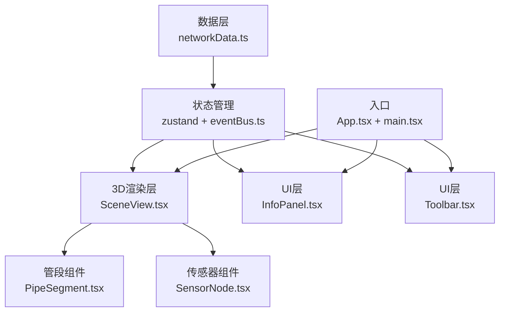

## 1. 架构设计



## 2. 技术描述

- **前端框架**：React@18 + TypeScript@5
- **3D引擎**：Three.js@0.160 + @react-three/fiber@8 + @react-three/drei@9
- **状态管理**：zustand@4 + 自定义事件总线
- **构建工具**：Vite@5
- **数据模拟**：内置数据生成模块，无需后端
- **图表绘制**：Canvas 2D API

## 3. 核心数据结构

### 3.1 节点数据 (Node)
```typescript
interface Node {
  id: string;
  x: number;      // 平面坐标 -50~50
  y: number;      // 埋深 -8~-2
  z: number;      // 平面坐标 -50~50
  sensor: Sensor;
}
```

### 3.2 管段数据 (PipeSegment)
```typescript
interface PipeSegment {
  id: string;
  type: 'drainage' | 'gas' | 'power' | 'communication';
  startNodeId: string;
  endNodeId: string;
  material: string;
  diameter: number;
}
```

### 3.3 传感器数据 (Sensor)
```typescript
interface Sensor {
  id: string;
  type: 'pressure' | 'flow' | 'voltage';
  value: number;
  unit: string;
  history: number[];
}
```

## 4. 事件总线定义

| 事件名称 | 数据类型 | 说明 |
|---------|----------|------|
| SELECT_NODE | string | 选中传感器节点ID |
| SELECT_PIPE | string | 选中管段ID |
| FILTER_TYPE | { type: string, visible: boolean } | 类型筛选变更 |
| SENSOR_UPDATE | { nodeId: string, value: number } | 传感器数据更新 |
| VIEW_CHANGE | 'top' \| 'profile' | 视角切换 |
| CLEAR_SELECTION | void | 清除选中状态 |

## 5. 项目文件结构

```
src/
├── data/
│   └── networkData.ts       # 管网数据生成与管理
├── components/
│   ├── SceneView.tsx        # 3D场景主容器
│   ├── PipeSegment.tsx      # 管段渲染组件
│   ├── SensorNode.tsx       # 传感器节点组件
│   ├── InfoPanel.tsx        # 信息面板
│   └── Toolbar.tsx          # 左侧工具栏
├── utils/
│   └── eventBus.ts          # 发布订阅事件总线
├── store/
│   └── useNetworkStore.ts   # zustand状态管理
├── types/
│   └── index.ts             # TypeScript类型定义
├── App.tsx                  # 主应用组件
├── main.tsx                 # 入口文件
└── index.css                # 全局样式
```

## 6. 核心模块设计

### 6.1 事件总线 (eventBus.ts)
- 实现发布订阅模式
- 类型安全的事件定义
- 支持事件订阅与取消

### 6.2 数据生成模块 (networkData.ts)
- 生成12个节点（网格分布）
- 生成15条管段连接
- 每2秒更新传感器读数（±5%波动）
- 维护20条历史数据

### 6.3 3D渲染模块
- **SceneView**: Canvas容器、光照、相机控制、地表平面
- **PipeSegment**: CylinderGeometry、根据类型着色、选中发光效果
- **SensorNode**: SphereGeometry、颜色渐变、脉冲动画、悬浮标签

### 6.4 UI交互模块
- **Toolbar**: 四个类型复选框、状态管理、筛选事件发布
- **InfoPanel**: 选中对象详情展示、Canvas 2D折线图绘制

### 6.5 动画系统
- 相机飞行：1.2s easeOutQuad缓动
- 管线渐隐：0.5s透明度过渡
- 选中脉冲：节点放大1.5倍动画
