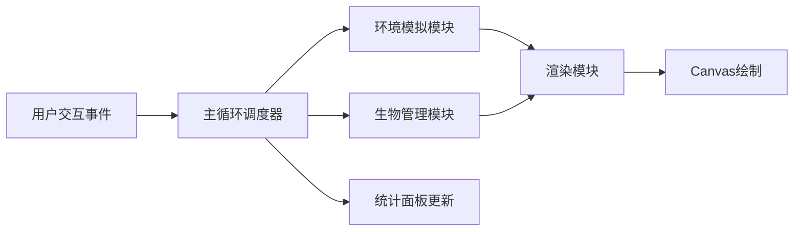

## 1. 产品概述

深海热泉生态模拟器是一款基于Canvas 2D的互动模拟应用，让玩家管理深海火山口热泉周围的微观生物群落，体验极端环境下的生态平衡挑战。

- **核心目标**：通过调节温度、补充营养盐等操作，维持生物群落的健康平衡，防止生物爆炸式增长或大规模灭绝
- **目标用户**：独立游戏爱好者、生态模拟爱好者、科普教育用户
- **市场价值**：提供沉浸式的深海生态体验，兼具教育性与娱乐性

## 2. 核心功能

### 2.1 功能模块
1. **环境模拟模块**：热泉温度波动、营养盐浓度动态、水体扰动事件
2. **生物群落模块**：三种生物（嗜热古菌、管虫、虾）的生长、繁殖、死亡逻辑
3. **能量可视化模块**：从热泉到生物的能量流动粒子动画
4. **交互控制模块**：温度调节、营养补充、速度控制、暂停/恢复
5. **统计面板模块**：实时显示环境参数与生物种群数据

### 2.2 页面详情
| 页面名称 | 模块名称 | 功能描述 |
|-----------|-------------|---------------------|
| 主页面 | 左侧控制面板 | 温度滑块（180-450°C）、营养盐补充按钮、速度控制（1x/2x/4x）、暂停/恢复按钮 |
| 主页面 | Canvas主区域 | 深海背景、热泉口发光效果、烟雾粒子、生物个体、能量流动流线动画 |
| 主页面 | 统计面板 | 温度、营养盐浓度、各物种数量、总能量值实时显示 |

## 3. 核心流程

**数据流向说明**：
1. 用户通过UI控件触发事件（调节温度、补充营养等）
2. 主循环接收事件并转发至环境模块
3. 环境模块更新温度、营养盐、扰动状态
4. 生物模块根据环境状态更新个体能量、繁殖、死亡
5. 渲染模块从主循环获取环境和生物状态，绘制到Canvas
6. 统计面板实时显示最新数据

## 4. 用户界面设计

### 4.1 设计风格
- **主题**：深海科技风，沉浸式深色主题
- **主色调**：深蓝#0d1b2a到#1b2838渐变背景
- **强调色**：热泉橙#ff5722、能量黄#ffeb3b、生物绿#4caf50、粉红#e91e63、橙#ff9800、亮蓝#00bcd4
- **UI控件**：圆角6px，悬浮放大1.1倍，点击凹陷效果
- **字体**：等宽字体，科技感，数字使用亮蓝色高亮

### 4.2 页面设计概述
| 页面名称 | 模块名称 | UI元素 |
|-----------|-------------|-------------|
| 主页面 | 左侧控制面板 | 占宽15%，半透明深蓝背景，垂直排列滑块、按钮、标签 |
| 主页面 | Canvas主区域 | 占宽85%，居中显示，深海渐变背景，热泉位于中心 |
| 主页面 | 统计面板 | 右下角浮动，150px宽，半透明深蓝#1a237e背景，白色文字，亮蓝数字 |

### 4.3 生物图标规范
- **嗜热古菌**：六边形，边长8px，绿色#4caf50
- **管虫**：细长矩形，宽4px高16px，粉红#e91e63
- **虾**：三角形，边长10px，橙色#ff9800

### 4.4 视觉特效
- **热泉口**：橙红到亮黄径向渐变，发光效果
- **烟雾粒子**：半透明白色#ffffff10，向上飘散
- **能量流动**：粒子大小2-4px，颜色从橙#ff5722渐变到黄#ffeb3b，速度0.5px/帧，流线宽1px

### 4.5 响应式
- 桌面端优先设计，固定布局比例
- Canvas自适应窗口大小，保持纵横比
- 控制面板最小宽度200px

## 5. 性能约束

- **帧率要求**：主循环稳定30FPS以上
- **生物上限**：1000个，超过时触发极端环境大量死亡事件
- **渲染优化**：Canvas脏矩形渲染，粒子对象池复用
