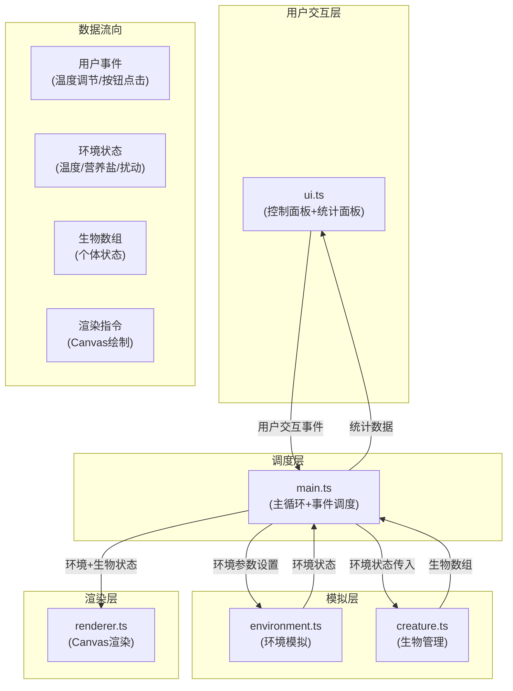

## 1. 架构设计



## 2. 技术描述

- **前端框架**：纯TypeScript + Canvas 2D API（无前端框架）
- **构建工具**：Vite 5.x
- **样式预处理器**：Sass/SCSS
- **类型支持**：TypeScript 5.x 严格模式
- **Node类型**：@types/node

## 3. 项目文件结构

```
├── package.json              # 项目依赖与脚本
├── vite.config.js            # Vite构建配置（含SCSS插件）
├── tsconfig.json             # TypeScript配置（严格模式）
├── index.html                # 入口HTML页面
└── src/
    ├── main.ts               # 主入口，游戏初始化与主循环
    ├── environment.ts        # 环境模拟模块
    ├── creature.ts           # 生物管理模块
    ├── renderer.ts           # Canvas渲染模块
    ├── ui.ts                 # 用户界面模块
    └── styles.scss           # 全局样式
```

### 3.1 文件调用关系与数据流向

| 文件 | 被调用方 | 输出数据 | 说明 |
|------|----------|----------|------|
| **main.ts** | environment.ts, creature.ts, renderer.ts, ui.ts | 环境状态、生物数组 | 核心调度器，接收UI事件，调用模拟模块，驱动渲染 |
| **environment.ts** | 无 | EnvironmentState | 被main.ts调用，管理温度、营养盐、扰动事件 |
| **creature.ts** | 无 | Creature[] | 被main.ts调用，管理生物个体生长、繁殖、死亡 |
| **renderer.ts** | 无 | Canvas绘制 | 被main.ts调用，接收环境和生物状态进行渲染 |
| **ui.ts** | 无 | 用户事件回调 | 被main.ts初始化，捕获交互事件并回调至main.ts |

## 4. 核心数据模型

### 4.1 类型定义

```typescript
// 生物类型枚举
enum Species {
  ARCHAEA = 'archaea',      // 嗜热古菌
  TUBE_WORM = 'tubeWorm',   // 管虫
  SHRIMP = 'shrimp'         // 虾
}

// 生物个体接口
interface Creature {
  id: number;
  species: Species;
  x: number;
  y: number;
  energy: number;          // 0-100
  temperatureTolerance: { min: number; max: number };
  velocity: { x: number; y: number };
  age: number;
}

// 环境状态接口
interface EnvironmentState {
  temperature: number;     // °C
  nutrientConcentration: number;  // 0-100
  isDisturbed: boolean;    // 水体扰动状态
  ventPosition: { x: number; y: number };
  ventRadius: number;
}

// 能量粒子接口
interface EnergyParticle {
  x: number;
  y: number;
  targetX: number;
  targetY: number;
  progress: number;        // 0-1
  size: number;
  color: string;
}

// 烟雾粒子接口
interface SmokeParticle {
  x: number;
  y: number;
  velocityY: number;
  alpha: number;
  size: number;
}
```

### 4.2 物种温度耐受范围

| 物种 | 最低温度 | 最适温度 | 最高温度 |
|------|----------|----------|----------|
| 嗜热古菌 | 80°C | 300°C | 400°C |
| 管虫 | 20°C | 250°C | 350°C |
| 虾 | 10°C | 200°C | 300°C |

## 5. 核心算法与逻辑

### 5.1 环境模拟算法

```
温度波动逻辑：
- 基础范围：240-360°C
- 每5秒随机偏移：±10°C
- 温度计算公式：currentTemp += (Math.random() - 0.5) * 20

营养盐浓度：
- 基于温度变化：nutrient += (temperature - 300) * 0.01
- 范围限制：0-100

水体扰动事件：
- 每15秒随机触发，概率30%
- 持续时间：3秒
- 扰动期间生物死亡率增加2倍
```

### 5.2 生物更新逻辑

```
每帧更新：
1. 能量消耗：energy -= 0.1 * (1 + disturbanceMultiplier)
2. 温度影响：超出耐受范围时，消耗加速2倍
3. 能量补充：距离热泉<30px时，energy += 0.5
4. 死亡判定：energy <= 0 时移除
5. 繁殖判定：energy > 80时，每2秒10%概率分裂
```

### 5.3 性能控制

```
生物数量上限：1000
超过上限时触发极端环境事件：
- 温度骤升50°C
- 50%生物随机死亡
- 持续5秒后恢复
```

## 6. 渲染管线

```
渲染顺序（每帧）：
1. 绘制深海渐变背景
2. 绘制热泉口径向渐变发光
3. 绘制烟雾粒子
4. 绘制能量流动粒子流线
5. 绘制生物个体（按物种类型）
6. 统计面板由DOM渲染，不通过Canvas
```

## 7. 主循环实现

```typescript
// requestAnimationFrame 驱动，目标30FPS
let lastTime = 0;
const FPS = 30;
const FRAME_TIME = 1000 / FPS;

function loop(currentTime: number) {
  const deltaTime = currentTime - lastTime;
  
  if (deltaTime >= FRAME_TIME) {
    const speedMultiplier = getSpeedMultiplier();
    const steps = Math.floor(deltaTime / FRAME_TIME) * speedMultiplier;
    
    for (let i = 0; i < steps; i++) {
      if (!isPaused) {
        environment.update();
        creatures.update(environment.state);
      }
    }
    
    renderer.render(environment.state, creatures.list);
    ui.updateStats(environment.state, creatures.list);
    lastTime = currentTime;
  }
  
  requestAnimationFrame(loop);
}
```
