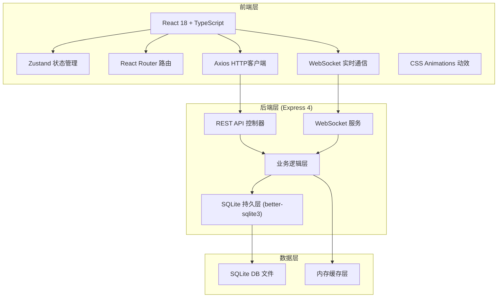
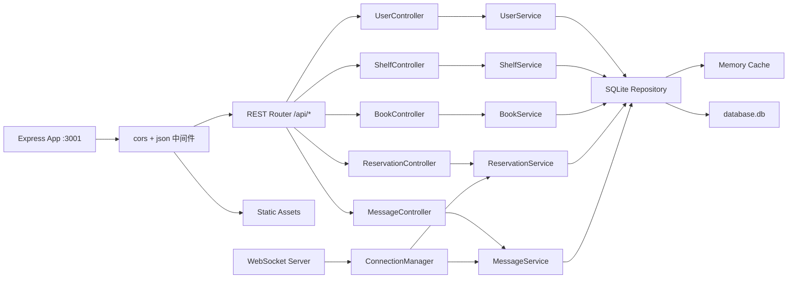
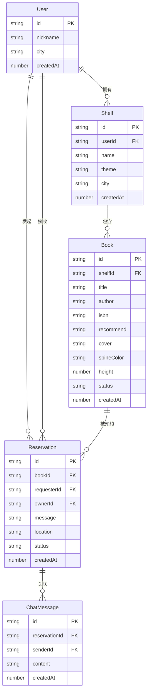

## 1. 架构设计



## 2. 技术描述

- **前端**：React@18 + TypeScript@5 + Vite@5
- **状态管理**：Zustand@4（用户态、书架数据、预约消息）
- **路由**：React Router Dom@6
- **HTTP**：Axios@1
- **构建工具**：Vite@5（代理/api到 :3001）
- **后端**：Node.js + Express@4 + TypeScript@5
- **数据库**：better-sqlite3（同步查询高性能，本地缓存索引）
- **实时通信**：ws@8（预约/消息推送）
- **工具**：uuid、concurrently、cors
- **类型支持**：@types系列包

## 3. 路由定义

| 前端路由 | 页面组件 | 用途 |
|-----------|-------------|-------|
| / | App.tsx (redirect) | 默认重定向到登录或主页 |
| /login | App.tsx 内嵌 | 用户昵称登录演示页 |
| /shelf | BookShelf.tsx | 个人书架管理页 |
| /browse | SearchPage.tsx | 同城书架浏览与预约 |

## 4. API 定义

```typescript
// ============ 类型定义 ============
interface User {
  id: string;
  nickname: string;
  city: string;
  avatar?: string;
}

interface Shelf {
  id: string;
  userId: string;
  name: string;
  theme: string; // #色值
  city: string;
  createdAt: number;
}

interface Book {
  id: string;
  shelfId: string;
  title: string;
  author: string;
  isbn?: string;
  recommend: string;
  cover: string; // base64 或 URL
  spineColor: string; // 书脊主色
  height: number; // 100-140
  status: 'available' | 'reserved' | 'offline';
  createdAt: number;
}

interface Reservation {
  id: string;
  bookId: string;
  requesterId: string;
  ownerId: string;
  message: string;
  location: string;
  status: 'pending' | 'confirmed' | 'rejected' | 'completed';
  createdAt: number;
}

interface ChatMessage {
  id: string;
  reservationId: string;
  senderId: string;
  content: string;
  createdAt: number;
}

// ============ REST API ============
// 用户模块
POST   /api/user/login            { nickname, city }          -> User
GET    /api/user/:id                                         -> User

// 书架模块
GET    /api/shelves?city=xxx                                -> Shelf[] (带前4本书缩略)
GET    /api/shelf/:id                                       -> { shelf, books: Book[] }
POST   /api/shelf                { userId, name, theme }    -> Shelf
PUT    /api/shelf/:id            { name?, theme? }           -> Shelf

// 书籍模块
POST   /api/book                 { shelfId, ...Book }       -> Book
PUT    /api/book/:id             { ...Partial<Book> }       -> Book
DELETE /api/book/:id                                         -> { ok: true }

// 预约模块
POST   /api/reservation          { bookId, requesterId, message, location } -> Reservation
GET    /api/reservations?userId=xxx                          -> Reservation[]
PUT    /api/reservation/:id      { status }                 -> Reservation

// 消息模块
GET    /api/messages/:reservationId                          -> ChatMessage[]
POST   /api/message              { reservationId, senderId, content } -> ChatMessage

// WebSocket 事件
// 客户端 -> 服务端:
//   join { userId }                     // 加入个人通知频道
//   sendMessage { reservationId, ... }  // 发送聊天消息
// 服务端 -> 客户端:
//   newReservation { reservation }      // 书主收到新预约通知
//   reservationUpdated { reservation }  // 预约状态变更通知
//   newMessage { message }              // 新聊天消息
```

## 5. 服务器架构图



## 6. 数据模型

### 6.1 ER Diagram



### 6.2 DDL (SQLite)

```sql
CREATE TABLE IF NOT EXISTS users (
  id TEXT PRIMARY KEY,
  nickname TEXT NOT NULL,
  city TEXT NOT NULL,
  created_at INTEGER NOT NULL
);

CREATE TABLE IF NOT EXISTS shelves (
  id TEXT PRIMARY KEY,
  user_id TEXT NOT NULL REFERENCES users(id),
  name TEXT NOT NULL,
  theme TEXT NOT NULL,
  city TEXT NOT NULL,
  created_at INTEGER NOT NULL
);

CREATE INDEX IF NOT EXISTS idx_shelves_city ON shelves(city);

CREATE TABLE IF NOT EXISTS books (
  id TEXT PRIMARY KEY,
  shelf_id TEXT NOT NULL REFERENCES shelves(id),
  title TEXT NOT NULL,
  author TEXT NOT NULL,
  isbn TEXT,
  recommend TEXT,
  cover TEXT NOT NULL,
  spine_color TEXT NOT NULL,
  height INTEGER NOT NULL,
  status TEXT NOT NULL DEFAULT 'available',
  created_at INTEGER NOT NULL
);

CREATE INDEX IF NOT EXISTS idx_books_shelf ON books(shelf_id);
CREATE INDEX IF NOT EXISTS idx_books_title ON books(title);
CREATE INDEX IF NOT EXISTS idx_books_author ON books(author);

CREATE TABLE IF NOT EXISTS reservations (
  id TEXT PRIMARY KEY,
  book_id TEXT NOT NULL REFERENCES books(id),
  requester_id TEXT NOT NULL REFERENCES users(id),
  owner_id TEXT NOT NULL REFERENCES users(id),
  message TEXT NOT NULL,
  location TEXT NOT NULL,
  status TEXT NOT NULL DEFAULT 'pending',
  created_at INTEGER NOT NULL
);

CREATE INDEX IF NOT EXISTS idx_reservations_owner ON reservations(owner_id);
CREATE INDEX IF NOT EXISTS idx_reservations_requester ON reservations(requester_id);
CREATE INDEX IF NOT EXISTS idx_reservations_book ON reservations(book_id);

CREATE TABLE IF NOT EXISTS chat_messages (
  id TEXT PRIMARY KEY,
  reservation_id TEXT NOT NULL REFERENCES reservations(id),
  sender_id TEXT NOT NULL REFERENCES users(id),
  content TEXT NOT NULL,
  created_at INTEGER NOT NULL
);

CREATE INDEX IF NOT EXISTS idx_messages_reservation ON chat_messages(reservation_id);
```

### 6.3 初始演示数据

```sql
-- 预置3个用户+书架+若干书籍，覆盖6种主题色
-- 城市统一设为"北京"以便浏览演示
```
