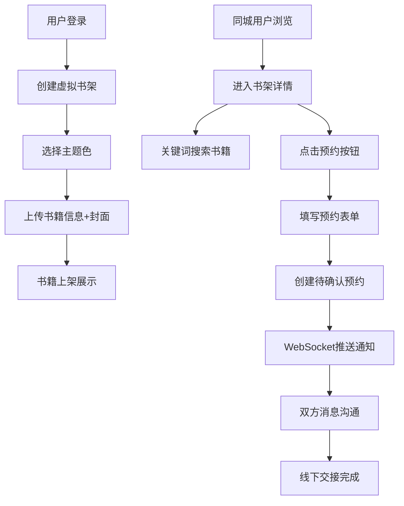

## 1. 产品概述

流浪书架是一个基于地理位置的实体书交换社区，为喜爱阅读的通勤人群提供虚拟街头书架空间，让闲置书籍通过线下交接的方式在城市中漂流。用户可创建个性化虚拟书架、浏览同城书籍、预约线下取书，系统追踪每本书的漂流轨迹。

## 2. 核心功能

### 2.1 用户角色

| 角色 | 注册方式 | 核心权限 |
|------|----------|----------|
| 普通用户 | 昵称登录（演示模式） | 管理书架、上传书籍、浏览同城书架、发起预约、消息沟通 |

### 2.2 功能模块

1. **书架管理页**：虚拟书架创建与编辑、书籍上传、书脊展示、翻页动画、编辑/下架操作
2. **同城浏览页**：城市书架网格展示、书架缩略图、关键词搜索、预约表单、消息面板

### 2.3 页面详情

| 页面名称 | 模块名称 | 功能描述 |
|-----------|-------------|---------------------|
| 书架管理页 | 书架主题选择 | 6种主题色切换：木纹#d4a373、工业灰#9e9e9e、薄荷绿#a5d6a7、深海蓝#42a5f5、暖橙#ffcc80、暗夜紫#7e57c2 |
| 书架管理页 | 书籍上传表单 | 书名、作者、ISBN（可选）、推荐语（≤100字）、封面图（JPG/PNG，≤3MB） |
| 书架管理页 | 书脊陈列 | 竖立书脊样式（宽80px，高100-140px随机），书脊颜色根据封面主色调渐变提取 |
| 书架管理页 | 翻页详情卡 | 0.6s ease-in-out翻页动画展示详情，可编辑或下架 |
| 书架管理页 | 纸屑粒子特效 | CSS实现，≤30个，带淡出效果 |
| 同城浏览页 | 城市选择 | 浏览器定位或手动选择城市 |
| 同城浏览页 | 书架网格 | 3-4列布局，展示前4本书脊缩略图+书架名+拥有者昵称 |
| 同城浏览页 | 搜索功能 | 按书名/作者/推荐语关键词搜索 |
| 同城浏览页 | 预约系统 | 预约表单（消息+交接地点），状态流转：待确认→确认/拒绝 |
| 同城浏览页 | 实时消息 | WebSocket推送预约通知，消息面板沟通 |

## 3. 核心流程

### 主业务流程：书籍漂流

用户创建书架 → 上传闲置书籍 → 同城用户浏览书架 → 发起预约 → 双方消息沟通 → 线下交接 → 书籍完成一次漂流

## 4. 用户界面设计

### 4.1 设计风格
- **主色调**：旧纸页暖色系背景 #f5f0e8，模拟阅读氛围
- **卡片/按钮**：8px圆角，hover时0.2s过渡缩放+阴影加深
- **字体**：正文使用温暖的衬线风格，标题略微粗犷，营造书店人文气息
- **布局**：卡片式网格布局，桌面三列、平板两列、移动单列
- **图标风格**：柔和圆润线条，emoji点缀增添温度

### 4.2 页面设计概览

| 页面名称 | 模块名称 | UI元素 |
|-----------|-------------|-------------|
| 书架管理页 | 顶部导航 | 暖米色背景、品牌logo"流浪书架"、城市切换、用户头像 |
| 书架管理页 | 书架容器 | 木纹/工业灰等主题背景板、木板纹理质感、顶部悬挂感装饰 |
| 书架管理页 | 书脊阵列 | 80px宽竖立书脊，顶部书名竖排或横排，渐变书脊色，hover微倾斜 |
| 书架管理页 | 翻页详情卡 | 书页展开动画，左侧封面图，右侧书籍详情 + 编辑/下架按钮 |
| 同城浏览页 | 书架网格 | 每个卡片：缩略书架 + 4本微缩书脊预览 + 书架名 + 昵称 |
| 同城浏览页 | 预约弹窗 | 半透明遮罩、消息输入框、地点选择、提交/取消按钮 |
| 通用 | 消息面板 | 右下角悬浮，新消息红点提示，WebSocket实时同步 |

### 4.3 响应式
- **桌面端（≥1024px）**：书架网格3列，导航栏完整展示
- **平板端（768-1023px）**：书架网格2列，导航栏简化
- **移动端（<768px）**：书架网格1列，底部Tab导航，触摸优化
- 所有按钮≥44x44px触摸区域，关键操作支持双击/长按交互

### 4.4 动效设计
- **书脊翻页**：0.6s ease-in-out 3D翻转，书页展开感
- **纸屑飘落**：30个粒子，随机位置/颜色/旋转，opacity渐变淡出循环
- **卡片悬停**：translateY(-4px) + box-shadow加深，0.2s过渡
- **通知推送**：右上角滑入动画，2s自动消失或点击关闭
- **页面切换**：浅淡的渐入渐出过渡

### 4.5 性能目标
- 书架列表加载响应 < 400ms（SQLite缓存查询）
- 预约提交反馈 < 2s
- WebSocket消息推送实时性 < 500ms
