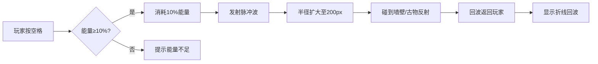

## 1. 产品概述

废墟回声是一款2D横版探索游戏，玩家扮演考古学家在随机生成的废墟遗址中探索，使用音波探测器寻找埋藏的古物，同时避开坍塌陷阱。游戏融合了探索、解谜与策略元素，通过独特的音波探测机制营造神秘的废墟探险氛围。

- **核心玩法**：音波探测 + 古物收集 + 陷阱规避
- **目标用户**：休闲游戏爱好者、探索解谜游戏玩家
- **产品价值**：提供沉浸式废墟探索体验，随机性保证重玩价值

## 2. 核心特性

### 2.1 功能模块

1. **地图生成模块**：随机生成废墟地图，保证连通性，包含墙壁、走廊、密室
2. **探测交互模块**：音波脉冲探测系统，回波反馈机制，能量管理
3. **古物收集模块**：古物生成、收集判定、收集特效、胜利条件
4. **UI状态管理模块**：HUD显示、能量条、古物计数、消息提示
5. **全局事件总线**：模块间通信机制，解耦各功能模块

### 2.2 游戏元素详情

| 元素类型 | 名称 | 功能描述 |
|----------|------|----------|
| 地形 | 地面 | 可站立区域，碎石纹理 |
| 地形 | 墙壁 | 不可穿越，深褐色 |
| 地形 | 密室 | 5-8格封闭空间 |
| 物品 | 古物 | 金色星形，收集目标，共15-20个 |
| 危险 | 坍塌陷阱 | 倒三角形，触碰即死，共5-8个 |
| 道具 | 能量条 | 100%容量，探测消耗10%，每5秒恢复5% |

## 3. 核心流程

### 3.1 游戏主流程

玩家进入游戏 → 随机地图生成 → 角色从起始点出发 → 使用空格键探测周围环境 → 根据回波判断古物位置 → WASD移动角色 → 收集古物 → 避开陷阱 → 收集满10个古物胜利 / 触碰陷阱失败

### 3.2 音波探测流程

## 4. 用户界面设计

### 4.1 设计风格

- **整体调性**：暗色调废墟风格，神秘、复古、探险氛围
- **主色调**：深棕 (#1a0f0a) → 暗紫 (#2d1b4e) 渐变背景
- **强调色**：
  - 青绿 #00e676（高能量）
  - 黄色 #ffeb3b（中能量）
  - 红色 #f44336（低能量/危险）
  - 金色 #ffd700（古物）
  - 淡蓝 #90caf9（探测回波）
- **字体**：monospace 等宽字体，复古像素感
- **动效**：cubic-bezier(0.4, 0, 0.2, 1) 缓动曲线

### 4.2 界面布局

| 区域 | 元素 | 位置 | 说明 |
|------|------|------|------|
| 游戏区域 | Canvas画布 | 居中 | 16:9比例，黑边填充 |
| HUD左上 | 能量条 | 左上角 | 宽200px高16px，颜色随能量变化 |
| HUD右上 | 古物计数 | 右上角 | 白色1.2rem monospace，格式 x/总数 |
| 屏幕中央 | 消息提示 | 居中 | 能量耗尽提示、胜利/失败界面 |

### 4.3 特殊效果

- **粒子爆散**：收集古物时20-30个金色粒子向四周散开，持续0.3秒
- **屏幕震动**：触碰陷阱时偏移5px，10Hz频率，持续0.3秒
- **脉冲波**：半透白色圆形扩散，持续1.5秒
- **回波折线**：淡蓝到白渐变，3-5段折线
- **陷阱标记**：探测后地面出现暗紫色裂纹纹理
- **胜利界面**：半透明黑底 + 白色文字，淡入动画0.5秒
- **失败界面**：红色高亮边框闪烁3次

### 4.4 响应式

- 画布保持16:9比例
- 窗口缩放时边缘填充纯黑色
- 游戏内容等比例缩放

## 5. 性能要求

- 主循环稳定60FPS（requestAnimationFrame）
- 帧渲染时间 ≤ 16ms
- 粒子总数 ≤ 80个（爆散 + 探测脉冲）
- 地图大小：30×20 格子
