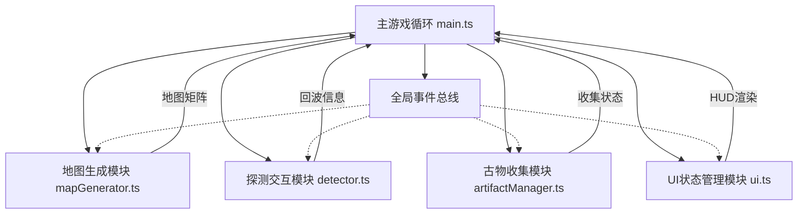

## 1. 架构设计



## 2. 技术选型

- **构建工具**：Vite 5.x
- **语言**：TypeScript 5.x（严格模式，target ES2020）
- **渲染**：Canvas 2D API
- **样式**：原生 CSS
- **状态管理**：全局事件总线（发布订阅模式）
- **音频**：Web Audio API（生成简单音效）

## 3. 文件结构

```
.
├── package.json          # 项目配置
├── vite.config.js        # Vite构建配置
├── tsconfig.json         # TypeScript配置
├── index.html            # 入口页面
└── src/
    ├── main.ts           # 主游戏循环 & 协调器
    ├── mapGenerator.ts   # 地图生成模块
    ├── detector.ts       # 音波探测模块
    ├── artifactManager.ts # 古物管理模块
    ├── ui.ts             # UI/HUD渲染模块
    └── types.ts          # 类型定义（可选）
```

## 4. 模块设计

### 4.1 全局事件总线

采用发布订阅模式，实现模块间解耦通信。

**事件定义：**
- `map:generated` — 地图生成完成
- `detector:pulse` — 发射探测脉冲
- `detector:echo` — 收到回波
- `artifact:collected` — 收集到古物
- `trap:triggered` — 触发陷阱
- `energy:changed` — 能量变化
- `game:win` — 游戏胜利
- `game:lose` — 游戏失败
- `ui:message` — 显示消息提示

### 4.2 地图生成模块 (mapGenerator.ts)

**职责**：生成随机废墟地图，保证连通性

**核心接口：**
```typescript
interface MapGenerator {
  generate(seed: number): MapData;
  getTile(x: number, y: number): TileType;
  isWalkable(x: number, y: number): boolean;
}
```

**数据结构：**
```typescript
enum TileType {
  WALL = 0,
  FLOOR = 1,
  CHAMBER = 2,
}

interface MapData {
  width: number;      // 30 格
  height: number;     // 20 格
  tiles: TileType[][];
  artifacts: Position[];
  traps: Position[];
  startPos: Position;
}
```

**生成算法：**
1. 初始化为全墙壁
2. 随机挖掘走廊（Drunkard Walk 算法）
3. 生成密室（5-8格封闭空间）
4. BFS 验证连通性，不连通则打通
5. 随机放置古物和陷阱

### 4.3 探测交互模块 (detector.ts)

**职责**：音波探测逻辑，脉冲波扩散，回波生成

**核心接口：**
```typescript
interface Detector {
  pulse(originX: number, originY: number): boolean;
  update(deltaTime: number): void;
  render(ctx: CanvasRenderingContext2D): void;
  getEchoes(): EchoData[];
}
```

**脉冲波：**
- 半径从 0 扩大到 200px
- 持续 1.5 秒
- 半透白色 `rgba(255,255,255,0.15)`
- 碰到墙壁或古物反射

**回波：**
- 折线形式，3-5段线段
- 淡蓝 #90caf9 到白渐变
- 从反射点返回玩家
- 用于判断古物方位

### 4.4 古物管理模块 (artifactManager.ts)

**职责**：古物数据管理，收集状态追踪

**核心接口：**
```typescript
interface ArtifactManager {
  init(mapData: MapData): void;
  collect(index: number): boolean;
  getCollectedCount(): number;
  getTotalCount(): number;
  getArtifact(index: number): ArtifactData;
  getAllArtifacts(): ArtifactData[];
}
```

**胜利条件：** 收集 10 个古物

### 4.5 UI 模块 (ui.ts)

**职责**：HUD 渲染，消息提示，状态显示

**核心接口：**
```typescript
interface UIRenderer {
  render(ctx: CanvasRenderingContext2D, state: GameState): void;
  showMessage(text: string, duration: number): void;
  showWinScreen(): void;
  showLoseScreen(): void;
}
```

**HUD 元素：**
- 能量条（左上）
- 古物计数（右上）
- 消息提示（居中）
- 胜利/失败界面

### 4.6 主游戏循环 (main.ts)

**职责**：初始化，游戏循环，输入处理，模块协调

**核心流程：**
1. 初始化 Canvas
2. 初始化各模块
3. 生成地图
4. 启动 requestAnimationFrame 循环
5. 每帧：处理输入 → 更新逻辑 → 渲染画面

**输入处理：**
- WASD / 方向键：移动
- 空格键：探测
- 移动速度：3px/帧

## 5. 性能优化

- **离屏缓存**：地图地面纹理预渲染到 OffscreenCanvas
- **粒子池**：对象池管理粒子，避免频繁 GC
- **空间分区**：探测碰撞检测使用网格加速
- **帧率控制**：requestAnimationFrame + deltaTime 计算
- **粒子上限**：同时存在粒子 ≤ 80 个

## 6. 音效设计

使用 Web Audio API 生成合成音效：
- 探测音：低频正弦波，渐强渐弱
- 收集音：高频短促正弦波
- 陷阱音：噪声 + 低频振荡
- 回波音：短促高频脉冲
