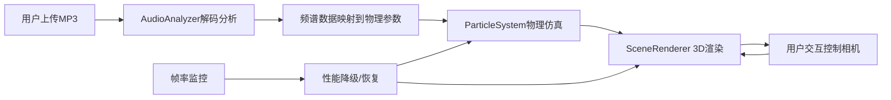

## 1. 产品概述

粒子物理音频可视化系统，将音频频谱实时映射到3D粒子物理仿真中，创造富有物理互动感和随机美感的音乐可视化体验。

- **核心价值**：解决传统音乐可视化仅按固定模板播放频谱、缺乏物理互动感和随机美感的问题
- **目标用户**：音乐爱好者、视觉艺术家、VJ创作者
- **产品定位**：沉浸式3D粒子音乐可视化Web应用

## 2. 核心功能

### 2.1 功能模块

1. **粒子物理仿真模块**：3000粒子3D空间运动仿真，含重力、空气阻力、随机风力、弹性碰撞
2. **音频分析与映射模块**：Web Audio API实时FFT分析，三频段频谱映射到物理参数
3. **3D场景交互与相机控制模块**：自动旋转相机、鼠标拖拽、滚轮缩放、WASD平移
4. **可视化效果与视觉反馈模块**：动态连接线、粒子光晕、星空背景
5. **性能自适应与状态监控模块**：帧率检测、自动降级、实时状态面板

### 2.2 页面详情

| 页面名称 | 模块名称 | 功能描述 |
|---------|---------|---------|
| 主场景页 | 3D粒子场景 | 全屏Canvas渲染粒子系统，支持鼠标/键盘交互 |
| 主场景页 | 音频控制面板 | 文件拖拽上传、播放/暂停按钮、文件信息显示 |
| 主场景页 | 状态监控面板 | 粒子数、帧率、音频能量、降级状态实时显示 |

## 3. 核心流程

用户上传MP3音频文件 → 系统解码并实时分析频谱 → 频谱数据映射到粒子物理参数 → 粒子系统物理仿真更新 → 3D场景渲染输出视觉效果 → 用户通过鼠标/键盘交互调整视角

## 4. 用户界面设计

### 4.1 设计风格

- **主色调**：深空蓝 #0a0a2e → 紫黑色 #0a0012 径向渐变背景
- **粒子色彩**：全色相随机（0-360°），高饱和度，中高明度
- **UI元素**：半透明深色面板 #00000080，圆角8px，白色文字 #ffffff
- **设计风格**：深邃太空主题，科幻感，沉浸式体验

### 4.2 页面设计概览

| 页面名称 | 模块名称 | UI元素 |
|---------|---------|-------|
| 主场景页 | 3D场景 | 全屏Canvas、粒子云、动态连接线、星空背景、光晕效果 |
| 主场景页 | 上传区域 | 中央拖拽区域（初始显示）、虚线边框、上传图标 |
| 主场景页 | 播放控制 | 底部居中播放/暂停按钮、进度条（可选） |
| 主场景页 | 状态面板 | 右上角半透明面板、四行状态信息、14px字号 |

### 4.3 响应式设计

- 桌面端优先设计，全屏Canvas自适应窗口大小
- 移动端支持触摸拖拽和双指缩放（基础支持）
- UI面板位置固定，不随窗口大小变化而错位

### 4.4 3D场景指引

- **环境**：深空背景，径向渐变从中心深蓝到边缘紫黑，点缀500颗静态星星
- **光照**：环境光 + 粒子自发光（光晕效果）
- **相机**：透视相机，FOV 60°，默认距离约10单位，自动环绕旋转
- **构图**：粒子系统居中，相机围绕中心点旋转，动态粒子群为视觉焦点
- **交互**：鼠标拖拽旋转视角、滚轮缩放、WASD水平平移
- **后期**：粒子光晕效果、线条透明度动态变化
- **性能**：目标60FPS，降级机制确保流畅体验

### 4.5 动画与动效

- 低能时粒子缓慢漂浮呈星云状（平均速度 < 0.5单位/秒）
- 高能时粒子爆炸般喷涌（速度可达10单位/秒）
- 连接线随音频能量动态显现/消失
- 相机旋转速度随平均能量变化
- 参数过渡采用指数平滑（平滑因子0.3）
