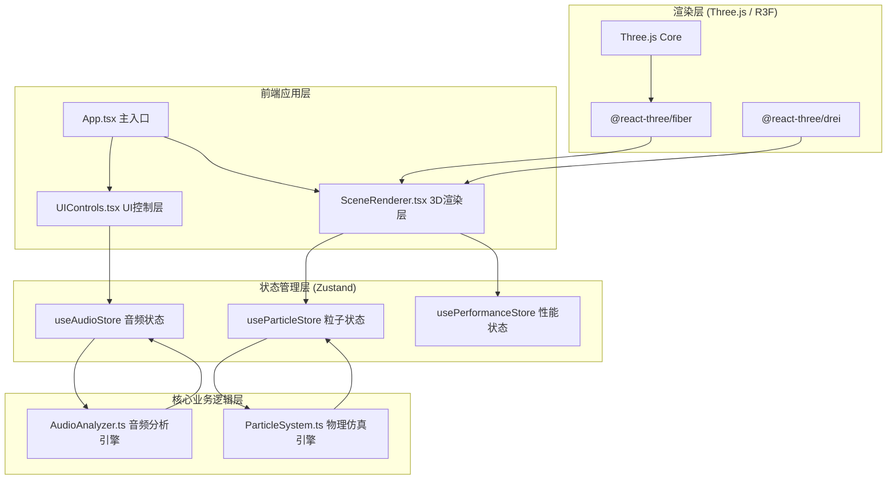

## 1. 架构设计



## 2. 技术选型说明

- **前端框架**：React@18 + TypeScript
- **构建工具**：Vite@5 + @vitejs/plugin-react
- **3D渲染**：Three.js + @react-three/fiber + @react-three/drei
- **状态管理**：Zustand
- **音频处理**：Web Audio API (原生)
- **样式方案**：CSS + Tailwind CSS 可选

### 核心依赖版本

| 依赖包 | 版本 | 用途 |
|-------|------|------|
| react | ^18.2.0 | UI框架 |
| react-dom | ^18.2.0 | DOM渲染 |
| typescript | ^5.3.0 | 类型系统 |
| three | ^0.160.0 | 3D引擎核心 |
| @react-three/fiber | ^8.15.0 | React Three.js封装 |
| @react-three/drei | ^9.92.0 | R3F常用组件库 |
| zustand | ^4.4.0 | 状态管理 |
| vite | ^5.0.0 | 构建工具 |
| @vitejs/plugin-react | ^4.2.0 | React插件 |
| @types/react | ^18.2.0 | React类型定义 |
| @types/react-dom | ^18.2.0 | ReactDOM类型定义 |
| @types/three | ^0.160.0 | Three.js类型定义 |

## 3. 目录结构

```
src/
├── types/              # 类型定义
│   └── index.ts        # 全局类型
├── store/              # Zustand状态管理
│   ├── useAudioStore.ts
│   ├── useParticleStore.ts
│   └── usePerformanceStore.ts
├── engine/             # 核心引擎
│   ├── AudioAnalyzer.ts    # 音频分析引擎
│   └── ParticleSystem.ts   # 粒子物理仿真引擎
├── components/         # React组件
│   ├── SceneRenderer.tsx   # 3D场景渲染
│   ├── UIControls.tsx      # UI控制面板
│   ├── ParticlePoints.tsx  # 粒子点组件
│   ├── ConnectionLines.tsx # 连接线组件
│   ├── StarField.tsx       # 星空背景
│   └── StatusPanel.tsx     # 状态监控面板
├── hooks/              # 自定义Hooks
│   ├── useAudioAnalysis.ts
│   ├── useParticleSimulation.ts
│   └── usePerformanceMonitor.ts
├── utils/              # 工具函数
│   ├── math.ts         # 数学工具
│   └── color.ts        # 颜色工具
├── App.tsx             # 根组件
├── main.tsx            # 入口文件
└── index.css           # 全局样式
```

## 4. 数据流向与调用关系

### 4.1 数据流图

```
用户上传MP3文件
    ↓
UIControls.tsx → useAudioStore.loadAudioFile()
    ↓
AudioAnalyzer.loadFile() → 解码音频 → 创建AnalyserNode
    ↓
每帧循环 (useFrame):
  ├─ AudioAnalyzer.analyze() → 频谱数据 + 平均能量
  │   → useAudioStore 更新
  │
  ├─ 频谱映射到物理参数 (指数平滑)
  │   ├─ 低频 → 重力强度
  │   ├─ 中频 → 风力强度
  │   └─ 高频 → 粒子大小缩放
  │
  ├─ ParticleSystem.update(dt)
  │   ├─ 应用重力、风力、阻尼
  │   ├─ 粒子间碰撞检测
  │   └─ 更新位置/速度数组
  │   → useParticleStore 更新
  │
  └─ SceneRenderer 渲染
      ├─ 更新粒子几何体位置/颜色
      ├─ 生成动态连接线
      └─ 更新相机位置/旋转
```

### 4.2 模块调用关系

| 调用方 | 被调用方 | 数据传递 |
|-------|---------|---------|
| UIControls.tsx | useAudioStore | 音频文件、播放状态 |
| SceneRenderer.tsx | useAudioStore | 频谱数据、平均能量 |
| SceneRenderer.tsx | useParticleStore | 粒子位置、速度、颜色 |
| SceneRenderer.tsx | usePerformanceStore | 帧率、降级状态 |
| useAudioStore | AudioAnalyzer | 分析结果、控制命令 |
| useParticleStore | ParticleSystem | 物理参数、仿真结果 |
| ParticleSystem | AudioAnalyzer数据 | 频率能量映射参数 |

## 5. 核心算法与技术要点

### 5.1 粒子物理仿真

- **数值积分**：半隐式欧拉法（Semi-implicit Euler）
- **空间划分**：网格空间划分加速碰撞检测
- **碰撞检测**：粒子间球-球碰撞检测，弹性碰撞（恢复系数0.7）
- **受力系统**：重力 + 空气阻力 + 随机风力
- **数据结构**：TypedArray（Float32Array）存储位置/速度/颜色

### 5.2 音频分析

- **FFT大小**：1024
- **频率范围**：20Hz - 20kHz
- **频段划分**：
  - 低频：20 - 250 Hz
  - 中频：250 - 4000 Hz
  - 高频：4000 - 20000 Hz
- **平滑处理**：指数移动平均（平滑因子0.3）

### 5.3 性能优化

- **BufferGeometry**：使用BufferGeometry而非Geometry
- **实例化渲染**：粒子使用Points而非Mesh
- **动态顶点**：仅更新必要的attribute
- **帧率监控**：requestAnimationFrame时间差计算
- **分级降级**：粒子数3000→1500、连线阈值1.5→1、光晕开关

### 5.4 相机控制

- **轨道控制**：基于OrbitControls改造
- **自动旋转**：速度与音频平均能量成正比（0.01-0.1 rad/frame）
- **交互**：鼠标拖拽旋转（灵敏度0.005）、滚轮缩放（3-30单位）
- **键盘控制**：WASD水平面平移（5单位/秒）

## 6. 状态管理设计

### 6.1 Audio Store

```typescript
interface AudioState {
  isLoaded: boolean;
  isPlaying: boolean;
  duration: number;
  currentTime: number;
  frequencyData: Uint8Array;  // 1024个频率值
  averageEnergy: number;       // 0-255
  lowFreqEnergy: number;       // 低频能量
  midFreqEnergy: number;       // 中频能量
  highFreqEnergy: number;      // 高频能量
  loadAudioFile: (file: File) => Promise<void>;
  play: () => void;
  pause: () => void;
  togglePlay: () => void;
  update: () => void;  // 每帧调用更新频谱
}
```

### 6.2 Particle Store

```typescript
interface ParticleState {
  count: number;
  positions: Float32Array;  // xyz * count
  velocities: Float32Array; // xyz * count
  colors: Float32Array;     // rgb * count
  sizes: Float32Array;      // 半径 * count
  sizeScale: number;        // 大小缩放系数
  gravity: number;          // 重力强度
  windStrength: number;     // 风力强度
  updatePhysics: (dt: number) => void;
  setCount: (count: number) => void;
}
```

### 6.3 Performance Store

```typescript
interface PerformanceState {
  fps: number;
  status: 'normal' | 'degraded';
  particleCount: number;
  lineDistanceThreshold: number;
  glowEnabled: boolean;
  updateFPS: (fps: number) => void;
  degrade: () => void;
  restore: () => void;
}
```

## 7. 关键配置参数

| 参数 | 正常值 | 降级值 | 单位 |
|-----|-------|-------|------|
| 粒子数量 | 3000 | 1500 | 个 |
| 连接线距离阈值 | 1.5 | 1.0 | 单位 |
| 最大连接线数 | 2000 | 1000 | 条 |
| 粒子光晕 | 开启 | 关闭 | - |
| 帧率降级阈值 | < 30 | - | FPS |
| 帧率恢复阈值 | > 45 | - | FPS |
| 平滑因子 | 0.3 | 0.3 | - |
| 碰撞恢复系数 | 0.7 | 0.7 | - |
| 阻尼系数 | 0.02 | 0.02 | - |
