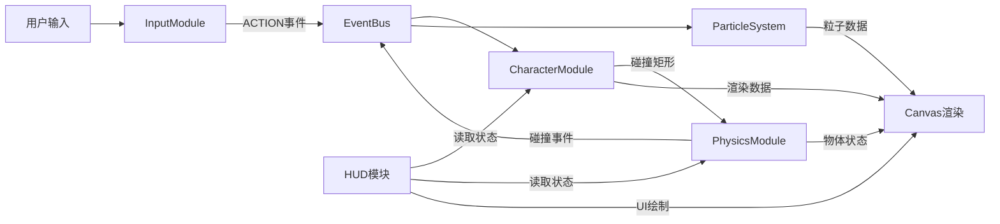

## 1. 产品概述
本产品是一个基于Canvas 2D的2D角色动画与实时物理互动应用，解决传统帧动画缺乏动态反馈、角色动作与场景物体无法真实碰撞的问题。通过骨骼动画系统、物理碰撞引擎和粒子特效系统的结合，为用户提供流畅、真实、富有表现力的互动体验。

- 核心价值：实现骨骼动画与物理模拟的深度融合，角色动作与场景物体产生真实的物理互动
- 目标用户：游戏开发者、动画爱好者、交互设计师
- 市场定位：作为技术演示和可复用的游戏/交互应用基础框架

## 2. 核心功能

### 2.1 功能模块
1. **主画布**：骨骼动画渲染、物理碰撞、粒子特效、场景物体
2. **状态面板**：角色HP条、攻击条、当前动作名称
3. **物理调试面板**：碰撞开关、包围盒显示、粒子开关
4. **FPS计数器**：实时帧率显示、性能警告

### 2.2 页面详情
| 页面名称 | 模块名称 | 功能描述 |
|-----------|-------------|---------------------|
| 主画布 | 骨骼动画系统 | 支持13个关节点的骨骼动画，6种动作状态，0.3s插值过渡，Canvas线条+圆形绘制 |
| 主画布 | 物理碰撞模块 | AABB碰撞检测、动量守恒响应、3种互动物体（木箱、花瓶、弹簧垫） |
| 主画布 | 粒子特效系统 | 跳跃尘土、攻击火花、花瓶碎片，粒子池管理与生命周期控制 |
| 主画布 | 输入控制系统 | 键盘W/A/S/D/空格映射为游戏动作，通过事件总线分发 |
| 左上角 | 角色状态面板 | HP条（绿色）、攻击条（橙色）、动作名称文本 |
| 右上角 | FPS计数器 | 绿色帧率数值，低于30FPS红色警告 |
| 右下角 | 物理调试面板 | 齿轮图标折叠/展开，3个复选框控制物理调试选项 |

## 3. 核心流程
用户通过键盘输入控制角色动作，输入模块将按键映射为动作事件并发送到事件总线。角色模块接收动作事件后更新骨骼状态和位置，物理模块检测角色与场景物体的碰撞并计算响应结果，粒子模块监听特效事件创建和管理粒子，最后所有模块的渲染数据统一绘制到Canvas上。HUD模块周期性读取各模块状态并在顶层绘制UI元素。

## 4. 用户界面设计

### 4.1 设计风格
- 主色调：深蓝渐变背景（#1a1a2e → #16213e）
- 角色骨骼：灰色骨头（#aaaaaa）+ 白色关节（#ffffff）
- 场景物体：木箱#c88a5a、花瓶#e07a5f、弹簧垫#81b29a
- 粒子特效：尘土#d4a373、火花#ffb703
- UI元素：HP条#4caf50、攻击条#ff9800、FPS#76ff03
- 字体：monospace等宽字体，14px-16px
- 整体风格：科技感深色主题，清晰的视觉层次

### 4.2 页面设计概述
| 页面名称 | 模块名称 | UI元素 |
|-----------|-------------|-------------|
| 主画布 | 游戏区域 | 80%窗口居中，渐变背景，y=600px地面线，骨骼角色，场景物体，粒子特效 |
| 左上角 | 状态面板 | 半透明背景，矩形血条/能量条，白色文本 |
| 右上角 | FPS计数器 | 绿色数字，性能警告红色闪烁 |
| 右下角 | 调试面板 | 齿轮图标，半透明黑色面板（rgba(0,0,0,0.7)），复选框 |

### 4.3 响应性
- 桌面端优先，Canvas自适应窗口大小保持80%占比
- 键盘交互为主，无需移动端触控优化

### 4.4 性能指标
- 目标帧率：60FPS
- 性能阈值：低于30FPS显示警告
- 测试环境：Chrome 120+，4GB RAM
