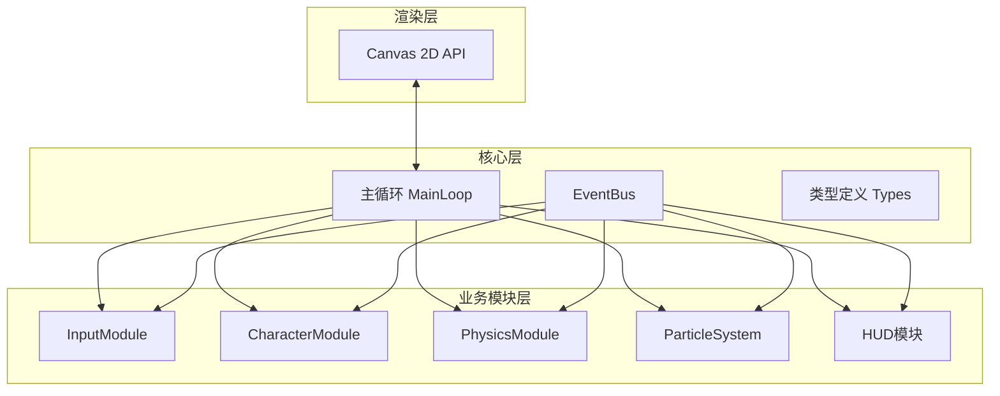

## 1. 架构设计
本项目采用模块化架构，各模块通过事件总线解耦，数据单向流动确保可维护性和可扩展性。前端基于TypeScript强类型约束，使用Vite作为构建工具，Canvas 2D作为渲染引擎。



## 2. 技术描述
- 前端技术栈：TypeScript + Vite + Canvas 2D API
- 构建工具：Vite 5.x
- 编程语言：TypeScript 5.x（严格模式，target ES2020）
- 无后端依赖，纯前端实现
- 无数据库需求

## 3. 模块定义

### 3.1 项目结构
```
├── package.json          # 项目依赖与脚本
├── vite.config.js       # Vite构建配置
├── tsconfig.json      # TypeScript配置
├── index.html         # 入口HTML
└── src/
    ├── main.ts        # 游戏主循环
    ├── types.ts       # 全局类型定义
    ├── eventBus.ts    # 事件总线
    ├── modules/
    │   ├── input.ts   # 输入模块
    │   ├── character.ts  # 角色骨骼动画模块
    │   ├── physics.ts   # 物理碰撞模块
    │   └── particles.ts # 粒子特效模块
    └── ui/
        └── hud.ts     # HUD界面模块
```

### 3.2 核心数据流向
1. **输入**：键盘事件 → InputModule → EventBus.emit('ACTION', payload)
2. **角色**：EventBus.on('ACTION') → 更新骨骼状态 → 输出Joint[]和Rect
3. **物理**：接收角色Rect和物体列表 → AABB碰撞检测 → 动量响应 → EventBus.emit('COLLISION')
4. **粒子**：EventBus.on('EFFECT') → 创建粒子 → 更新生命周期 → 渲染
5. **渲染**：主循环requestAnimationFrame → 调用各模块update/render → Canvas绘制

## 4. 数据模型

### 4.1 骨骼关节数据结构
```typescript
interface Joint {
  name: string;
  x: number;
  y: number;
  parent: string | null;
}

interface SkeletonFrame {
  joints: Joint[];
}

interface Animation {
  name: 'idle' | 'walk' | 'jump' | 'attack' | 'hurt' | 'fall';
  frames: SkeletonFrame[];
  frameRate: number;
}

interface CharacterState {
  position: { x: number; y: number };
  velocity: { x: number; y: number };
  hp: number;
  attack: number;
  currentAction: string;
  collisionRect: Rect;
}
```

### 4.2 物理物体数据结构
```typescript
interface Rect {
  x: number;
  y: number;
  width: number;
  height: number;
}

interface PhysicsObject {
  id: string;
  type: 'box' | 'vase' | 'spring';
  rect: Rect;
  mass: number;
  velocity: { x: number; y: number };
  hp?: number;
  elasticity?: number;
}

interface CollisionResult {
  collided: boolean;
  normal: { x: number; y: number };
  penetration: number;
}
```

### 4.3 粒子数据结构
```typescript
interface Particle {
  x: number;
  y: number;
  vx: number;
  vy: number;
  size: number;
  color: string;
  life: number;
  maxLife: number;
  rotation?: number;
  rotationSpeed?: number;
}
```

### 4.4 事件类型定义
```typescript
type GameEvent =
  | { type: 'ACTION'; payload: 'idle' | 'walk' | 'jump' | 'attack' | 'hurt' | 'fall' | 'crouch' }
  | { type: 'COLLISION'; payload: { objectId: string; type: string } }
  | { type: 'EFFECT'; payload: { type: 'dust' | 'spark' | 'debris'; x: number; y: number } }
  | { type: 'VASE_BROKEN'; payload: { x: number; y: number; color: string } };
```

## 5. 核心算法

### 5.1 骨骼动画插值
```typescript
function lerpFrame(from: SkeletonFrame, to: SkeletonFrame, t: number): SkeletonFrame {
  return {
    joints: from.joints.map((joint, i) => ({
      ...joint,
      x: joint.x + (to.joints[i].x - joint.x) * t,
      y: joint.y + (to.joints[i].y - joint.y) * t,
    })),
  };
}
```

### 5.2 AABB碰撞检测
```typescript
function aabbCollision(a: Rect, b: Rect): CollisionResult {
  const dx = (a.x + a.width / 2) - (b.x + b.width / 2);
  const overlapX = (a.width + b.width) / 2 - Math.abs(dx);
  if (overlapX <= 0) return { collided: false, normal: { x: 0, y: 0 }, penetration: 0 };
  // ...
}
```

### 5.3 动量守恒响应
```typescript
function momentumResponse(
  v1: number, v2: number, m1: number, m2: number, e: number): [number, number] {
  const newV1 = ((m1 - e * m2) * v1 + (1 + e) * m2 * v2) / (m1 + m2);
  const newV2 = ((m2 - e * m1) * v2 + (1 + e) * m1 * v1) / (m1 + m2);
  return [newV1, newV2];
}
```

## 6. 性能优化策略
1. **对象池**：粒子系统采用对象池复用，避免频繁GC
2. **requestAnimationFrame**：使用浏览器原生API同步60FPS
3. **脏矩形渲染**：仅重绘变化区域（本项目全屏重绘但使用缓存
4. **离屏Canvas**：静态背景预渲染
5. **事件节流**：输入事件节流处理
6. **类型安全**：TypeScript严格模式减少运行时错误
